## Einleitung

### Datengrundlage

Der [National Health and Nutrition Survey (NHANES)](https://www.cdc.gov/nchs/nhanes/index.htm?CDC_AA_refVal=https%3A%2F%2Fwww.cdc.gov%2Fnchs%2Fnhanes.htm) ist ein Studienprogramm zur Erhebung von Gesundheits- und Ernährungsstatus von Erwachsenen und Kindern in den USA. Die Erhebung enthält zahlreiche Daten aus Befragungen und physischen Untersuchungen. Das Vorhaben wird vom [National Center for Health Statistics (NCHS)](https://www.cdc.gov/nchs/index.htm) als Teil des [Centers for Disease Control and Prevention (CDC)](https://www.cdc.gov/nchs/index.htm) durchgeführt. Das Programm startete in den frühen 1960er Jahren und umfasst Stichproben um die 5000 Personen pro Jahr. Die Daten des laufenden NHANES Programms werden alle zwei Jahre erhoben und reichen zurück bin ins Jahr 1999. Die [Datensätze](https://wwwn.cdc.gov/nchs/nhanes/Default.aspx) sind frei zugänglich. Aus den Daten gibt es auch Peer-Review Publikationen (z.B. McClure et al. (2020)) welche zur Evidenz im Fachgebiet betragen.

### Sinn und Zweck der Uebung

Die Erfahrungen in der Vermittlung von Wissen aus dem Bereich der Statistik zeigen, dass es zugänglicher ist, wenn auch in der Ausbildung mit *echten* Daten gearbeitet wird. Ebenfalls scheint es wichtig zu sein selbst mit Daten zu arbeiten um einen starken Bezug zur Anwendung zu schaffen und das Wissen zu festigen. Daher werden wir uns nun konkret mit dem Datenauszug 2015-2016 aus der NHANES Erhebung auseinandersetzen, wobei nur mit einem Bruchteil der Datengrundlage gearbeitet wird um das Wissen in angewandter Statistik zu festigen. Folgende Ziele werden damit verfolgt:

-   Die Studierenden wenden das Wissen aus den vergangenen Lerneinheiten an.
-   Die Studierenden nehmen eine forschende Haltung um anhand von Daten neue Erkenntnisse zu gewinnen.
-   Die Studierenden führen bezüglich der Fragestellung(en) geeignete Analysen mit Hilfe der Methoden der beschreibenden und schliessenden Statistik durch.
-   Durch die eigenständige Arbeit von der Fragestellung bis zur Analyse entwickeln die Studierenden ihre Problemlösungskompetenz.

### Bemerkungen zur Limitierung

Die NHANES Erhebung ist sehr umfassend und wir werden uns zu Ausbildungszwecken nur mit einem Bruchteil der erhobenen Informationen beschäftigen. Dies ebenfalls nur im Rahmen der vermittelten Methoden der Statistik innerhalb dieses Moduls. Die Übungen haben daher nicht das Ziel komplexe statistische Analysen durchzuführen um valide und abschliessende Schlussfolgerungen aus den Daten zu ziehen.

## Beispieldatensatz aus NHANES 2015-2016

### Demographics

-   https://wwwn.cdc.gov/nchs/nhanes/Search/DataPage.aspx?Component=Demographics&CycleBeginYear=2015
-   List of variables: https://wwwn.cdc.gov/nchs/nhanes/Search/variablelist.aspx?Component=Demographics&CycleBeginYear=2015
-   File: DEMO_I.XPT; Codebook: https://wwwn.cdc.gov/Nchs/Nhanes/2015-2016/DEMO_I.htm

#### Verwendete Variablen

-   Geschlecht: Geschlecht m/f (riagendr)
-   Alter: Alter in Jahren (ridageyr)
    -   80: 80 Jahre und älter
-   Ausbildung: Ausbildung - Höchster Abschluss (dmdeduc2)
    -   1: \< 9. Grad
    -   2: 9.-11. Grad
    -   3: High-school Abschluss
    -   4: Some college oder AA Grad
    -   5: College-Abschluss oder höherer Abschluss
-   Haushaltseinkommen pro Jahr als Bereich US Dollar (indhhin2)
    -   1: \$0 to \$4'999
    -   2: \$5'000 to \$9'999
    -   3: \$10'000 to \$14'999
    -   4: \$15'000 to \$19'999
    -   5: \$20'000 to \$24'999
    -   6: \$25'000 to \$34'999
    -   7: \$35'000 to \$44'999
    -   8: \$45'000 to \$54'999
    -   9: \$55'000 to \$64'999
    -   10: \$65'000 to \$74'999
    -   14: \$75'000 to \$99'999
    -   15: \$100'000 and Over
-   Familieneinkommen pro Jahr als Bereich US Dollar (indfmin2)
    -   1: \$0 to \$4'999
    -   2: \$5'000 to \$9'999
    -   3: \$10'000 to \$14'999
    -   4: \$15'000 to \$19'999
    -   5: \$20'000 to \$24'999
    -   6: \$25'000 to \$34'999
    -   7: \$35'000 to \$44'999
    -   8: \$45'000 to \$54'999
    -   9: \$55'000 to \$64'999
    -   10: \$65'000 to \$74'999
    -   14: \$75'000 to \$99'999
    -   15: \$100'000 and Over

### Examination data

-   https://wwwn.cdc.gov/nchs/nhanes/Search/DataPage.aspx?Component=Examination&CycleBeginYear=2015
-   Blood pressure file: BPX_I.XPT; Codebook: https://wwwn.cdc.gov/Nchs/Nhanes/2015-2016/BPX_I.htm
-   Body measures file: BMX_I.XPT; Codebook: https://wwwn.cdc.gov/Nchs/Nhanes/2015-2016/BMX_I.htm

Die Messungen wurden im Sitzen nach 5 Minuten ruhig Sitzen durchgeführt.

#### Verwendete Variablen aus Blutdruck Messungen

-   Puls in Schlägen pro Minute (bpxpls)
-   BlutdruckSys1: Systolischer Blutdruck 1. Messung in mm Hg (bpxsy1)
-   BlutdruckSys2: Systolischer Blutdruck 2. Messung in mm Hg (bpxsy2)
-   BlutdruckSys3: Systolischer Blutdruck 3. Messung in mm Hg (bpxsy3)
-   BlutdruckSys4: Systolischer Blutdruck 4. Messung in mm Hg (bpxsy4)
-   BlutdruckDia1: Diastolischer Blutdruck 1. Messung in mm Hg (bpxdi1)
-   BlutdruckDia2: Diastolischer Blutdruck 2. Messung in mm Hg (bpxdi2)
-   BlutdruckDia3: Diastolischer Blutdruck 3. Messung in mm Hg (bpxdi3)
-   BlutdruckDia4: Diastolischer Blutdruck 4. Messung in mm Hg (bpxdi4)

#### Verwendete Variablen aus Körpermessungen

-   Koerpergewicht: Körpergewicht in kg (bmxwt)
-   Koerpergroese: Körpergrösse in cm (bmxht)
-   BMI: Body-Mass-Index in kg/m² (bmxbmi)
-   Taillenumfang: Taillenumfang in cm (bmxwaist)

### Dietary data

-   https://wwwn.cdc.gov/nchs/nhanes/Search/DataPage.aspx?Component=Dietary&CycleBeginYear=2015
-   Day 1 total file: DR1TOT_I.XPT; Codebook: https://wwwn.cdc.gov/Nchs/Nhanes/2015-2016/DR1TOT_I.htm
-   Day 2 total file: DR2TOT_I.XPT; 3-10 day after day 1; Codebook: https://wwwn.cdc.gov/Nchs/Nhanes/2015-2016/DR2TOT_I.htm
-   Day 1 individual food file: DR1IIF_I.XPT; Codebook: https://wwwn.cdc.gov/Nchs/Nhanes/2015-2016/DR1IFF_I.htm
-   Day 2 individual food file: DR2IIF_I.XPT; Codebook: https://wwwn.cdc.gov/Nchs/Nhanes/2015-2016/DR2IFF_I.htm

Bei den Ernährungsdaten ist zu beachten, dass die Erhebung zwei mal erfolgte. Die zweite Messung erfolgte im Abstand von drei bis zehn Tagen auf die erste Messung (Praefix *dr1t*, respektive *dr2t*). Die Messwerte beziehen sich jeweils auf die Nahrungsaufnahe innhalb der letzten 24 Stunden. Die Individual Food Files schlüsseln die Angaben in den Total Files zusätzlich nach verschiedenen Lebensmitteln auf.

#### Verwendete Variablen aus Ernährungsdaten (Day 1 and 2 total files)

-   OnDiet: Spezielle Diät? Ja/Nein (drqsdiet)

-   Energie1: Energieaufnahme in kcal Messung 1 (dr1tkcal)

-   Protein1: Proteinaufnahme in g Messung 1 (dr1tprot)

-   Kohlenhydrate1: Kohlenhydrataufnahme in g Messung 1 (dr1tcarb)

-   Zucker1: Zuckeraufnahme in g Messung 1 (dr1tsugr)

-   Nahrungsfaser1: Nahrungsfaseraufnahme in g Messung 1 (dr1tfibe)

-   Fett1: Fettaufnahme in g Messung 1 (dr1ttfat)

-   FS1: Aufnahme Gesättigte Fettsäuren in g Messung 1 (dr1tsfat)

-   MUFA1: Aufnahme einfach (mono) ungesättigte Fettsäuren in g Messung 1 (dr1tmfat)

-   PUFA1: Aufnahme mehrfach (poly) ungesättigte Fettsäuren in g Messung 1 (dr1tpfat)

-   Cholesterin1: Cholesterinaufnahme in mg Messung 1 (dr1tchol)

-   Energie2: Energieaufnahme in kcal Messung 2 (dr2tkcal)

-   Protein2: Proteinaufnahme in g Messung 2 (dr2tprot)

-   Kohlenhydrate2: Kohlenhydrataufnahme in g Messung 2 (dr2tcarb)

-   Zucker2: Zuckeraufnahme in g Messung 2 (dr2tsugr)

-   Nahrungsfaser2: Nahrungsfaseraufnahme in g Messung 2 (dr2tfibe)

-   Fett2: Fettaufnahme in g Messung 2 (dr2ttfat)

-   FS2: Aufnahme Gesättigte Fettsäuren in g Messung 2 (dr2tsfat)

-   MUFA2: Aufnahme einfach (mono) ungesättigte Fettsäuren in g Messung 2 (dr2tmfat)

-   PUFA2: Aufnahme mehrfach (poly) ungesättigte Fettsäuren in g Messung 2 (dr2tpfat)

-   Cholesterin2: Cholesterinaufnahme in mg Messung 2 (dr2tchol)

#### Verwendete Variablen aus Individual Food Files

Keine

### Questionaire data

-   https://wwwn.cdc.gov/nchs/nhanes/search/datapage.aspx?Component=Questionnaire&CycleBeginYear=2015
-   Diet Behavior & Nutrition file: DBQ_I.XPT; Codebook: https://wwwn.cdc.gov/Nchs/Nhanes/2015-2016/DBQ_I.htm
-   Weight History file: WHQ_I.XPT; Codebook: https://wwwn.cdc.gov/Nchs/Nhanes/2015-2016/WHQ_I.htm
-   Alcohol Use file: ALQ_I.XPT; Codebook: https://wwwn.cdc.gov/Nchs/Nhanes/2015-2016/ALQ_I.htm
-   Smoking - Cigarette Use file: SMQ_I.XPT; Codebook: https://wwwn.cdc.gov/Nchs/Nhanes/2015-2016/SMQ_I.htm

#### Verwendete Variablen aus Alcolol Use

Keine

#### Verwendete Variablen aus Smoking - Cigarette Use

-   Rauchen100: Bisher min. 100 Zigaretten geraucht (smq020)
-   AlterRauchenRegel: Alter in welchem mit regelmässig Rauchen begonnen wurde in Jahren (smd030)
-   Rauchen: Rauchen Sie jetzt? (smq040)
    -   1: Jeden Tag
    -   2: Gelegentlich
    -   3: Nie

#### Verwendete Variablen aus Diet Behavior & Nutrition

-   Gesund: Wie gesund ist die Ernährung? (dbq700)
    -   1: Exzellent
    -   2: Sehr gut
    -   3: Gut
    -   4: Ausreichend
    -   5: Schlecht
-   MahlzeitenAuswaerts7d: Anzahl Mahlzeiten (Morgenessen, Mittagessen, Abendessen) nicht zu Hause zubereitet in den letzten 7 Tagen (dbd895)
    -   5555: Mehr als 21 pro Woche
-   MahlzeitenFastFood7d: Anzahl der Mahlzeiten auswärts Fast Food (dbd900)
    -   5555: Mehr als 21 pro Woche
-   ReadyToEat30d: Anzahl "ready-to-eat" Lebensmittel (z.B. Salat, Suppe, Sandwiches) aus Supermarkt in den letzten 30 Tagen (dbd905)
    -   5555: Mehr als 21 pro Woche
-   FrozenMeals30d: Anzahl tiefgefrohrener Menus/Pizza in den letzten 30 Tagen {dbd910)
    -   5555: Mehr als 21 pro Woche

#### Verwendete Variablen aus Weight History

-   GewichtSelf: Abgefragtes Gewicht in kg (whd020)
-   GewichtSelf: Abgefragtes Gewicht in kg (whd010)
    -   7777: Antwort verweigert
    -   9999: Weiss nicht
    -   .: Missing
-   KoerpergroesseSelf: Abgefragte Koerpergroesse in cm (whd010)
-   KoerpergroesseSelf: Abgefragte Koerpergroesse in cm (whd020)
-   EinordnungGewicht: Einordnung des Gewichtes (whq030)
    -   1: Übergewicht
    -   2: Untergewicht
    -   3: Normalgewicht
-   GewichtAendern: Will mehr, weniger oder gleich viel wiegen (whq040)
    -   1: mehr
    -   2: weniger
    -   3: gleich
-   GewichtSelf1y: Abgefragtes Gewicht in kg von vor einem Jahr (whd050)
-   GewichtSelf10y: Abgefragtes Gewicht in kg von vor 10 Jahren (whd110)
-   GewichtSelf25y: Abgefragtes Gewicht in kg mit 25 Jahren (whd120)
-   GewichtMax: Abgefragtes maximales Gewicht in kg (whd140)
-   AlterGewichtMax: Alter bei maximalem Gewicht in Jahren (whq150)
    -   80: 80 Jahre und älter
-   GewichtReduzieren: Versuchte im vergangenen Jahr Gewicht zu reduzieren (whq070)
    -   1: Ja
    -   2: Nein
-   WenigerEssen (whd080a)
    -   Weniger Essen (Menge) um Gewicht zu reduzieren
-   WenigerKalorien (whd080b)
    -   Nahrungsmittel mit weniger Kalorien um Gewicht zu reduzieren
-   WenigerFett (whd080c)
    -   Weniger Fett essen um Gewicht zu reduzieren
-   Bewegung (whd080d)
    -   Bewegung um Gewicht zu reduzieren
-   MahzeitenAuslassen (whd080e)
    -   Mahlzeiten auslassen um Gewicht zu reduzieren
-   Diaetprodukte (whd080f)
    -   "Diät" Nahrungsmittel oder Produkte um Gewicht zu reduzieren
-   Fluessigdiaet (whd080g)
    -   Flüssignahrung (slimfast, optifast) um Gewicht zu reduzieren
-   Coachingprogramm (whd080h)
    -   Gewichtsreduktionsprogramm um Gewicht zu reduzieren
-   Diaetpillen (whd080i)
    -   Diätpillen durch Arzt verchrieben um Gewicht zu reduzieren
-   AndereSupplemente (whd080j)
    -   Nicht verschreibungspflichtige Pillen, Medikamente, Kräuter oder andere Supplemente um Gewicht zu reduzieren
-   LaxativeErbrechen (whd080k)
    -   Abführmittel oder Erbrechen um Gewicht zu reduzieren
-   Wassertrinken (whd080m)
    -   Viel Wasser trinken um Gewicht zu reduzieren
-   Spezialdiaet (whd080n)
    -   Spezialdiät um Gewicht zu reduzieren
-   WenigerKohlenhydrate (whd080o)
    -   Weniger Kohlenhydrate essen um Gewicht zu reduzieren
-   BeginnRauchen (whd080p)
    -   Begonnen (wieder) zu Rauchen um Gewicht zu reduzieren
-   FruechteGemuese (whd080q)
    -   Mehr Früchte, Gemüse, Salat essen um Gewicht zu reduzieren
-   Essverhalten (whd080r)
    -   Essverhalten geändert um Gewicht zu reduzieren
-   WenigerZucker (whd080s)
    -   Weniger Zucker essen um Gewicht zu reduzieren
-   WenigerFastfood (whd080t)
    -   Weniger Fast Food essen um Gewicht zu reduzieren
-   Operation (whd080u)
    -   Operativer Eingriff um Gewicht zu reduzieren

## Load packages

<details class="code-fold">
<summary>Code</summary>

``` r
library(tidyverse) # Funktionen für moderne Datenmanipulation und Plotting
library(broom) # Statistische Analyseobjekte in Tidy Tibbles konvertieren
library(mosaic) # Praktsiche Funktion für deskriptive Statistik
library(jmv) # jamovi library
library(scatr) # scatter plot like in jamovi
# library(flexplot)
```

</details>

## Datenimport

Die Datenniveaus werden beim Datenimport gleich richtig eingestellt. Alles was kategoriell ist wird als Faktor abgebildet.

<details class="code-fold">
<summary>Code</summary>

``` r
df1 = read.csv("NHANES-Exercise-Data.csv")
df1$Ausbildung = as_factor(df1$Ausbildung)
df1$Haushaltseinkommen = as_factor(df1$Haushaltseinkommen)
df1$Familieneinkommen = as_factor(df1$Familieneinkommen)
df1$Gesund = as_factor(df1$Gesund)
df1$EinordnungGewicht = as_factor(df1$EinordnungGewicht)
df1$GewichtAendern = as_factor(df1$GewichtAendern)
df1$WenigerEssen = as_factor(df1$WenigerEssen)
df1$WenigerKalorien = as_factor(df1$WenigerKalorien)
df1$WenigerFett = as_factor(df1$WenigerFett)
df1$Bewegung = as_factor(df1$Bewegung)
df1$MahlzeitenAuslassen = as_factor(df1$MahlzeitenAuslassen)
df1$Diaetprodukte = as_factor(df1$Diaetprodukte)
df1$Fluessigdiaet = as_factor(df1$Fluessigdiaet)
df1$Coachingprogramm = as_factor(df1$Coachingprogramm)
df1$Diaetpillen = as_factor(df1$Diaetpillen)
df1$AndereSupplemente = as_factor(df1$AndereSupplemente)
df1$LaxativeErbrechen = as_factor(df1$LaxativeErbrechen)
df1$Wassertrinken = as_factor(df1$Wassertrinken)
df1$Spezialdiaet = as_factor(df1$Spezialdiaet)
df1$WenigerKohlenhydrate  = as_factor(df1$WenigerKohlenhydrate)
df1$BeginnRauchen = as_factor(df1$BeginnRauchen)
df1$FruechteGemuese = as_factor(df1$FruechteGemuese)
df1$Essverhalten = as_factor(df1$Essverhalten)
df1$WenigerZucker = as_factor(df1$WenigerZucker)
df1$WenigerFastfood = as_factor(df1$WenigerFastfood)
df1$Operation = as_factor(df1$Operation)
```

</details>

## Übersicht

<details class="code-fold">
<summary>Code</summary>

``` r
summary(df1)
```

</details>

          seqn        Geschlecht            Alter       Ausbildung
     Min.   :83754   Length:150         Min.   :16.00   1   :11   
     1st Qu.:86984   Class :character   1st Qu.:28.00   2   :10   
     Median :89160   Mode  :character   Median :49.00   3   :27   
     Mean   :89285                      Mean   :46.43   4   :49   
     3rd Qu.:92034                      3rd Qu.:63.00   5   :33   
     Max.   :93687                      Max.   :80.00   NA's:20   
                                                                  
     Haushaltseinkommen Familieneinkommen      Puls        BlutdruckSys1  
     6      :25         6      :26        Min.   : 50.00   Min.   : 88.0  
     15     :21         15     :21        1st Qu.: 64.00   1st Qu.:112.0  
     9      :12         14     :12        Median : 70.00   Median :120.0  
     14     :12         7      :11        Mean   : 73.14   Mean   :124.3  
     7      :11         2      :10        3rd Qu.: 80.00   3rd Qu.:134.0  
     (Other):51         (Other):53        Max.   :114.00   Max.   :204.0  
     NA's   :18         NA's   :17        NA's   :3        NA's   :11     
     BlutdruckSys2   BlutdruckSys3   BlutdruckSys4   BlutdruckDia1  
     Min.   : 88.0   Min.   : 90.0   Min.   :124.0   Min.   :48.00  
     1st Qu.:110.0   1st Qu.:110.5   1st Qu.:128.0   1st Qu.:62.00  
     Median :120.0   Median :120.0   Median :142.0   Median :70.00  
     Mean   :123.7   Mean   :123.9   Mean   :139.4   Mean   :69.87  
     3rd Qu.:134.0   3rd Qu.:134.0   3rd Qu.:145.5   3rd Qu.:76.00  
     Max.   :188.0   Max.   :186.0   Max.   :158.0   Max.   :98.00  
     NA's   :5       NA's   :4       NA's   :140     NA's   :11     
     BlutdruckDia2   BlutdruckDia3  BlutdruckDia4  Koerpergewicht   Koerpergroesse 
     Min.   :46.00   Min.   :44.0   Min.   :56.0   Min.   : 45.20   Min.   :146.4  
     1st Qu.:64.00   1st Qu.:64.0   1st Qu.:78.5   1st Qu.: 65.17   1st Qu.:157.8  
     Median :70.00   Median :70.0   Median :82.0   Median : 78.75   Median :166.6  
     Mean   :70.65   Mean   :70.1   Mean   :80.2   Mean   : 80.77   Mean   :166.7  
     3rd Qu.:78.00   3rd Qu.:78.0   3rd Qu.:85.5   3rd Qu.: 89.67   3rd Qu.:174.4  
     Max.   :98.00   Max.   :96.0   Max.   :98.0   Max.   :154.20   Max.   :194.3  
     NA's   :5       NA's   :4      NA's   :140    NA's   :2        NA's   :2      
          BMI        Taillenumfang       OnDiet             Energie1   
     Min.   :17.20   Min.   : 66.50   Length:150         Min.   : 415  
     1st Qu.:24.18   1st Qu.: 86.40   Class :character   1st Qu.:1376  
     Median :27.95   Median : 97.45   Mode  :character   Median :1896  
     Mean   :28.94   Mean   : 98.24                      Mean   :2084  
     3rd Qu.:32.70   3rd Qu.:109.97                      3rd Qu.:2615  
     Max.   :49.80   Max.   :148.90                      Max.   :7574  
     NA's   :2       NA's   :10                          NA's   :8     
        Protein1      Kohlenhydrate1      Zucker1       Nahrungsfaser1  
     Min.   : 13.25   Min.   : 54.44   Min.   :  8.61   Min.   : 1.800  
     1st Qu.: 46.85   1st Qu.:158.78   1st Qu.: 52.42   1st Qu.: 9.225  
     Median : 74.23   Median :220.31   Median : 88.47   Median :14.050  
     Mean   : 82.13   Mean   :250.58   Mean   :108.32   Mean   :16.539  
     3rd Qu.:106.75   3rd Qu.:298.35   3rd Qu.:138.74   3rd Qu.:18.975  
     Max.   :287.18   Max.   :818.16   Max.   :512.25   Max.   :57.900  
     NA's   :8        NA's   :8        NA's   :8        NA's   :8       
         Fett1             FS1             MUFA1            PUFA1       
     Min.   :  8.98   Min.   : 3.653   Min.   : 2.629   Min.   : 1.838  
     1st Qu.: 49.15   1st Qu.:13.951   1st Qu.:16.635   1st Qu.: 9.559  
     Median : 74.91   Median :25.018   Median :25.402   Median :16.018  
     Mean   : 81.00   Mean   :26.241   Mean   :29.068   Mean   :18.047  
     3rd Qu.:106.47   3rd Qu.:35.605   3rd Qu.:38.878   3rd Qu.:23.035  
     Max.   :241.06   Max.   :81.658   Max.   :98.785   Max.   :69.320  
     NA's   :8        NA's   :8        NA's   :8        NA's   :8       
      Cholesterin1       Energie2       Protein2      Kohlenhydrate2 
     Min.   :  18.0   Min.   : 271   Min.   :  2.69   Min.   : 25.2  
     1st Qu.: 141.5   1st Qu.:1385   1st Qu.: 52.66   1st Qu.:153.6  
     Median : 220.5   Median :1854   Median : 70.40   Median :230.9  
     Mean   : 307.8   Mean   :1948   Mean   : 75.86   Mean   :238.7  
     3rd Qu.: 416.8   3rd Qu.:2472   3rd Qu.: 92.36   3rd Qu.:313.7  
     Max.   :1238.0   Max.   :4296   Max.   :250.15   Max.   :563.7  
     NA's   :8        NA's   :35     NA's   :35       NA's   :35     
        Zucker2       Nahrungsfaser2      Fett2             FS2        
     Min.   :  4.27   Min.   : 0.00   Min.   :  0.63   Min.   :  0.01  
     1st Qu.: 52.42   1st Qu.: 8.85   1st Qu.: 47.50   1st Qu.: 14.12  
     Median : 93.13   Median :14.30   Median : 68.04   Median : 20.81  
     Mean   : 99.87   Mean   :17.32   Mean   : 74.59   Mean   : 24.05  
     3rd Qu.:135.37   3rd Qu.:22.00   3rd Qu.: 97.19   3rd Qu.: 30.65  
     Max.   :358.97   Max.   :63.50   Max.   :190.02   Max.   :101.61  
     NA's   :35       NA's   :35      NA's   :35       NA's   :35      
         MUFA2            PUFA2         Cholesterin2    Gesund
     Min.   : 0.072   Min.   : 0.005   Min.   :   0.0   1:14  
     1st Qu.:15.214   1st Qu.: 9.676   1st Qu.: 150.0   2:23  
     Median :24.427   Median :15.592   Median : 234.0   3:61  
     Mean   :26.459   Mean   :17.223   Mean   : 291.7   4:43  
     3rd Qu.:34.602   3rd Qu.:22.230   3rd Qu.: 406.0   5: 9  
     Max.   :78.843   Max.   :52.409   Max.   :1107.0         
     NA's   :35       NA's   :35       NA's   :35             
     MahlzeitenAuswaerts7d MahlzeitenFastFood7d ReadyToEat30d    FrozenMeals30d 
     Min.   : 0.000        Min.   : 0.000       Min.   : 0.000   Min.   : 0.00  
     1st Qu.: 0.000        1st Qu.: 1.000       1st Qu.: 0.000   1st Qu.: 0.00  
     Median : 2.000        Median : 1.000       Median : 0.000   Median : 0.00  
     Mean   : 2.787        Mean   : 2.362       Mean   : 2.966   Mean   : 2.43  
     3rd Qu.: 4.000        3rd Qu.: 3.000       3rd Qu.: 3.000   3rd Qu.: 2.00  
     Max.   :21.000        Max.   :21.000       Max.   :90.000   Max.   :30.00  
                           NA's   :45           NA's   :2        NA's   :1      
     KoerpergroesseSelf  GewichtSelf     EinordnungGewicht GewichtAendern
     Min.   :147.3      Min.   : 47.63   1   :77           1:16          
     1st Qu.:160.0      1st Qu.: 63.50   2   : 4           2:89          
     Median :167.6      Median : 77.11   3   :68           3:45          
     Mean   :168.5      Mean   : 79.82   NA's: 1                         
     3rd Qu.:175.3      3rd Qu.: 88.90                                   
     Max.   :200.7      Max.   :149.69                                   
     NA's   :3          NA's   :5                                        
     GewichtSelf1y    GewichtSelf10y   GewichtSelf25y     GewichtMax    
     Min.   : 44.45   Min.   : 48.99   Min.   : 39.01   Min.   : 51.71  
     1st Qu.: 63.50   1st Qu.: 65.77   1st Qu.: 56.70   1st Qu.: 72.12  
     Median : 77.11   Median : 76.43   Median : 63.50   Median : 83.01  
     Mean   : 79.57   Mean   : 79.29   Mean   : 69.68   Mean   : 86.96  
     3rd Qu.: 90.72   3rd Qu.: 90.72   3rd Qu.: 79.38   3rd Qu.: 97.52  
     Max.   :154.22   Max.   :137.44   Max.   :127.01   Max.   :158.76  
     NA's   :6        NA's   :56       NA's   :39       NA's   :15      
     AlterGewichtMax GewichtReduzieren  WenigerEssen WenigerKalorien WenigerFett
     Min.   :12.00   Length:150         0:108        0:130           0:130      
     1st Qu.:25.25   Class :character   1: 42        1: 20           1: 20      
     Median :40.00   Mode  :character                                           
     Mean   :41.10                                                              
     3rd Qu.:55.00                                                              
     Max.   :80.00                                                              
     NA's   :16                                                                 
     Bewegung MahlzeitenAuslassen Diaetprodukte Fluessigdiaet Coachingprogramm
     0:102    0:135               0:145         0:144         0:148           
     1: 48    1: 15               1:  5         1:  6         1:  2           
                                                                              
                                                                              
                                                                              
                                                                              
                                                                              
     Diaetpillen AndereSupplemente LaxativeErbrechen Wassertrinken Spezialdiaet
     0:149       0:146             0:149             0:112         0:146       
     1:  1       1:  4             1:  1             1: 38         1:  4       
                                                                               
                                                                               
                                                                               
                                                                               
                                                                               
     WenigerKohlenhydrate BeginnRauchen FruechteGemuese Essverhalten WenigerZucker
     0:135                0:150         0:117           0:124        0:125        
     1: 15                              1: 33           1: 26        1: 25        
                                                                                  
                                                                                  
                                                                                  
                                                                                  
                                                                                  
     WenigerFastfood Operation  Rauchen100        RauchenAlterRegel
     0:115           0:149     Length:150         Min.   : 9.00    
     1: 35           1:  1     Class :character   1st Qu.:15.00    
                               Mode  :character   Median :17.50    
                                                  Mean   :19.19    
                                                  3rd Qu.:21.50    
                                                  Max.   :58.00    
                                                  NA's   :92       
       Rauchen         
     Length:150        
     Class :character  
     Mode  :character  
                       
                       
                       
                       

## Aufgabe 1 - Zweigruppenvergleich unabhängig

Es soll untersucht werden ob sich der BMI zwischen den Personen, welche sich als normal- oder übergewichtig einordnen, unterscheidet. Es ist ein Signifikanzniveau von 0.05 anzunehmen.

Aufgaben:

-   Formulieren der Hypothesen
-   Deskriptive Statistik
    -   Zusammenfassende Beschreibung der Daten mit Kennzahlen
    -   Visualisierung
-   Schliessende Statistik
    -   Auswahl des statistischen Tests mit Begründung
    -   Interpretation
    -   Welchen Fehler könnte man bei der Testentscheidung begehen?

Die Hypothesen sind wie folgt:

-   H0: **Der BMI unterscheidet sich nicht** zwischen Personen, welche sich selbst als normal- oder übergewichtig eingeschätzt haben.
-   H1: **Der BMI unterscheidet sich** zwischen Personen, welche sich selbst als normal- oder übergewichtig eingeschätzt haben.

### Vorbereitung

Der Codierungstabelle ist folgende Zuordnung zu entnehmen:

-   1: Übergewicht
-   2: Untergewicht
-   3: Normalgewicht

Die Zahlen werden umcodiert, damit die Interpretation weniger fehleranfällig ist.

<details class="code-fold">
<summary>Code</summary>

``` r
df1$EinordnungGewicht <- recode_factor(df1$EinordnungGewicht,
  `1`="Übergewicht", `2` = "Untergewicht", `3` = "Normalgewicht")
```

</details>

Wir sind nur an den Kategorien Über- und Normalgewicht interessiert. Also werden nur diese ausgewählt.

<details class="code-fold">
<summary>Code</summary>

``` r
df2 <- filter(df1, EinordnungGewicht %in% c("Übergewicht","Normalgewicht"))
```

</details>

### Deskriptive Statistik

<details class="code-fold">
<summary>Code</summary>

``` r
descriptives(formula = BMI ~ EinordnungGewicht, df2,
             sd = TRUE,
             skew = TRUE,
             sw = TRUE,
             box = TRUE,
             hist = TRUE,
             dens = TRUE,
             qq = TRUE)
```

</details>


     DESCRIPTIVES

     Descriptives                                              
     ───────────────────────────────────────────────────────── 
                              EinordnungGewicht    BMI         
     ───────────────────────────────────────────────────────── 
       N                      Übergewicht                 77   
                              Untergewicht                 0   
                              Normalgewicht               67   
       Missing                Übergewicht                  0   
                              Untergewicht                 0   
                              Normalgewicht                1   
       Mean                   Übergewicht           32.85974   
                              Untergewicht               NaN   
                              Normalgewicht         24.90448   
       Median                 Übergewicht           32.40000   
                              Untergewicht               NaN   
                              Normalgewicht         25.00000   
       Standard deviation     Übergewicht           5.530686   
                              Untergewicht               NaN   
                              Normalgewicht         3.948741   
       Minimum                Übergewicht           21.80000   
                              Untergewicht               NaN   
                              Normalgewicht         17.60000   
       Maximum                Übergewicht           49.80000   
                              Untergewicht               NaN   
                              Normalgewicht         34.20000   
       Skewness               Übergewicht          0.7281557   
                              Untergewicht               NaN   
                              Normalgewicht        0.3426969   
       Std. error skewness    Übergewicht          0.2739081   
                              Untergewicht               NaN   
                              Normalgewicht        0.2928363   
       Shapiro-Wilk W         Übergewicht          0.9581745   
                              Untergewicht               NaN   
                              Normalgewicht        0.9736623   
       Shapiro-Wilk p         Übergewicht          0.0126317   
                              Untergewicht               NaN   
                              Normalgewicht        0.1657697   
     ───────────────────────────────────────────────────────── 

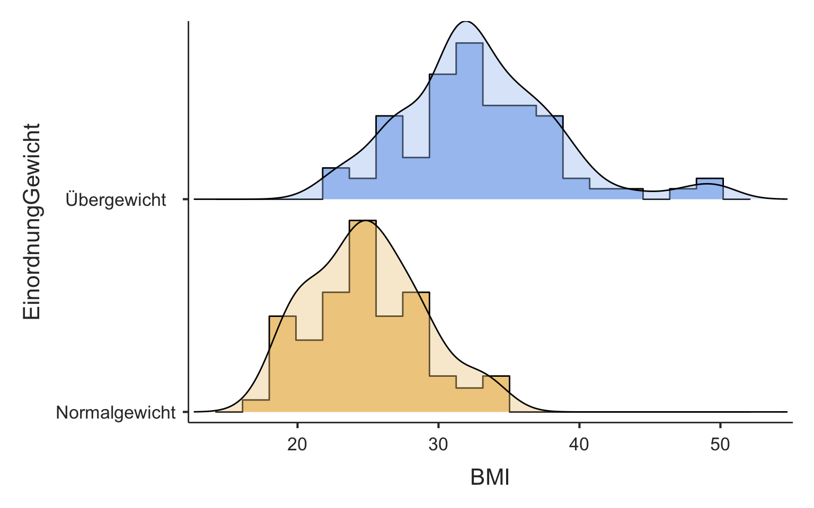

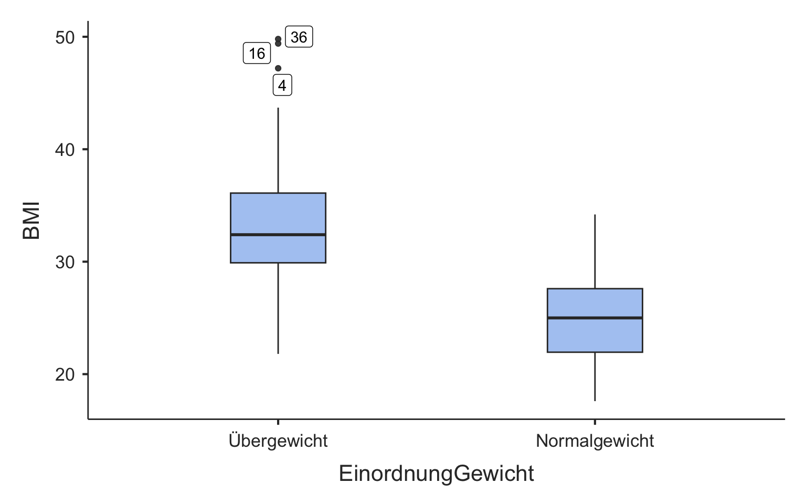

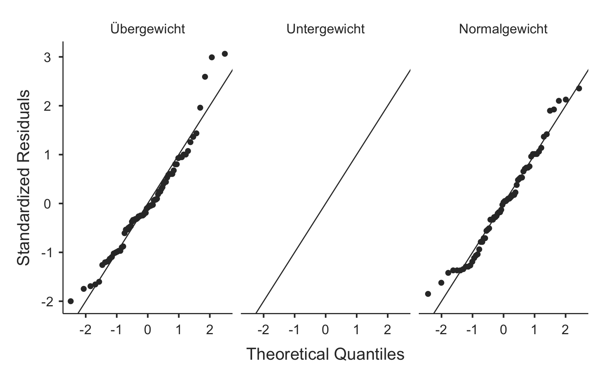

Es gibt 77 Beobachtungen für übergewichtige und 67 Beobachtungen für normalgewichtige Gewichtseinschätzungen. Anhand der Boxplots scheint es so, dass jene Personen, die sich als normalgewichtig eingeschätzt haben, auch einen tieferen BMI zu haben scheinen.

### Schliessende Statistik

Es handelt sich um kleine Umfänge (N \< 100) unabhängiger Daten. Die Annahmen Normalverteilung und Gleichheit der Varianzen müssen geprüft werden um über das geeignete Testverfahren zu entscheiden.

Die Verteilung wird über die Kennzahlen, Histogramm und QQ-Plot aus der deskriptiven Statistik beurteilt. Beim Vergleich von unabhängigen Gruppen muss die Normalverteilung in beiden Gruppen gegeben sein. Also muss die Voraussetzung in beiden Gruppen überprüft werden. In der Gruppe "Übergewicht" weist das Histogramm auf eine rechtsschiefe Verteilung hin, was ein Hinweis auf Abweichung von der Normalverteilung ist. In der Gruppe "Normalgewicht" hingegen, scheint die Verteilung recht symmetrisch zu sein. Die Asymmetrie bei der übergewichtigen Gruppe ist auch im Boxplot und den Lagekennzahlen erkennbar, mit den Ausreissern gegen oben und dem Mittelwert, welcher gegenüber dem Median durch die Ausreisser grösser ist. Der Wert für die Schiefe (Skewness) von der deskriptiven Statistik bestätigt die Eindrücke der Asymmetrie. Sie beträgt 0.73 für die übergewichtige und 0.34 für die normalgewichtige Gruppe. Betrachtet man den QQ-Plot der übergewichtigen Gruppe, weisen Abweichungen von der Linie am rechten oberen Ende auf eine Verletzung der Voraussetzung der Normalverteilung hin. Dies bestätigt auch der Shapiro-Wilk Test bei der deskriptiven Statistik, welcher für die übergewichtige Gruppe signifikant ist (p \< 0.05).

Da eine der Gruppen die Voraussetzung der Normalverteilung nicht zu erscheinen füllt, entscheiden wir uns also für ein nicht-parametrisches Testverfahren und verwenden den Mann-Whitney U Test für den Gruppenvergleich. Da man so oder so ein nicht-parametrisches Testverfahren anwendet wird die Voraussetzung der Gleichheit der Varianzen hinfällig, das dies nur beim parametrischen Testen relevant ist.

<details class="code-fold">
<summary>Code</summary>

``` r
results = ttestIS(formula = BMI ~ EinordnungGewicht, data = df2,
        welchs = TRUE,
        mann = TRUE,
        eqv = TRUE,
        meanDiff = TRUE,
        ci = TRUE)
results$ttest
```

</details>


     Independent Samples T-Test                                                                                                   
     ──────────────────────────────────────────────────────────────────────────────────────────────────────────────────────────── 
                                Statistic    df          p             Mean difference    SE difference    Lower       Upper      
     ──────────────────────────────────────────────────────────────────────────────────────────────────────────────────────────── 
       BMI    Student's t        9.797820    142.0000    < .0000001           7.955263        0.8119421    6.350206    9.560319   
              Welch's t          10.02287    136.9910    < .0000001           7.955263        0.7937114    6.385752    9.524773   
              Mann-Whitney U     595.0000                < .0000001           7.699990                     6.299943    9.299933   
     ──────────────────────────────────────────────────────────────────────────────────────────────────────────────────────────── 
       Note. Hₐ μ <sub>Group 1</sub> ≠ μ <sub>Group 2</sub>

<details class="code-fold">
<summary>Code</summary>

``` r
results$assum$eqv
```

</details>


     Homogeneity of Variances Test (Levene's)      
     ───────────────────────────────────────────── 
              F           df    df2    p           
     ───────────────────────────────────────────── 
       BMI    3.516039     1    142    0.0628311   
     ───────────────────────────────────────────── 
       Note. A low p-value suggests a
       violation of the assumption of equal
       variances

Die Mann-Whitney-U Teststatistik weist darauf hin, dass es einen signifikanten Unterschied im BMI zwischen den sich selbstständig als normal- oder übergewichtig einschätzenden Personen gibt (p \< 0.001). Man lehnt also die Nullhypothese ab und nimmt die Alternativhypothese an. Die normalgewichtigen Personen weisen im Mittel einen um 7.7 kg/m^2 geringeren BMI auf als die übergewichtigen Personen. Die normalgewichtigen Personen haben mit 95% Vertrauenswahrscheinlichkeit einen zwischen 6.3 kg/m^2 und 9.3 kg/m^2 geringeren BMI als übergewichtige Personen.

Möglicherweise begeht man einen Fehler 1. Art, mit dem man die Nullhypothese fälschlicherweise ablehnen würde. Diese Wahrscheinlichkeit entspricht gerade dem p-Wert und ist damit sehr klein. Es ist also sehr unwahrscheinlich, dass das vorliegende Testergebnis durch Zufall entstanden ist. Es ist anzunehmen, dass der Unterschied in Wirklichkeit tatsächlich vorliegt.

#### Bemerkungen zum statistischen Testverfahren

Vergleicht man die Resultate des nicht-parametrichen Mann-Whitney-U Test mit den parametrsichen Vergleich (Student's t), stellt man fest, dass dies nichts am statistischen Schluss und nur wenig am geschätzten Effekt ändert. Die Mittelwertsdifferenz wird nur wenig grösser geschätzt mit dem parametrsichen Verfahren. Das zeigt, dass die angenommene Abweichung von der Normalverteilung in der übergewichtigen Gruppe nicht so gravierend ist. Würde man davon absehen, nicht-parametrsich zu testen, müsste man die Gleichheit der Varianzen beurteilen. Anhand des nicht signifikanten Resultats des Levene-Test (p = 0.063 und damit p \> 0.05) kann man sagen, dass die Varianzen als gleich angenommen werden können. Also dürfte man, unter Annahme der Voraussetzung der Normalverteilung in beiden Gruppen, den Student's t-Test für den Zweigruppenvergleich anwenden. Wären die Varianzen nicht gleich, würde man den Welch's t-Test für den Zweigruppenvergleich anwenden.

## Aufgabe 2 - Zweigruppenvergleich abhängig (N \> 100)

Es soll untersucht werden ob sich das selbst eingeschätzte Körpergewicht vom gemessenen Körpergewicht unterscheidet. Es ist ein Signifikanzniveau von 0.05 anzunehmen.

Aufgaben:

-   Formulieren der Hypothesen
-   Deskriptive Statistik
    -   Zusammenfassende Beschreibung der Daten mit Kennzahlen
    -   Visualisierung
-   Schliessende Statistik
    -   Auswahl des statistischen Tests mit Begründung
    -   Interpretation
    -   Welchen Fehler könnte man bei der Testentscheidung begehen?
-   Nehme an du kennst lediglich die mittlere Differenz von 0.83 kg zwischen geschätztem und gemessenem Körpergewicht und den Standardfehler von 0.42 kg. Da es sich um eine grosse Stichprobe handelt kannst du die z-Verteilung verwenden (nicht die t-Verteilung). Berechne den z-Wert und den zweiseitigen p-Wert von Hand.

Die Hypothesen sind wie folgt:

-   H0: Das gemessene **Gewicht unterscheidet sich nicht** vom selbst geschätzten Körpergewicht.
-   H1: Das gemessene **Gewicht unterscheidet sich** vom selbst geschätzten Körpergewicht.

### Deskriptive Statistik

<details class="code-fold">
<summary>Code</summary>

``` r
descriptives(df1, vars(Koerpergewicht, GewichtSelf), sd = TRUE)
```

</details>


     DESCRIPTIVES

     Descriptives                                            
     ─────────────────────────────────────────────────────── 
                             Koerpergewicht    GewichtSelf   
     ─────────────────────────────────────────────────────── 
       N                                148            145   
       Missing                            2              5   
       Mean                        80.76689       79.81662   
       Median                      78.75000       77.11070   
       Standard deviation          20.93905       21.01586   
       Minimum                     45.20000       47.62720   
       Maximum                     154.2000       149.6855   
     ─────────────────────────────────────────────────────── 

Schaut man sich die deskriptive Statistik an (Mittelwert und Median), ist zu erwarten, dass sich das geschätzte nicht vom gemessenen Körpergewicht untnerscheidet. Denn das gemessene Körpergewicht ist Mittel um nur etwa 1 kg höher bei einer Streuung um 20 kg. Die Streuungskennzahlen und die Extremwerte liegen für beide Variablen ebenfalls im selben Bereich.

### Schliessende Statistik

Bei diesem Vergleich handelt es ich um abhängige Daten, da jede Person gemessen wurde und sich zusätzlich selbst geschätzt hat. Heisst, die Messwerte stammen jeweils von der gleichen Person. Aus der deskriptiven Statistik ist zu sehen, dass der Stichprobenumfang, mit 148 respektive 145 Beobachtungen pro Variable, deutlich mehr als 100 beträgt. Damit müssen wir die Voraussetzung der Normalverteilung der Differenzen nicht prüfen und dürfen direkt den t-Test für abhängige Daten anwenden.

<details class="code-fold">
<summary>Code</summary>

``` r
ttestPS(df1, pairs = list(list(i1 = 'Koerpergewicht', i2 = 'GewichtSelf')),
        meanDiff = T,
        ci = T,
        plots = T,
        effectSize = T)
```

</details>


     PAIRED SAMPLES T-TEST

     Paired Samples T-Test                                                                                                                                                              
     ────────────────────────────────────────────────────────────────────────────────────────────────────────────────────────────────────────────────────────────────────────────────── 
                                                       statistic    df          p            Mean difference    SE difference    Lower           Upper                    Effect Size   
     ────────────────────────────────────────────────────────────────────────────────────────────────────────────────────────────────────────────────────────────────────────────────── 
       Koerpergewicht    GewichtSelf    Student's t     1.975934    142.0000    0.0501004          0.8282534        0.4191706    -3.677174e-4    1.656875    Cohen's d      0.1652359   
     ────────────────────────────────────────────────────────────────────────────────────────────────────────────────────────────────────────────────────────────────────────────────── 
       Note. Hₐ μ <sub>Measure 1 - Measure 2</sub> ≠ 0

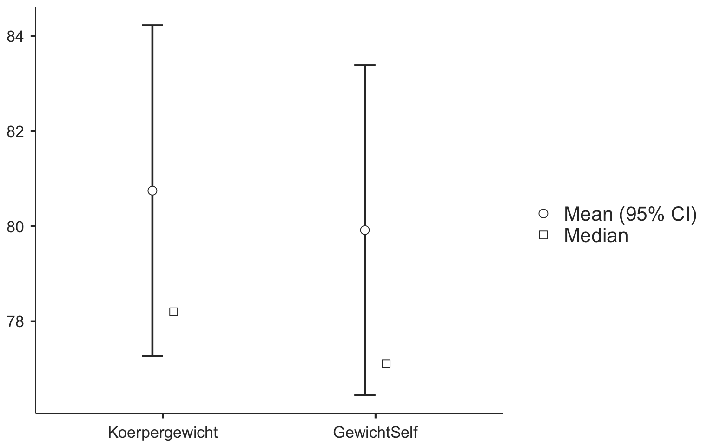

Der p-Wert liegt gerundet bei 0.05 und ist jedoch nicht kleiner als des Signifikanzniveaus von 0.05. Damit gibt es keinen signifikanten Unterschied zwischen dem gemessenen und dem geschätzten Körpergewicht. Die Nullhypothese wird nicht verworfen und als plausibel betrachtet. Es ist anzunehmen, dass es keinen Unterschied zwischen dem gemessenen und dem geschätzten Körpergewicht gibt. Der Punktschätzer für die mittlere Differenz zwischen gemessenem und geschätztem Körpergewicht beträgt 0.8 kg (gemessen ist im Mittel höher; siehe deskriptive Statistik). Das gemessene Körpergewicht unterscheidet sich mit einer Wahrscheinlichkeit von 95% zwischen 0 kg und 1.7 kg vom geschätzten Körpergewicht. Eine Differenz von Null ist im Vertrauensintervall drin. Das heisst, die Mittelwertsdifferenz könnte auch Null betragen, was den Entscheid stützt, dass die Nullhypthese als plausibel anzunehmen ist und sich die Gruppen nicht unterscheiden. Da die Null jedoch nur undeutlich im Vertrauensintervall drin ist, unterscheiden sich die Gruppen nur undeutlich nicht. Der Effekt zwischen Messung und Schätzung ist schwach, da die Effektstärke (Cohen's d) mit 0.16 unterhalb von 0.2 liegt (vgl. Handout *LE4_StatTest* Slide Nr. 40). Die Effektstärke von 0.17 beduetet, dass sich die Gruppenmittelwerte nur um 0.17 Standardabweichungen unterscheiden.

Möglicherweise begeht man einen Fehler 2. Art und behält die Nullhypothese fälschlicherweise bei. Das heisst, man würde nicht entdecken, dass sich das gemessene und geschätzte Körpergewicht im Mittel in Wirklichkeit unterscheiden.

Den z-Wert erhält man, indem man den beobachteten Effekt durch den zugehörigen Fehler teilt. Im vorliegenden Fall also die mittlere Differenz, dividiert durch den Standardfehler:

$$
z = \frac{0.83}{0.42} = 1.976
$$

Der zweiseitige p-Wert ist die Summe der Fläche unterhalb der z-Verteilung (Standardnormalverteilung) für $z \leq 1.97$ und $z \geq 1.97$:

<details class="code-fold">
<summary>Code</summary>

``` r
2*pnorm(-1.976, mean = 0, sd = 1)
```

</details>

    [1] 0.04815478

## Aufgabe 3 - Zweigruppenvergleich abhängig (N \< 100)

In Aufgabe 2 hat man gesehen, dass das sich das geschätzte nicht vom gemessenen Körpergewicht unterscheidet. Nun will man untersuchen ob das auch so ist, wenn man nur die Männer betrachtet.

Man wählt nur die männlichen Personen aus:

<details class="code-fold">
<summary>Code</summary>

``` r
df2 = filter(df1, Geschlecht == "m")
```

</details>

### Deskriptive Statistik

<details class="code-fold">
<summary>Code</summary>

``` r
descriptives(df2, vars(Koerpergewicht, GewichtSelf), sd = T)
```

</details>


     DESCRIPTIVES

     Descriptives                                            
     ─────────────────────────────────────────────────────── 
                             Koerpergewicht    GewichtSelf   
     ─────────────────────────────────────────────────────── 
       N                                 77             77   
       Missing                            2              2   
       Mean                        86.01818       85.38729   
       Median                      83.60000       81.19303   
       Standard deviation          20.27620       20.74908   
       Minimum                     52.40000       53.07031   
       Maximum                     154.2000       149.6855   
     ─────────────────────────────────────────────────────── 

Schaut man sich die deskriptive Statistik an (Mittelwert und Median), ist zu erwarten, dass sich das geschätzte nicht vom gemessenen Körpergewicht untnerscheidet. Denn das gemessene Körpergewicht ist Mittel um nur etwa 0.6 kg höher bei einer Streuung um 20 kg. Die Streuungskennzahlen und die Extremwerte liegen für beide Variablen ebenfalls im ähnlichen Bereich.

Da man nun weniger als 100 Bebachtungen hat muss man die Annhame der **Normalverteilung der Differenzen** berücksichtigen. Wichtig ist, dass sich beim Vergleich von abhängigen Daten, die Voraussetzung der Normalverteilung auf die Differenzen zwischen den Variablen und nicht auf die Variablen selbst bezieht. Um dies zu überprüfen müsste man nun also die Differenzen berechnen und diese einer neuen Variablen zuweisen, welche man anschliessend auf die Kriterien der Normalverteilung überprüft. Das ist etwas umständlich und geht in jamovi einfacher, indem man beim Zweigruppenvergleich in jamovi unter **Assumption Checks** die Hacken für *Normality test* und *Q-Q Plot* setzt.

<details class="code-fold">
<summary>Code</summary>

``` r
ttestPS(df2, pairs = list(list(i1 = 'Koerpergewicht', i2 = 'GewichtSelf')),
        wilcoxon = T,
        meanDiff = T,
        ci = T,
        plots = T,
        norm = T,
        qq = T)
```

</details>


     PAIRED SAMPLES T-TEST

     Paired Samples T-Test                                                                                                                                 
     ───────────────────────────────────────────────────────────────────────────────────────────────────────────────────────────────────────────────────── 
                                                       statistic    df          p            Mean difference    SE difference    Lower         Upper       
     ───────────────────────────────────────────────────────────────────────────────────────────────────────────────────────────────────────────────────── 
       Koerpergewicht    GewichtSelf    Student's t    0.2559242    74.00000    0.7987194          0.1790421        0.6995901     -1.214922     1.573006   
                                        Wilcoxon W      1458.000                0.8637375         0.04613330        0.6995901    -0.6201685    0.8073135   
     ───────────────────────────────────────────────────────────────────────────────────────────────────────────────────────────────────────────────────── 
       Note. Hₐ μ <sub>Measure 1 - Measure 2</sub> ≠ 0


     Normality Test (Shapiro-Wilk)                                     
     ───────────────────────────────────────────────────────────────── 
                                             W            p            
     ───────────────────────────────────────────────────────────────── 
       Koerpergewicht    -    GewichtSelf    0.7377508    < .0000001   
     ───────────────────────────────────────────────────────────────── 
       Note. A low p-value suggests a violation of the assumption
       of normality

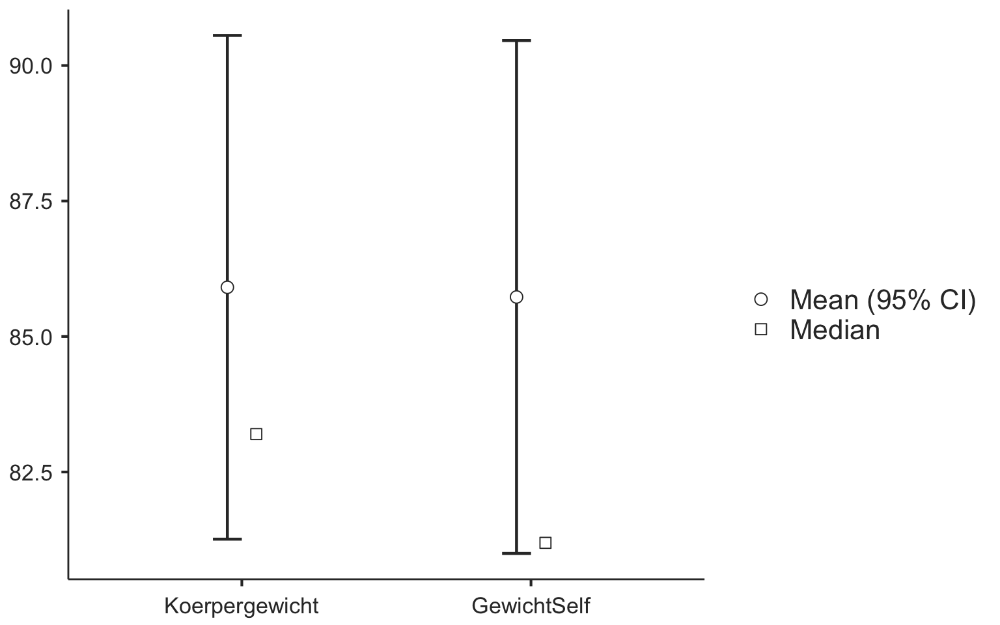

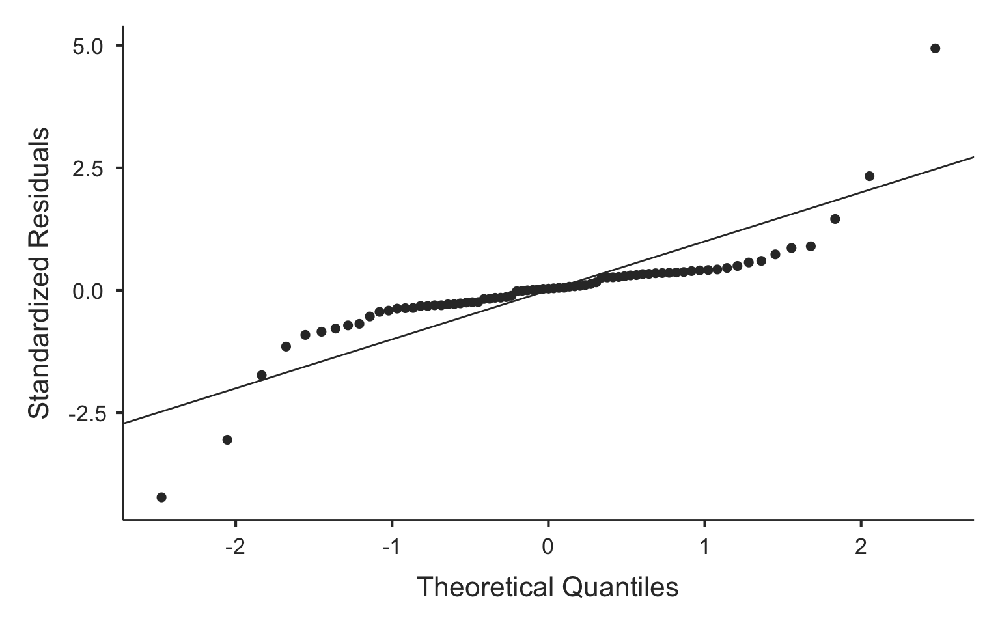

Der Shapiro-Wilk Normalitätstest (p \< 0.05) und der QQ-Plot weisen auf eine Verletzung der Voraussetzung der Normalverteilung hin. Man muss also den Wilcoxon-Test für den Zweigruppenvergleich anwenden. Die Differenz zwischen dem gemessenen und geschätzten Körpergewicht beträgt mit einer Vertrauenswahrscheinlichkeit von 95% zwischen -0.6 kg und 0.8 kg. Die Differenz liegt im Mittel bei 0.05 kg um welche das gemessene Körpergewicht höher ist als das geschätzte Körpergewicht. Der p-Wert ist nicht kleiner als 0.05 und die Null ist im Vertrauensintervall enthalten. Das heisst es könnte gut sein, dass die Mittelwertsdifferenz Null beträgt. Die Nullhypothese wird beibehalten und es kann gesagt werden, dass bei den Männern das gemessene Körpergewicht sich nicht vom geschätzten Körpergewicht unterscheidet. Wäre man von einer Normalverteilung der Differenzen ausgegangen und hätte parametrsich getestet, wäre man zum selben Schluss gekommen.

## Aufgabe 4 - Korrelation

In Aufgabe 3 hat man gesehen, dass sich das geschätzte Gewicht im Mittel nicht vom das gemessenen Gewicht unterscheidet. Nun soll mit einer Korrelationsanalyse untersucht werden ob beispielsweise schwere Personen sich auch effektiv schwerer schätzen. Heisst, man sucht nach einem Zusammenhang zwischen gemessenem und geschätztem Körpergewicht.

Im ersten Schritt müssen die Daten visualisiert werden um eine subjektive Einschätzung über einen möglichen Zusammenhang zu machen. Dazu eignet sich das Streudiagramm.

<details class="code-fold">
<summary>Code</summary>

``` r
ggplot(df1, aes(x = GewichtSelf, y = Koerpergewicht)) +
  geom_point() +
  labs(x = 'GewichtSelf (kg)', y = 'Körpergewicht (kg)')
```

</details>

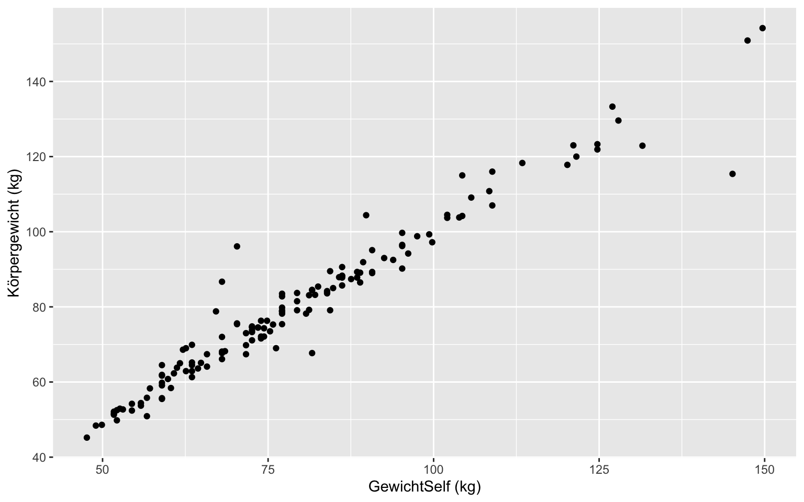

Im Streudiagramm ist ein deutlicher positiver linearer Zusammenhang zu erkennen. Wenn das Körpergewicht kleiner geschätzt wird, scheint es auch gemessen kleiner zu sein. Wenn das Körpergewicht grösser geschätzt wird, scheint es auch gemessen grösser zu sein. Visuell beurteilt scheint also ein recht starker Zusammenhang vorhanden zu sein, welcher linear beschrieben werden kann. Es macht also durchaus Sinn die Stärke des linearen Zusammenhangs mit dem Korrelationskoeffizienten zu quantifizieren.

In den Daten sind keine Ausreisser sichtbar, welche den Korrelationskoeffizienten offensichtlich beinflussen würden. Man kann davon ausgehen, dass der Korrelationskoeffizient nach Pearson gut dafür geeignet ist.

<details class="code-fold">
<summary>Code</summary>

``` r
corrMatrix(df1, vars = vars(GewichtSelf, Koerpergewicht),
           spearman = T,
           ci = T,
           sig = F)
```

</details>


     CORRELATION MATRIX

     Correlation Matrix                                                    
     ───────────────────────────────────────────────────────────────────── 
                                           GewichtSelf    Koerpergewicht   
     ───────────────────────────────────────────────────────────────────── 
       GewichtSelf       Pearson's r                 —                     
                         95% CI Upper                —                     
                         95% CI Lower                —                     
                         Spearman's rho              —                     
                                                                           
       Koerpergewicht    Pearson's r         0.9719765                 —   
                         95% CI Upper        0.9797995                 —   
                         95% CI Lower        0.9611833                 —   
                         Spearman's rho      0.9673711                 —   
     ───────────────────────────────────────────────────────────────────── 

Der Pearson Korrelationskoeffizient für den linearen Zusammenhang des geschätzen und gemessenen Körpergewichtes beträgt 0.972. Mit 95% Vertrauenswahrscheienlichkeit liegt der Korrelationskoeffizient der Population zwischen 0.961 und 0.980. Die Stärke des linearen Zusammenhang kann als stark bezeichnet werden da der Korrelationkoeffizient über 0.7 liegt (siehe Handout LE Slide Nr. 22). Der Korrelationskoeffizient nach Pearson ist positiv, also liegt ein starker positiver linearer Zusammenhang vor.

Zusätzlich wurde der Rangkorrelationskoeffizient nach Spearman berechnet und er unterscheidet sich praktisch nicht vom Korrelationkoeffizieten nach Pearson. Dass die Werte nahe beieinander liegen bestätigt die Einschätzung, dass es keine massgeblichen Ausreisser gibt welche den Korrelationskoeffizienten nach Pearson beinflussen könnten. Wäre dies der Fall würden sich die beiden Korrelationskoeffizienten deutlich unterscheiden.

## Aufgabe 5 - Regression

In Aufgabe 4 konnte festgestellt werden, dass es einen starken positiven linearen Zusammenhang zwischen dem geschätzten und dem gemessenen Körpergewicht gibt. Man will nun ein Modell berechnen, mit welchem das gemessene Körpergewicht basierend auf dem geschätzten Körpergewicht vorausgesagt, respektive der Zusammenhang beschrieben, werden kann.

Um die Aufgabe zu lösen, braucht man die einfache lineare Regression. "Einfach" darum, weil die Voraussage basierend auf einer Variablen gemacht wird (dem geschätzten Körpergewicht).

Im Unterschied zur Korrelationsanalyse, wird bei der linearen Regression ein Modell berechnet, welches die Daten beschreibt. Dabei muss zwischen abhängigen und unabhängigen Variablen unterschieden werden. Im vorliegenden Fall soll das wahre Körpergewicht (das gemessene) anhand des geschätzten Körpergewichtes vorausgesagt werden. Die Variable, welche das Modell voraussagt, bezeichnet man als abhängige Variable ("Dependent" in jamovi) und die Variable, welche zur Voraussage genutzt wird, bezeichnet man als unabhängige Variable ("Covariate" in jamovi).

<details class="code-fold">
<summary>Code</summary>

``` r
ggplot(df1, aes(x = GewichtSelf, y = Koerpergewicht)) +
  geom_point() +
  geom_smooth(method=lm , color="red", se=FALSE) +
  labs(x = 'GewichtSelf (kg)', y = 'Körpergewicht (kg)')
```

</details>

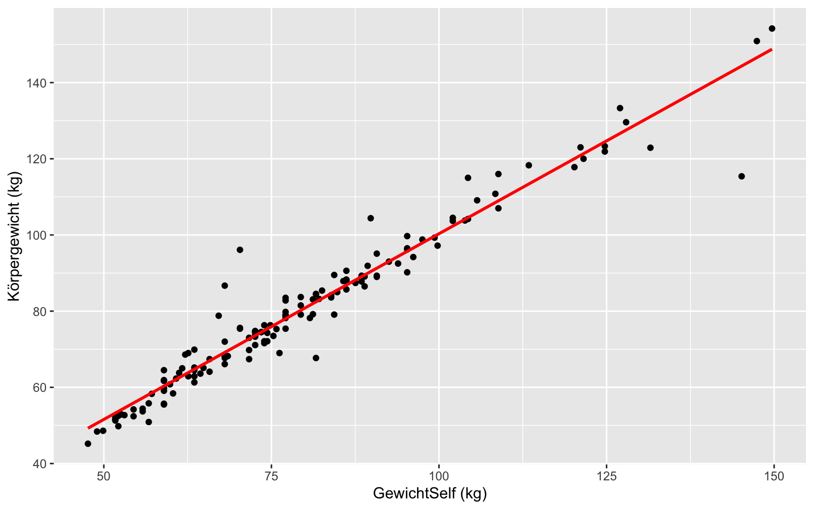

<details class="code-fold">
<summary>Code</summary>

``` r
linReg(data = df1, dep = Koerpergewicht, covs = GewichtSelf,
       blocks = list(list('GewichtSelf')),
       ci = T,
       qqPlot = T,
       resPlots = T)
```

</details>


     LINEAR REGRESSION

     Model Fit Measures                  
     ─────────────────────────────────── 
       Model    R            R²          
     ─────────────────────────────────── 
           1    0.9719765    0.9447383   
     ─────────────────────────────────── 
       Note. Models estimated using
       sample size of N=143


     MODEL SPECIFIC RESULTS

     MODEL 1

     Model Coefficients - Koerpergewicht                                                             
     ─────────────────────────────────────────────────────────────────────────────────────────────── 
       Predictor      Estimate     SE            Lower         Upper       t            p            
     ─────────────────────────────────────────────────────────────────────────────────────────────── 
       Intercept      2.8291586    1.64120966    -0.4154005    6.073718     1.723825     0.0869312   
       GewichtSelf    0.9749630    0.01985797     0.9357051    1.014221    49.096815    < .0000001   
     ─────────────────────────────────────────────────────────────────────────────────────────────── 


     ASSUMPTION CHECKS

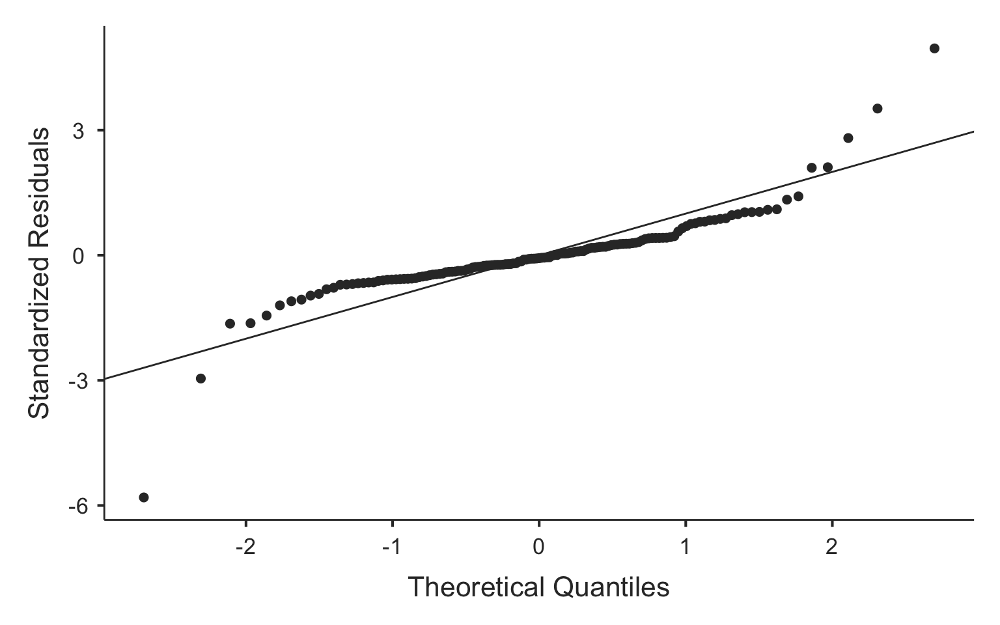

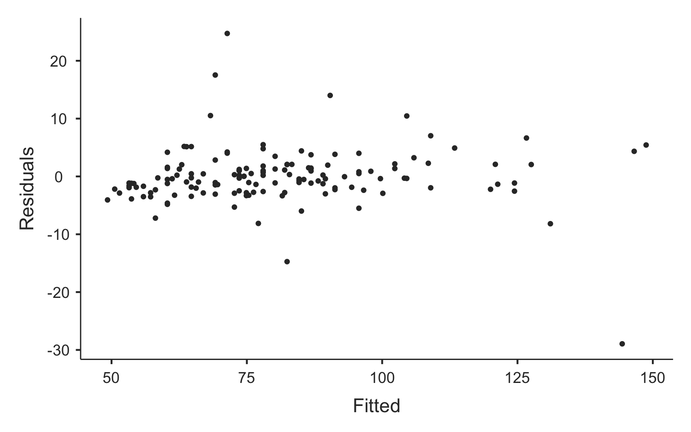

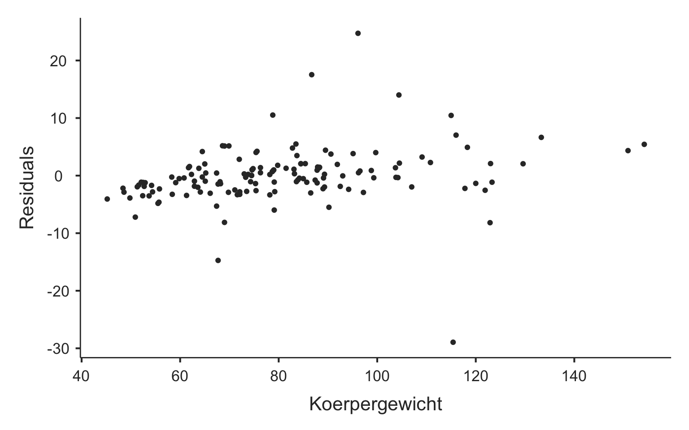

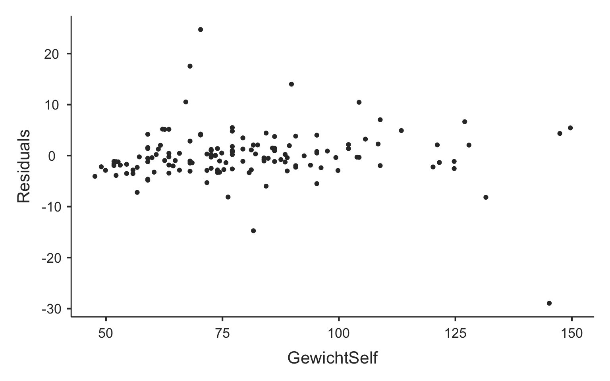

Die einfache lineare Regression liefert als Ergebnis die zwei nötigen Parameter um eine Gerade zu beschreiben (die Koeffizenten des Regressionsmodells), den Achsenabschnitt (Intercept) und die Steigung. Die Steigung ist benannt mit der unabhängigen Variablen, hier *GewichtSelf*. Das Regressionsmodell hat also mit den auf zwei Nachkommastelle gerundeten Koeffizienten folgende Form:

$$
Koerpergewicht = 2.83 + 0.98*GewichtSelf
$$

### Interpretation der Koeffizienten

Der Achsenabschnitt sagt, wie schwer eine Person wäre, die sich 0 kg schätzen würde. Dies zu interpretieren ist natürlich nicht sinnvoll, da niemand 0 kg wiegt.

Die Steigung sagt, um wie viel die abhängige Variable, pro Zunahme der unabhängigen Variable um eine Einheit, zunimmt. Für das vorliegende Beispiel also zum Beispiel, um wie viel das gemessene Körpergewicht zunimmt, wenn das geschätzte Körpergewicht um ein Kilogramm zunimmt. Würde das gemessene Körpergewicht gleich viel zunehmen wie das geschätzte Körpergewicht wäre die Steigung 1. Das Modell ist also plausibel, denn die Steigung von 1 ist im Vertrauensintervall enthalten.

### Vorhersage

Mit dem Modell lässt sich nun das tatsächliche (d.h. gemessene) Körpergewicht voraussagen wenn man das geschätzte Körpergewicht kennt. Gehen wir davon aus, eine Person schätzt sich auf 68 kg. Das Modell lässt uns nun voraussagen wie schwer die Person tatsächlich ist, indem man die 68 kg in die obige Gleichung einsetzt:

$$
Koerpergewicht = 2.83 + 0.98*68
$$

<details class="code-fold">
<summary>Code</summary>

``` r
2.83 + 0.98*68
```

</details>

    [1] 69.47

Wenn eine Person sich also auf 68 kg schätzt, wird sie laut dem Modell 69.47 kg wiegen.

### Modellprüfung

Es ist wichtig zu bedenken, dass es sich um ein Modell handelt und ein Modell immer ein vereinfachtes Abbild der Realität darstellt. Das Modell beschreibt den linearen Zusammenhang so, wie er im Mittel aufgrund der vorliegenden Daten in der Population erwartet werden kann. Wie bei allem was in der schliessenden Statistik gemacht wird, handelt es sich bei den Koeffizienten des Modells um Schätzer, welche fehlerbehaftet sind, da man ja nicht die gesamte Population kennt. Das wiederspiegelt sich in den jeweiligen Vertrauensintervallen. Der Achsenabschnitt des Modells der Population liegt mit 95% Vertrauenswahrscheinlichkeit zwischen -0.42 und 6.07 und die die Steigung mit 95% Vertrauenswahrscheinlichkeit zwischen 0.94 und 1.01.

Mit den Vertrauensintervallen bewegt man sich natürlich in der schliessenden Statistik und damit auch bei der statistischen Signifikanz. Damit lässt sich also Prüfen ob ein Koeffizient signifikant unterschiedlich von Null ist. Wie weiter oben bei der Interpretation der Modellkoeffizienten besprochen, macht es im Beispiel keinen Sinn, dies für den Achsenabschnitt zu interpretieren, da es unmöglich ist, dass eine Person Null Kilogramm wiegt. Hingegen lässt sich die Prüfung der Steigung auf den Unterschied zu Null interpretierten. Die Null ist deutlich nicht im Vertrauensintervall enthalten und der p-Wert liegt deutlich unterhalb des Signifikanzniveaus. Daher ist es sehr unwahrscheinlich, dass die Steigung Null beträgt und es damit sehr wahrscheinlich einen **linearen Zusammenahng** zwischen dem geschätzten und gemessenen Körpergewicht gibt.

### Wie gut "passt" Modell?

Wie im vorherigen Abschnitt erwähnt, ist ein Modell immer eine Vereinfachung. Somit muss beurteilt werden wie gut das Modell zu den Daten passt. Die geschieht übers Bestimmtheitsmass $R^2$, welches 0.95 beträgt. Dieser Wert besagt, dass das lineare Modell 95% der Variation des gemessenen Körpergewichts erklären kann. Also den Grossteil und damit passt das Modell sehr gut. Erstrebenswert sind natürlich 100%, denn in diesem Fall wäre der Zusammenhang perfekt linear (alle Punkte auf einer Linie) und das Modell könnte die Daten komplett erklären. Ist $R^2 > 0.5$ kann man von einem starken linearen Zusammenhang sprechen (siehe Handout LE5 Slide Nr. 38). Das ist hier der Fall und der Zusammenhang kann als sehr stark bezeichnet werden. Dies widerspiegelt sich im Wert $R = 0.97$, welcher bei der linearen Regression gerade dem Pearson-Korrelationskoeffizienten entspricht. Der Wert ist der selbe wie bei Aufgabe 4 und man kommt zum Schluss, dass es sich um einen starken positiven linearen Zusammenhang zwischen dem geschätzen und gemessenen Körpergewicht handelt.

### Prüfung der Annahmen

Wir haben gelernt, dass die Schlüsse aus inferenzstatistsichen Verfahren nur unter gewissen Voraussetzungen valide sind (z.B. Annahme der Normalverteilung in beiden Gruppen beim parametrsichen Vergleich von zwei unabhängigen Gruppen). Ähnliche Voraussetzungen gelten auch bei der linearen Regression und müssen zur weiteren Beurteilung der Güte des Modells berücksichtigt werden.

#### Linearer Zusammenhang?

Zuerst muss natürlich visuell geprüft werden ob es sich überhauput um einen möglichen linearen Zusamemnhang handelt. Das ist laut dem Streudiagramm offensichtlich der Fall (man kann sich sehr gut eine Gerade in die Punktewolke "hineindenken"). Die lineare Regression scheint also für den Beschrieb des Zusammenhangs geeignet zu sein.

#### Normalverteilung der Residuen

Die Residuen (vgl. Handout LE5 Slide Nr. 37), also alle Abweichungen der Daten von der Regressionsgeraden, sollten normalverteilt sein. Dies wird über den QQ-Plot beurteilt und sieht für unser Beispiel nicht ganz so optimal aus.

#### Konstante Variabilität der Residuen

Die Residuen sollten keine Streuungsmuster entlang der Regressionslinie vorweisen. Das heisst, sie sollten entlang der Regressionsgeraden immer gleichmässig um die Gerade herum gestreut sein. Dies überprüft man am besten mit dem Diagramm wo die Residuals gegenüber den Fitted (Werten des Modells) aufgetragen sind. Die Bedingung scheint für unser Beispiel gut erfüllt, denn die Streuung scheint ziemlich kosntant über den Wertebereich der Werte des Modells.

## Literatur

McClure, Scott T., Haley Schlechter, Susan Oh, Karen White, Beiwen Wu, Scott Jordan Pilla, Nisa M. Maruthur, Hsin-Chieh Yeh, Edgar R. Miller, and Lawrence J. Appel. 2020. "Dietary Intake of Adults with and Without Diabetes: Results from NHANES 2013-2016." *BMJ Open Diabetes Research & Care* 8 (October). <https://doi.org/10.1136/bmjdrc-2020-001681>.
