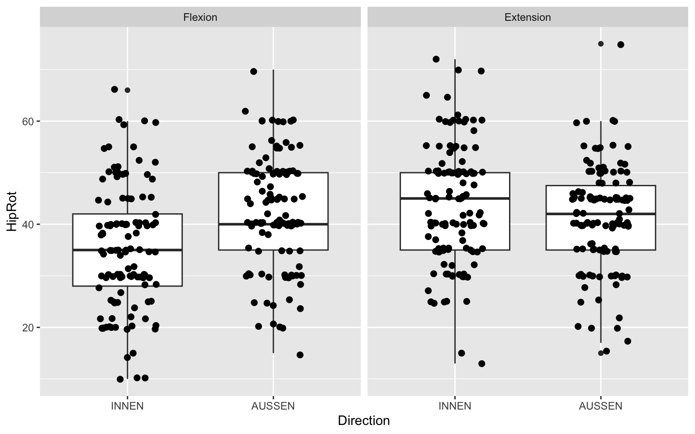
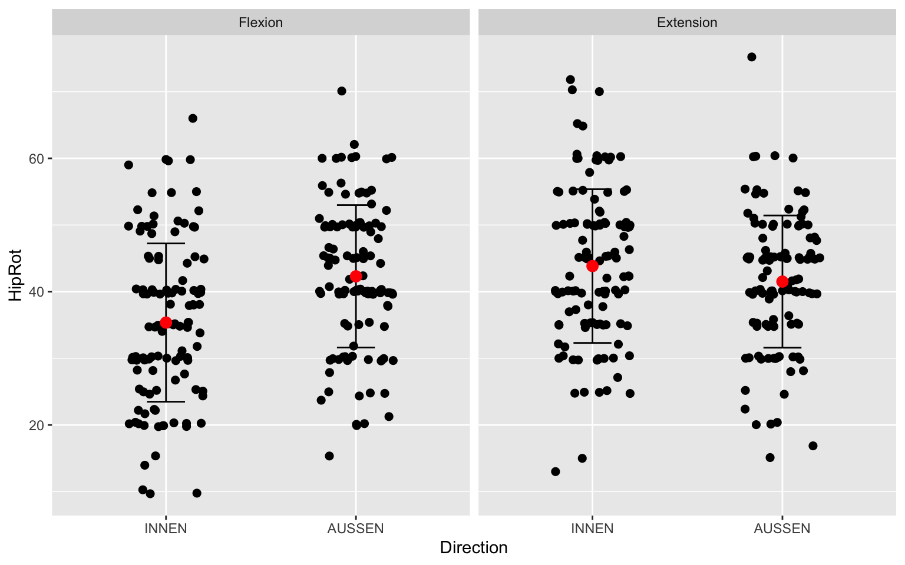

<link href="index_files/libs/htmltools-fill-0.5.8.1/fill.css" rel="stylesheet" />
<script src="index_files/libs/htmlwidgets-1.6.4/htmlwidgets.js"></script>
<script src="index_files/libs/plotly-binding-4.10.4/plotly.js"></script>
<script src="index_files/libs/typedarray-0.1/typedarray.min.js"></script>
<script src="index_files/libs/jquery-3.5.1/jquery.min.js"></script>
<link href="index_files/libs/crosstalk-1.2.1/css/crosstalk.min.css" rel="stylesheet" />
<script src="index_files/libs/crosstalk-1.2.1/js/crosstalk.min.js"></script>
<link href="index_files/libs/plotly-htmlwidgets-css-2.11.1/plotly-htmlwidgets.css" rel="stylesheet" />
<script src="index_files/libs/plotly-main-2.11.1/plotly-latest.min.js"></script>


## Autor

Patric Eichelberger, <patric.eichelberger@bfh.ch>

## Init

<details class="code-fold">
<summary>Code</summary>

``` r
library(tidyverse)
library(plotly)
library(data.table) # provides fread()
```

</details>

## Import hip data set

<details class="code-fold">
<summary>Code</summary>

``` r
filepath <- file.path("HipData.csv")
df <- fread(filepath)
head(df)
```

</details>

           ID HipRot_INNEN_Flexion HipRot_AUSSEN_Flexion HipRot_INNEN_Extension
       <char>                <int>                 <int>                  <int>
    1:   hip1                   30                    50                     25
    2:   hip2                   44                    32                     42
    3:   hip3                   40                    50                     38
    4:   hip4                   28                    28                     32
    5:   hip5                   15                    30                     15
    6:   hip6                   20                    30                     40
       HipRot_AUSSEN_Extension
                         <int>
    1:                      40
    2:                      36
    3:                      51
    4:                      28
    5:                      30
    6:                      45

## Box plots to summarise data

Using R-base plotting:

<details class="code-fold">
<summary>Code</summary>

``` r
label = c("INNEN Flex", "AUSSEN Flex", "INNEN Ext", "AUSSEN Ext")
boxplot(df$HipRot_INNEN_Flexion,
        df$HipRot_AUSSEN_Flexion,
        df$HipRot_INNEN_Extension,
        df$HipRot_AUSSEN_Extension,
        names = label,
        ylab = "Hip rotation (deg)")
```

</details>


To achieve something similar with ggplot:

<details class="code-fold">
<summary>Code</summary>

``` r
ggplot(data = df, aes(y = HipRot_INNEN_Flexion)) +
  geom_boxplot()
```

</details>


The problem is, that we would need to make four separate plots, since we can only provide one y-axis variable to ggplot. This is far away from convienient.

To use the strengts of ggplot, we need to make data tidy. E.g. we want want on row per observation in the data set. We make grouping variables for the suffixes in the variable names.

-   Direction: AUSSEN/INNEN
-   ASTE (Ausgangsstellung): Flexion/Extension

Don't do that by hand and instead use the `pivot_longer` function from the `tidyr` package, which is part of the `tidyverse` package (https://tidyverse.tidyverse.org/), a package for data science in R. `tidyverse` contains the data science packages

-   [ggplot2](https://ggplot2.tidyverse.org/), for data visualisation.
-   [dplyr](https://dplyr.tidyverse.org/), for data manipulation.
-   [tidyr](https://tidyr.tidyverse.org/), for data tidying.
-   [readr](https://readr.tidyverse.org/), for data import.
-   [purrr](https://purrr.tidyverse.org/), for functional programming.
-   [tibble](https://tibble.tidyverse.org/), for tibbles, a modern re-imagining of data frames.
-   [stringr](https://stringr.tidyverse.org/), for strings.
-   [forcats](https://forcats.tidyverse.org/), for factors.
-   [lubridate](https://lubridate.tidyverse.org/), for date/times.

For each of those packages, there are cheatsheets to easy the daily use. Very helpful to learn how to work with those packages is the book R for Data Science (2e) from Hadley Wickham et al. available at <https://r4ds.hadley.nz/>.

<details class="code-fold">
<summary>Code</summary>

``` r
dflong <- df %>% pivot_longer(
  cols = -c("ID"),
  names_to = c(".value", "Direction", "ASTE"),
  names_pattern = ("(.*)_(.*)_(.*)")
)
dflong$Direction <- as_factor(dflong$Direction)
dflong$ASTE <- as_factor(dflong$ASTE)
head(dflong)
```

</details>

    # A tibble: 6 × 4
      ID    Direction ASTE      HipRot
      <chr> <fct>     <fct>      <int>
    1 hip1  INNEN     Flexion       30
    2 hip1  AUSSEN    Flexion       50
    3 hip1  INNEN     Extension     25
    4 hip1  AUSSEN    Extension     40
    5 hip2  INNEN     Flexion       44
    6 hip2  AUSSEN    Flexion       32

<details class="code-fold">
<summary>Code</summary>

``` r
str(dflong)
```

</details>

    tibble [496 × 4] (S3: tbl_df/tbl/data.frame)
     $ ID       : chr [1:496] "hip1" "hip1" "hip1" "hip1" ...
     $ Direction: Factor w/ 2 levels "INNEN","AUSSEN": 1 2 1 2 1 2 1 2 1 2 ...
     $ ASTE     : Factor w/ 2 levels "Flexion","Extension": 1 1 2 2 1 1 2 2 1 1 ...
     $ HipRot   : int [1:496] 30 50 25 40 44 32 42 36 40 50 ...

Create the boxplots with ggplot. ggplot follows a layered approach:

    graph = data + coordinate system + plot

The following just creates an axes without plotting anything.

<details class="code-fold">
<summary>Code</summary>

``` r
ggplot(data = dflong, aes(x = Direction, y = HipRot))
```

</details>


We need to tell ggplot to make box plots out from the provided data

<details class="code-fold">
<summary>Code</summary>

``` r
ggplot(data = dflong, aes(x = Direction, y = HipRot)) +
geom_boxplot()
```

</details>


The problem is now that we collapsed the ASTEs in those two boxplots. An approach is to input only a data frame with either Flexion or Extension data an make separate figures. To select a subset of rows in a data frame, we use here `filter()` from the `dplyr` package.

<details class="code-fold">
<summary>Code</summary>

``` r
dfp <- filter(dflong, ASTE == "Flexion")
ggplot(data = dfp, aes(x = Direction, y = HipRot)) +
  geom_boxplot()
```

</details>


REMARK about piping operations: Instead of first allocating a sub-dataset to a variable we can achieve the same with less typing when using the piping operator `%>%`:

<details class="code-fold">
<summary>Code</summary>

``` r
dflong %>% 
  filter(ASTE == "Flexion") %>%
  ggplot(aes(x = Direction, y = HipRot)) +
  geom_boxplot()
```

</details>


<details class="code-fold">
<summary>Code</summary>

``` r
dflong %>% 
  filter(ASTE == "Extension") %>%
  ggplot(aes(x = Direction, y = HipRot)) +
  geom_boxplot()
```

</details>


We now generated two separate figures for the two ASTEs. However, this is still not very convenient, since we repeat our code and we don't have the same y-axis limits to compare the data summaries. This is where the strengths of ggplot come into play. First, lets differentiate the ASTEs by different colors:

<details class="code-fold">
<summary>Code</summary>

``` r
dflong %>% 
  ggplot(aes(x = Direction, y = HipRot, color = ASTE)) +
  geom_boxplot()
```

</details>


We could also plot into separate axes in subfigures using `facet_wrap` or `facet_grid`. However, that this works we need to take care that the grouping variables are of the type factor.

<details class="code-fold">
<summary>Code</summary>

``` r
dflong %>% 
  ggplot(aes(x = Direction, y = HipRot)) +
  geom_boxplot() +
  facet_wrap(vars(ASTE))
```

</details>


We could also wrap the variable `Direction`:

<details class="code-fold">
<summary>Code</summary>

``` r
dflong %>% 
  ggplot(aes(y = HipRot)) +
  geom_boxplot() +
  facet_grid(rows = vars(Direction), cols = vars(ASTE))
```

</details>


We might also add single data points to the boxplot

<details class="code-fold">
<summary>Code</summary>

``` r
dflong %>% 
  ggplot(aes(x = Direction, y = HipRot)) +
  geom_boxplot() +
  geom_point(
    position = position_jitter(width = 0.2), # add jitter for better visibility
    size = 2) +
  facet_wrap(vars(ASTE))
```

</details>



## Dot plots with summary statistics

We need first to compute the summary statistics we want to add to the plot.

<details class="code-fold">
<summary>Code</summary>

``` r
means <- dflong %>%
  group_by(Direction, ASTE) %>%
  summarise_if(is.numeric, mean, na.rm = T) # calculate means
sds <- dflong %>%
  group_by(Direction, ASTE) %>%
  summarise_if(is.numeric, list(sd = sd), na.rm = T) # calculate standard deviations
summary_stats <- left_join(means, sds) # join into summary data frame

dflong %>% 
  ggplot(aes(x = Direction, y = HipRot)) +
  geom_point(
    position = position_jitter(width = 0.2), # add jitter for better visibility
    size = 2) +
  geom_errorbar(
    data = summary_stats,
    aes(x = Direction,
        ymin = HipRot - sd,
        ymax = HipRot + sd),
    width = 0.2
  ) +
  geom_point(
    data = summary_stats,
    aes(x = Direction, y = HipRot),
    color = "red",
    size = 3
  ) +
  facet_wrap(vars(ASTE))
```

</details>



### Error in ChatGPT code

Side mark: ChatGPT proposal produces an error when trying to plot the error bar. Seemingly, the y-variable must be named the same in the global data frame provided to ggplot and in the summary data frame.

<details class="code-fold">
<summary>Code</summary>

``` r
# Create a sample dataset (replace this with your own data)
set.seed(123)
data <- data.frame(
  Group = rep(c("A", "B", "C"), each = 30),
  Value = c(rnorm(30, mean = 20, sd = 5),
            rnorm(30, mean = 25, sd = 5),
            rnorm(30, mean = 18, sd = 4))
)

# Calculate mean and standard deviation for each group
summary_stats <- data %>%
  group_by(Group) %>%
  summarise(
    Mean = mean(Value),
    SD = sd(Value)
  )

# Create the dot plot
ggplot(data = data, aes(x = Group, y = Value)) +
  geom_point(position = position_jitter(width = 0.2), size = 2) +  # Add jitter for better visibility
  ############ produces error ##############
  # geom_errorbar(
  #   data = summary_stats,
  #   aes(x = Group, ymin = Mean - SD, ymax = Mean + SD),
  #   width = 0.2
  # ) +
  ##########################################
  geom_point(
    data = summary_stats,
    aes(x = Group, y = Mean),
    color = "red",
    size = 3
  ) +
  labs(title = "Dot Plot with Mean and SD") +
  theme_minimal()
```

</details>


## Scatter plots and linear models

We like to look at the relation between hip internal rotation in flexion and extension. A linear model can directly be added to the plot by `geom_smooth()`.

<details class="code-fold">
<summary>Code</summary>

``` r
ggplot(df, aes(x = HipRot_INNEN_Flexion, y = HipRot_INNEN_Extension)) +
  geom_point() +
  geom_smooth(method=lm) +
  labs(x = "Hip int rot flexion (deg)", y = "Hip int rot extension (deg)")
```

</details>


<details class="code-fold">
<summary>Code</summary>

``` r
# ggsave("output/Hip_IntFlex_vs_IntExt.png",
#        width = 10, height = 10 , units = "cm")
# ggsave("output/Hip_IntFlex_vs_IntExt.eps", device = cairo_ps,
#        width = 10, height = 10 , units = "cm")
```

</details>

We might also like to add prediction intervals. For that we need the linear model and calculate the prediction errors first.

<details class="code-fold">
<summary>Code</summary>

``` r
mdl <- lm(HipRot_INNEN_Extension ~ HipRot_INNEN_Flexion, data = df)
print(mdl)
```

</details>


    Call:
    lm(formula = HipRot_INNEN_Extension ~ HipRot_INNEN_Flexion, data = df)

    Coefficients:
             (Intercept)  HipRot_INNEN_Flexion  
                 23.9797                0.5616  

<details class="code-fold">
<summary>Code</summary>

``` r
summary(mdl)
```

</details>


    Call:
    lm(formula = HipRot_INNEN_Extension ~ HipRot_INNEN_Flexion, data = df)

    Residuals:
         Min       1Q   Median       3Q      Max 
    -20.3208  -6.3351  -0.2119   5.5560  29.1720 

    Coefficients:
                         Estimate Std. Error t value Pr(>|t|)    
    (Intercept)          23.97970    2.75463   8.705 2.66e-14 ***
    HipRot_INNEN_Flexion  0.56161    0.07388   7.601 8.63e-12 ***
    ---
    Signif. codes:  0 '***' 0.001 '**' 0.01 '*' 0.05 '.' 0.1 ' ' 1

    Residual standard error: 9.448 on 115 degrees of freedom
      (7 observations deleted due to missingness)
    Multiple R-squared:  0.3344,    Adjusted R-squared:  0.3286 
    F-statistic: 57.78 on 1 and 115 DF,  p-value: 8.63e-12

<details class="code-fold">
<summary>Code</summary>

``` r
summarydf <- summary(mdl)
coeffci <- confint(mdl)

newx <- seq(min(df$HipRot_INNEN_Flexion, na.rm = TRUE),
            max(df$HipRot_INNEN_Flexion, na.rm = TRUE),
            by = 0.1)
predint <- predict(mdl,
                   newdata = data.frame(HipRot_INNEN_Flexion = newx),
                   interval = "prediction")
predint <- as_tibble(predint)
predint$newx <- newx
ggplot(df, aes(x = HipRot_INNEN_Flexion, y = HipRot_INNEN_Extension)) +
  geom_point() +
  geom_smooth(method=lm) +
  geom_line(aes(x = newx, y = lwr), predint, color = "red", linetype = "dashed") +
  geom_line(aes(x = newx, y = upr), predint, color = "red", linetype = "dashed") +
  labs(x = "Hip int rot flexion (deg)", y = "Hip int rot extension (deg)")
```

</details>


<details class="code-fold">
<summary>Code</summary>

``` r
# ggsave("output/Hip_IntFlex_vs_IntExt_predict.png",
#        width = 10, height = 10 , units = "cm")
# ggsave("output/Hip_IntFlex_vs_IntExt_predict.eps", device = cairo_ps,
#        width = 10, height = 10 , units = "cm")
```

</details>

## Further data exploration

We might need to identify IDs in the visualisation. This can be achieved by coloring the ID during plotting. For better visibility we only choose a subset of the data.

<details class="code-fold">
<summary>Code</summary>

``` r
df %>% filter(ID == "hip1" | ID == "hip2" | ID == "hip3") %>%
ggplot(aes(x = HipRot_INNEN_Flexion, y = HipRot_INNEN_Extension, color = ID)) +
  geom_point() +
  labs(x = "Hip int rot flexion (deg)", y = "Hip int rot extension (deg)")
```

</details>


For further exploration we could add interactivity to the plot by `ggplotly`

<details class="code-fold">
<summary>Code</summary>

``` r
p <- df %>% filter(ID == "hip1" | ID == "hip2" | ID == "hip3") %>%
ggplot(aes(x = HipRot_INNEN_Flexion, y = HipRot_INNEN_Extension, color = ID)) +
  geom_point() +
  labs(x = "Hip int rot flexion (deg)", y = "Hip int rot extension (deg)")
ggplotly(p)
```

</details>
<div class="plotly html-widget html-fill-item" id="htmlwidget-52d82635d988c6e12f4c" style="width:768px;height:480px;"></div>
<script type="application/json" data-for="htmlwidget-52d82635d988c6e12f4c">{"x":{"data":[{"x":[30],"y":[25],"text":"HipRot_INNEN_Flexion: 30<br />HipRot_INNEN_Extension: 25<br />ID: hip1","type":"scatter","mode":"markers","marker":{"autocolorscale":false,"color":"rgba(248,118,109,1)","opacity":1,"size":5.6692913385826778,"symbol":"circle","line":{"width":1.8897637795275593,"color":"rgba(248,118,109,1)"}},"hoveron":"points","name":"hip1","legendgroup":"hip1","showlegend":true,"xaxis":"x","yaxis":"y","hoverinfo":"text","frame":null},{"x":[44],"y":[42],"text":"HipRot_INNEN_Flexion: 44<br />HipRot_INNEN_Extension: 42<br />ID: hip2","type":"scatter","mode":"markers","marker":{"autocolorscale":false,"color":"rgba(0,186,56,1)","opacity":1,"size":5.6692913385826778,"symbol":"circle","line":{"width":1.8897637795275593,"color":"rgba(0,186,56,1)"}},"hoveron":"points","name":"hip2","legendgroup":"hip2","showlegend":true,"xaxis":"x","yaxis":"y","hoverinfo":"text","frame":null},{"x":[40],"y":[38],"text":"HipRot_INNEN_Flexion: 40<br />HipRot_INNEN_Extension: 38<br />ID: hip3","type":"scatter","mode":"markers","marker":{"autocolorscale":false,"color":"rgba(97,156,255,1)","opacity":1,"size":5.6692913385826778,"symbol":"circle","line":{"width":1.8897637795275593,"color":"rgba(97,156,255,1)"}},"hoveron":"points","name":"hip3","legendgroup":"hip3","showlegend":true,"xaxis":"x","yaxis":"y","hoverinfo":"text","frame":null}],"layout":{"margin":{"t":27.68949771689498,"r":7.3059360730593621,"b":41.643835616438366,"l":37.260273972602747},"plot_bgcolor":"rgba(235,235,235,1)","paper_bgcolor":"rgba(255,255,255,1)","font":{"color":"rgba(0,0,0,1)","family":"","size":14.611872146118724},"xaxis":{"domain":[0,1],"automargin":true,"type":"linear","autorange":false,"range":[29.300000000000001,44.700000000000003],"tickmode":"array","ticktext":["30","35","40"],"tickvals":[30,35,40],"categoryorder":"array","categoryarray":["30","35","40"],"nticks":null,"ticks":"outside","tickcolor":"rgba(51,51,51,1)","ticklen":3.6529680365296811,"tickwidth":0.66417600664176002,"showticklabels":true,"tickfont":{"color":"rgba(77,77,77,1)","family":"","size":11.68949771689498},"tickangle":-0,"showline":false,"linecolor":null,"linewidth":0,"showgrid":true,"gridcolor":"rgba(255,255,255,1)","gridwidth":0.66417600664176002,"zeroline":false,"anchor":"y","title":{"text":"Hip int rot flexion (deg)","font":{"color":"rgba(0,0,0,1)","family":"","size":14.611872146118724}},"hoverformat":".2f"},"yaxis":{"domain":[0,1],"automargin":true,"type":"linear","autorange":false,"range":[24.149999999999999,42.850000000000001],"tickmode":"array","ticktext":["25","30","35","40"],"tickvals":[25,30,35,40],"categoryorder":"array","categoryarray":["25","30","35","40"],"nticks":null,"ticks":"outside","tickcolor":"rgba(51,51,51,1)","ticklen":3.6529680365296811,"tickwidth":0.66417600664176002,"showticklabels":true,"tickfont":{"color":"rgba(77,77,77,1)","family":"","size":11.68949771689498},"tickangle":-0,"showline":false,"linecolor":null,"linewidth":0,"showgrid":true,"gridcolor":"rgba(255,255,255,1)","gridwidth":0.66417600664176002,"zeroline":false,"anchor":"x","title":{"text":"Hip int rot extension (deg)","font":{"color":"rgba(0,0,0,1)","family":"","size":14.611872146118724}},"hoverformat":".2f"},"shapes":[{"type":"rect","fillcolor":null,"line":{"color":null,"width":0,"linetype":[]},"yref":"paper","xref":"paper","x0":0,"x1":1,"y0":0,"y1":1}],"showlegend":true,"legend":{"bgcolor":"rgba(255,255,255,1)","bordercolor":"transparent","borderwidth":1.8897637795275593,"font":{"color":"rgba(0,0,0,1)","family":"","size":11.68949771689498},"title":{"text":"ID","font":{"color":"rgba(0,0,0,1)","family":"","size":14.611872146118724}}},"hovermode":"closest","barmode":"relative"},"config":{"doubleClick":"reset","modeBarButtonsToAdd":["hoverclosest","hovercompare"],"showSendToCloud":false},"source":"A","attrs":{"1710a774ab610":{"x":{},"y":{},"colour":{},"type":"scatter"}},"cur_data":"1710a774ab610","visdat":{"1710a774ab610":["function (y) ","x"]},"highlight":{"on":"plotly_click","persistent":false,"dynamic":false,"selectize":false,"opacityDim":0.20000000000000001,"selected":{"opacity":1},"debounce":0},"shinyEvents":["plotly_hover","plotly_click","plotly_selected","plotly_relayout","plotly_brushed","plotly_brushing","plotly_clickannotation","plotly_doubleclick","plotly_deselect","plotly_afterplot","plotly_sunburstclick"],"base_url":"https://plot.ly"},"evals":[],"jsHooks":[]}</script>
