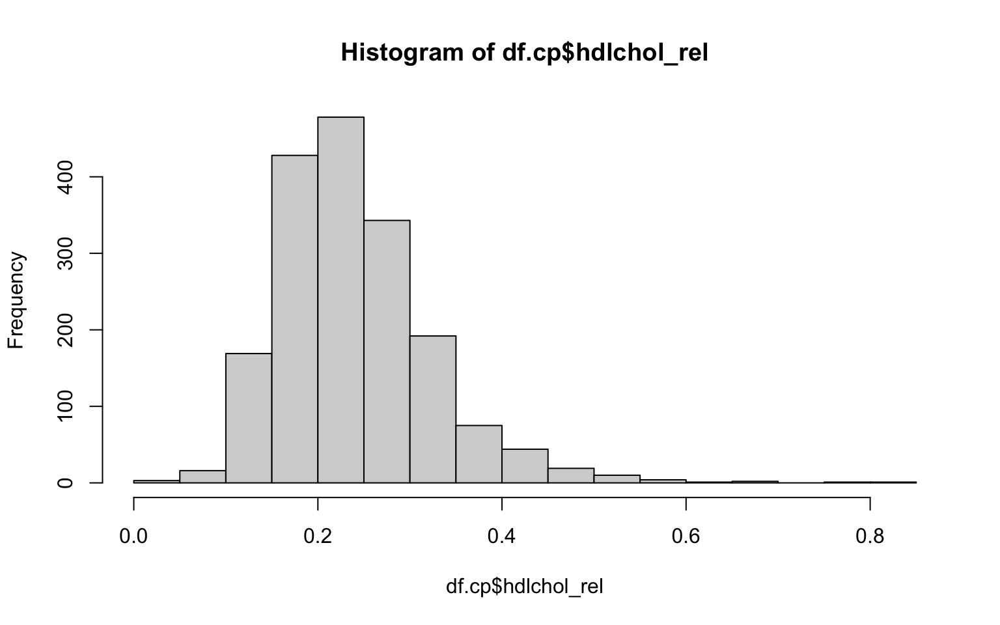
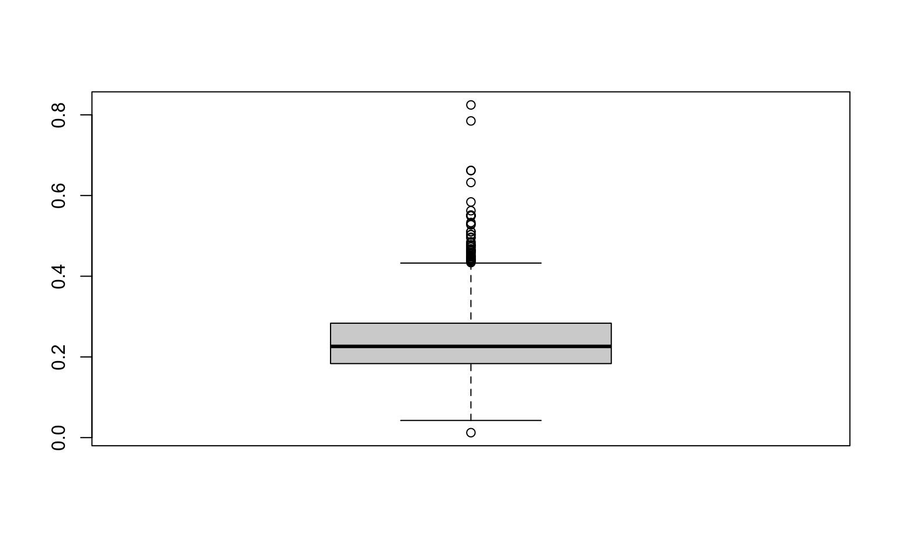
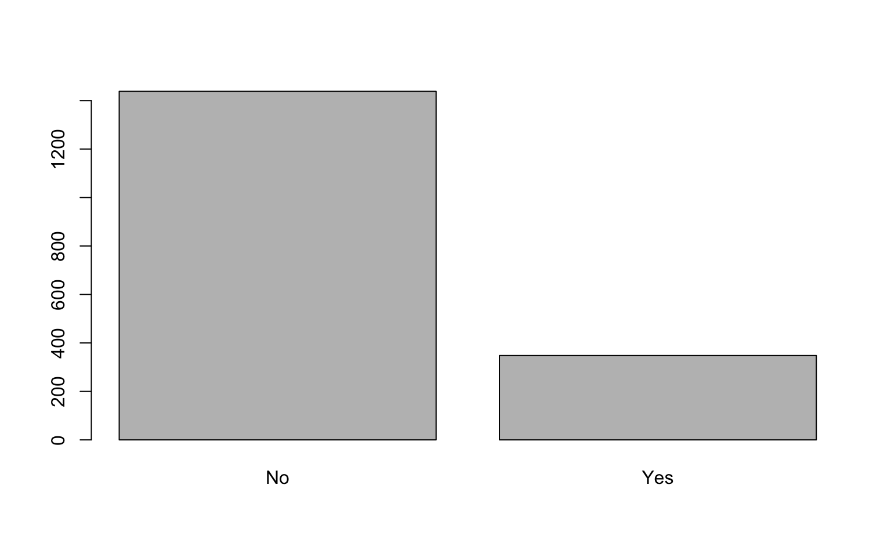

<script src="index_files/libs/kePrint-0.0.1/kePrint.js"></script>
<link href="index_files/libs/lightable-0.0.1/lightable.css" rel="stylesheet" />


## Generelles zu den Übungen

-   Niemand kann alle R-Funktionen auswendig. Daher ist es ganz normal, dass man spickt (z.B. [R-Cheat Sheet](https://raw.githubusercontent.com/rstudio/cheatsheets/master/base-r.pdf) oder in den Skripten zu den Workshops).  
-   Alle Aufgaben sind mit den Codes aus den R-Workshops lösbar.  
-   Wenn du eine Aufgabe nicht auf Anhieb lösen kannst, versuche dir zuerst Hilfe im Internet oder den Unterrichtsmaterialen zu holen. Schaue die Lösung erst an, wenn du mit Google und co. wirklich nicht weiter kommst.  
-   Fragen zu den Übungen bitte im Forum auf Moodle posten und entsprechend verlinken.

------------------------------------------------------------------------

## 1: Datensatz einlesen

### Aufgabe

Für diese Übung brauchst du wieder die Datei `caerphilly.csv`, welche du auf Moodle findest. Lade den Datensatz herunter und speichere ihn ab. Definiere danach deine Working directory entsprechend und importiere den Datensatz in `R`.

------------------------------------------------------------------------

### Lösung

Der Datenimport ist am einfachsten mit `library(rio)`. Beachte, dass der Name zwischen den beiden " " **identisch** mit jenem der Datei auf deinem Rechner sein muss. Die Working directory muss natürlich auch korrekt definiert sein.

<details class="code-fold">
<summary>Code</summary>

``` r
library(rio)
df.cp <- import("caerphilly.csv") # Diese wd() sieht bei dir natürlich anders aus
```

</details>

------------------------------------------------------------------------

### Codebook

Folgende Variablen sind im Datensatz enthalten:

-   `mi` = Myocardial infarction (0 = No, 1 = Yes)
-   `socclass` = Soziale Klasse mit den Levels I, II, IIIM, IIINM, IV, V
-   `diabetes` = Diabetes mit den Levels No/uncertain oder Yes
-   `smoking` = Raucherstatus mit den Levels `Never smoked`, `Ex 1-4 years`, `Ex>5 years`, `<15 per day`, `>15 per day`
-   `totchol` = Totales Cholesterin
-   `hdlchol` = High-Density-Lipoprotein-Cholesterin
-   `bmi` = Body Mass Index
-   `bmicat` = Body Mass Indes mit den Levels Underweight, Normal, Overweight, Obese

------------------------------------------------------------------------

## 2: Datensatz anschauen

### Aufgaben

1.  Nutze einen einfachen Befehl um zu kontrollieren, ob die Daten richtig eingelesen wurden.
2.  Wie viele Zeilen und Spalten hat der Datensatz? Was repräsentieren die Zeilen und die Spalten?
3.  Schau dir die 6. Zeile des Datensatzes an.
4.  Schau dir die 5. Spalte des Datensatzes an.
5.  Schau dir die Variable `totchol` an.
6.  Welchen totchol-Wert hat die 12. Person?

### Lösungen

1.  Nutze einen einfachen Befehl, um zu kontrollieren, ob die Daten richtig eingelesen wurden.

Es gibt verschiedene Möglichkeiten, dies zu tun. Du kannst im Global Environment (oben rechts) auf das kleine Tabellensymbol hinter dem neu erstellten Objekt klicken. Dann öffnet sich eine Tabelle und du hast quasi eine Excel-Ansicht. Mit `str()` siehst du die einzelnen Variablen, die jeweilige Datenklasse sowie die ersten Werte. Mit `head()` siehst du die ersten 6 Zeilen des Datensatzes.

<details class="code-fold">
<summary>Code</summary>

``` r
str(df.cp)
```

</details>

    'data.frame':   1786 obs. of  9 variables:
     $ id      : int  1 2 3 4 5 6 7 8 9 10 ...
     $ mi      : int  0 1 0 1 0 0 1 0 0 0 ...
     $ socclass: chr  "IIINM" "IV" "II" "IIINM" ...
     $ diabetes: chr  "No/uncertain" "No/uncertain" "No/uncertain" "No/uncertain" ...
     $ smoking : chr  " Ex>5 years" ">15 per day" " Ex>5 years" "Never smoked" ...
     $ totchol : num  4.98 5.58 6.34 6.8 6.04 5.59 4.83 7.7 6.04 7.08 ...
     $ hdlchol : num  1.33 0.99 1.92 1.42 1.16 1.16 1.16 1.5 1.5 1.64 ...
     $ bmi     : num  29.7 29.4 19.7 30.9 26.2 ...
     $ bmicat  : chr  "Overweight" "Overweight" "Underweight" "Obese" ...

<details class="code-fold">
<summary>Code</summary>

``` r
head(df.cp)
```

</details>

      id mi socclass     diabetes      smoking totchol hdlchol      bmi      bmicat
    1  1  0    IIINM No/uncertain   Ex>5 years    4.98    1.33 29.68024  Overweight
    2  2  1       IV No/uncertain  >15 per day    5.58    0.99 29.36095  Overweight
    3  3  0       II No/uncertain   Ex>5 years    6.34    1.92 19.73448 Underweight
    4  4  1    IIINM No/uncertain Never smoked    6.80    1.42 30.92452       Obese
    5  5  0    IIINM No/uncertain  >15 per day    6.04    1.16 26.15399  Overweight
    6  6  0     IIIM No/uncertain  <15 per day    5.59    1.16 24.60821      Normal

------------------------------------------------------------------------

1.  Wie viele Zeilen und Spalten hat der Datensatz? Was repräsentieren die Zeilen und die Spalten?

<details class="code-fold">
<summary>Code</summary>

``` r
nrow(df.cp)
```

</details>

    [1] 1786

<details class="code-fold">
<summary>Code</summary>

``` r
ncol(df.cp)
```

</details>

    [1] 9

Jede Zeile steht für eine Beobachtungseinheit und jede Spalte für eine Variable.

------------------------------------------------------------------------

1.  Schau dir die 6. Zeile des Datensatzes an.  

<details class="code-fold">
<summary>Code</summary>

``` r
df.cp[6, ]
```

</details>

      id mi socclass     diabetes     smoking totchol hdlchol      bmi bmicat
    6  6  0     IIIM No/uncertain <15 per day    5.59    1.16 24.60821 Normal

------------------------------------------------------------------------

1.  Schau dir die 5. Spalte des Datensatzes an.  
    Da es viele Werte sind, musst du etwas scrollen...

<details class="code-fold">
<summary>Code</summary>

``` r
df.cp[ ,5]
```

</details>

       [1] " Ex>5 years"  ">15 per day"  " Ex>5 years"  "Never smoked"
       [5] ">15 per day"  "<15 per day"  ">15 per day"  " Ex>5 years" 
       [9] "Never smoked" " Ex>5 years"  "<15 per day"  " Ex>5 years" 
      [13] ">15 per day"  "Never smoked" "Never smoked" " Ex>5 years" 
      [17] "Ex 1-4 years" "<15 per day"  ">15 per day"  " Ex>5 years" 
      [21] "Never smoked" " Ex>5 years"  "Never smoked" "Ex 1-4 years"
      [25] ">15 per day"  "<15 per day"  "Never smoked" ">15 per day" 
      [29] ">15 per day"  ">15 per day"  "<15 per day"  "<15 per day" 
      [33] " Ex>5 years"  "Ex 1-4 years" "<15 per day"  "Ex 1-4 years"
      [37] ">15 per day"  ">15 per day"  "Never smoked" ">15 per day" 
      [41] ">15 per day"  "<15 per day"  "<15 per day"  " Ex>5 years" 
      [45] " Ex>5 years"  ">15 per day"  "Never smoked" "<15 per day" 
      [49] " Ex>5 years"  " Ex>5 years"  " Ex>5 years"  "<15 per day" 
      [53] " Ex>5 years"  ">15 per day"  ">15 per day"  ">15 per day" 
      [57] "<15 per day"  "Ex 1-4 years" ">15 per day"  "Never smoked"
      [61] ">15 per day"  ">15 per day"  ">15 per day"  " Ex>5 years" 
      [65] "Never smoked" ">15 per day"  ">15 per day"  ">15 per day" 
      [69] ">15 per day"  "Never smoked" " Ex>5 years"  ">15 per day" 
      [73] ">15 per day"  "<15 per day"  ">15 per day"  ">15 per day" 
      [77] "Ex 1-4 years" "Never smoked" " Ex>5 years"  "Ex 1-4 years"
      [81] ">15 per day"  ">15 per day"  "<15 per day"  "Never smoked"
      [85] " Ex>5 years"  " Ex>5 years"  " Ex>5 years"  "<15 per day" 
      [89] "<15 per day"  "<15 per day"  ">15 per day"  "Never smoked"
      [93] "<15 per day"  "Ex 1-4 years" " Ex>5 years"  ">15 per day" 
      [97] "<15 per day"  "<15 per day"  "<15 per day"  ">15 per day" 
     [101] "<15 per day"  " Ex>5 years"  "<15 per day"  "Ex 1-4 years"
     [105] ">15 per day"  " Ex>5 years"  "<15 per day"  "<15 per day" 
     [109] "<15 per day"  ">15 per day"  ">15 per day"  ">15 per day" 
     [113] "Ex 1-4 years" " Ex>5 years"  "Ex 1-4 years" "<15 per day" 
     [117] "Ex 1-4 years" ">15 per day"  "Ex 1-4 years" "Never smoked"
     [121] " Ex>5 years"  ">15 per day"  ">15 per day"  " Ex>5 years" 
     [125] "<15 per day"  ">15 per day"  " Ex>5 years"  "<15 per day" 
     [129] "<15 per day"  "Never smoked" " Ex>5 years"  ">15 per day" 
     [133] "<15 per day"  "Never smoked" "<15 per day"  "Ex 1-4 years"
     [137] "<15 per day"  ">15 per day"  " Ex>5 years"  "<15 per day" 
     [141] " Ex>5 years"  "Never smoked" " Ex>5 years"  " Ex>5 years" 
     [145] "Never smoked" " Ex>5 years"  "Never smoked" "Ex 1-4 years"
     [149] "<15 per day"  " Ex>5 years"  "Ex 1-4 years" ">15 per day" 
     [153] ">15 per day"  "Never smoked" "<15 per day"  "<15 per day" 
     [157] "<15 per day"  ">15 per day"  "<15 per day"  ">15 per day" 
     [161] "Never smoked" ">15 per day"  "<15 per day"  ">15 per day" 
     [165] "<15 per day"  "<15 per day"  "<15 per day"  ">15 per day" 
     [169] ">15 per day"  "<15 per day"  ">15 per day"  "Ex 1-4 years"
     [173] "Never smoked" "<15 per day"  "<15 per day"  "Never smoked"
     [177] " Ex>5 years"  "<15 per day"  " Ex>5 years"  "Never smoked"
     [181] "<15 per day"  "Never smoked" ">15 per day"  " Ex>5 years" 
     [185] "<15 per day"  ">15 per day"  "<15 per day"  "Never smoked"
     [189] "<15 per day"  "Ex 1-4 years" ">15 per day"  "<15 per day" 
     [193] "<15 per day"  "<15 per day"  "Never smoked" ">15 per day" 
     [197] ">15 per day"  ">15 per day"  "Never smoked" ">15 per day" 
     [201] ">15 per day"  "Never smoked" ">15 per day"  "Never smoked"
     [205] "Never smoked" " Ex>5 years"  ">15 per day"  "<15 per day" 
     [209] ">15 per day"  " Ex>5 years"  " Ex>5 years"  "<15 per day" 
     [213] " Ex>5 years"  ">15 per day"  ">15 per day"  "Never smoked"
     [217] " Ex>5 years"  "Never smoked" " Ex>5 years"  ">15 per day" 
     [221] "<15 per day"  " Ex>5 years"  " Ex>5 years"  "Ex 1-4 years"
     [225] "<15 per day"  " Ex>5 years"  "Never smoked" " Ex>5 years" 
     [229] ">15 per day"  "Never smoked" "<15 per day"  "Never smoked"
     [233] "Ex 1-4 years" " Ex>5 years"  "<15 per day"  "Ex 1-4 years"
     [237] ">15 per day"  ">15 per day"  " Ex>5 years"  "<15 per day" 
     [241] "<15 per day"  "Never smoked" "<15 per day"  "<15 per day" 
     [245] "<15 per day"  ">15 per day"  "Never smoked" "Never smoked"
     [249] ">15 per day"  ">15 per day"  "Never smoked" ">15 per day" 
     [253] "Never smoked" " Ex>5 years"  " Ex>5 years"  ">15 per day" 
     [257] ">15 per day"  " Ex>5 years"  "<15 per day"  "Never smoked"
     [261] " Ex>5 years"  " Ex>5 years"  ">15 per day"  " Ex>5 years" 
     [265] ">15 per day"  ">15 per day"  "<15 per day"  "Never smoked"
     [269] ">15 per day"  " Ex>5 years"  "Never smoked" "<15 per day" 
     [273] " Ex>5 years"  " Ex>5 years"  ">15 per day"  ">15 per day" 
     [277] "<15 per day"  " Ex>5 years"  "Ex 1-4 years" ">15 per day" 
     [281] "<15 per day"  " Ex>5 years"  "<15 per day"  "Never smoked"
     [285] "Never smoked" "<15 per day"  "Never smoked" "<15 per day" 
     [289] "<15 per day"  ">15 per day"  ">15 per day"  ">15 per day" 
     [293] " Ex>5 years"  "Never smoked" " Ex>5 years"  "<15 per day" 
     [297] ">15 per day"  " Ex>5 years"  " Ex>5 years"  " Ex>5 years" 
     [301] " Ex>5 years"  ">15 per day"  "Ex 1-4 years" " Ex>5 years" 
     [305] ">15 per day"  ">15 per day"  "Ex 1-4 years" ">15 per day" 
     [309] "Never smoked" "Never smoked" "Ex 1-4 years" ">15 per day" 
     [313] " Ex>5 years"  ">15 per day"  "<15 per day"  ">15 per day" 
     [317] "<15 per day"  "<15 per day"  " Ex>5 years"  "<15 per day" 
     [321] "Ex 1-4 years" ">15 per day"  "Never smoked" "Ex 1-4 years"
     [325] ">15 per day"  "<15 per day"  ">15 per day"  "Ex 1-4 years"
     [329] ">15 per day"  " Ex>5 years"  " Ex>5 years"  ">15 per day" 
     [333] "<15 per day"  "<15 per day"  "Never smoked" ">15 per day" 
     [337] ">15 per day"  "Never smoked" "<15 per day"  ">15 per day" 
     [341] ">15 per day"  " Ex>5 years"  ">15 per day"  "<15 per day" 
     [345] "Never smoked" "Never smoked" "<15 per day"  " Ex>5 years" 
     [349] "Ex 1-4 years" " Ex>5 years"  ">15 per day"  " Ex>5 years" 
     [353] " Ex>5 years"  ">15 per day"  ">15 per day"  " Ex>5 years" 
     [357] ">15 per day"  ">15 per day"  " Ex>5 years"  "<15 per day" 
     [361] ">15 per day"  ">15 per day"  "Never smoked" ">15 per day" 
     [365] "<15 per day"  "<15 per day"  "Never smoked" "Never smoked"
     [369] "Never smoked" ">15 per day"  ">15 per day"  " Ex>5 years" 
     [373] "Never smoked" ">15 per day"  "<15 per day"  ">15 per day" 
     [377] ">15 per day"  "<15 per day"  "<15 per day"  "Ex 1-4 years"
     [381] " Ex>5 years"  "Never smoked" "<15 per day"  " Ex>5 years" 
     [385] "<15 per day"  "Ex 1-4 years" ">15 per day"  " Ex>5 years" 
     [389] " Ex>5 years"  "Ex 1-4 years" ">15 per day"  ">15 per day" 
     [393] "Never smoked" ">15 per day"  ">15 per day"  ">15 per day" 
     [397] ">15 per day"  "Never smoked" "<15 per day"  "Ex 1-4 years"
     [401] ">15 per day"  "<15 per day"  "<15 per day"  "Never smoked"
     [405] "Ex 1-4 years" ">15 per day"  ">15 per day"  ">15 per day" 
     [409] "<15 per day"  "Never smoked" "Ex 1-4 years" ">15 per day" 
     [413] " Ex>5 years"  " Ex>5 years"  ">15 per day"  " Ex>5 years" 
     [417] ">15 per day"  "Never smoked" "Ex 1-4 years" " Ex>5 years" 
     [421] "<15 per day"  ">15 per day"  "Ex 1-4 years" ">15 per day" 
     [425] ">15 per day"  "Ex 1-4 years" "Never smoked" "<15 per day" 
     [429] " Ex>5 years"  "Never smoked" "Ex 1-4 years" ">15 per day" 
     [433] "Never smoked" "Ex 1-4 years" " Ex>5 years"  "<15 per day" 
     [437] " Ex>5 years"  "<15 per day"  "Never smoked" ">15 per day" 
     [441] "<15 per day"  "Never smoked" "Never smoked" ">15 per day" 
     [445] "<15 per day"  "<15 per day"  " Ex>5 years"  "Ex 1-4 years"
     [449] ">15 per day"  ">15 per day"  ">15 per day"  "Ex 1-4 years"
     [453] "Never smoked" "<15 per day"  "<15 per day"  " Ex>5 years" 
     [457] "<15 per day"  "<15 per day"  "<15 per day"  " Ex>5 years" 
     [461] "Ex 1-4 years" "Never smoked" ">15 per day"  "Never smoked"
     [465] " Ex>5 years"  "<15 per day"  "<15 per day"  ">15 per day" 
     [469] "Never smoked" "<15 per day"  "<15 per day"  " Ex>5 years" 
     [473] "Never smoked" "Never smoked" "<15 per day"  ">15 per day" 
     [477] " Ex>5 years"  ">15 per day"  ">15 per day"  ">15 per day" 
     [481] ">15 per day"  " Ex>5 years"  ">15 per day"  " Ex>5 years" 
     [485] "Never smoked" " Ex>5 years"  " Ex>5 years"  "Never smoked"
     [489] ">15 per day"  ">15 per day"  " Ex>5 years"  "<15 per day" 
     [493] "<15 per day"  "Ex 1-4 years" "Ex 1-4 years" "<15 per day" 
     [497] "<15 per day"  "Never smoked" ">15 per day"  "Never smoked"
     [501] ">15 per day"  "<15 per day"  ">15 per day"  "<15 per day" 
     [505] "Never smoked" "Never smoked" ">15 per day"  ">15 per day" 
     [509] ">15 per day"  ">15 per day"  ">15 per day"  "<15 per day" 
     [513] "<15 per day"  "Never smoked" "<15 per day"  " Ex>5 years" 
     [517] ">15 per day"  ">15 per day"  ">15 per day"  ">15 per day" 
     [521] " Ex>5 years"  "<15 per day"  "<15 per day"  ">15 per day" 
     [525] "<15 per day"  "Never smoked" "Ex 1-4 years" " Ex>5 years" 
     [529] "<15 per day"  " Ex>5 years"  "Never smoked" ">15 per day" 
     [533] " Ex>5 years"  "Ex 1-4 years" " Ex>5 years"  "Never smoked"
     [537] "<15 per day"  ">15 per day"  "<15 per day"  " Ex>5 years" 
     [541] "Never smoked" "<15 per day"  " Ex>5 years"  "Never smoked"
     [545] "Never smoked" "Ex 1-4 years" "Never smoked" "<15 per day" 
     [549] "<15 per day"  "<15 per day"  ">15 per day"  " Ex>5 years" 
     [553] ">15 per day"  "Ex 1-4 years" " Ex>5 years"  "<15 per day" 
     [557] " Ex>5 years"  "<15 per day"  "Never smoked" ">15 per day" 
     [561] "<15 per day"  " Ex>5 years"  ">15 per day"  "Never smoked"
     [565] "<15 per day"  "<15 per day"  "Never smoked" "Ex 1-4 years"
     [569] "<15 per day"  "Ex 1-4 years" "<15 per day"  ">15 per day" 
     [573] "<15 per day"  "Never smoked" "Never smoked" ">15 per day" 
     [577] "<15 per day"  " Ex>5 years"  ">15 per day"  ">15 per day" 
     [581] "Ex 1-4 years" "Never smoked" "<15 per day"  " Ex>5 years" 
     [585] "Never smoked" " Ex>5 years"  ">15 per day"  "<15 per day" 
     [589] "Ex 1-4 years" "<15 per day"  "<15 per day"  " Ex>5 years" 
     [593] ">15 per day"  " Ex>5 years"  "Ex 1-4 years" "<15 per day" 
     [597] "Ex 1-4 years" "<15 per day"  "<15 per day"  " Ex>5 years" 
     [601] ">15 per day"  ">15 per day"  ">15 per day"  "<15 per day" 
     [605] "<15 per day"  "Never smoked" " Ex>5 years"  ">15 per day" 
     [609] "<15 per day"  ">15 per day"  " Ex>5 years"  "<15 per day" 
     [613] " Ex>5 years"  "<15 per day"  ">15 per day"  ">15 per day" 
     [617] ">15 per day"  " Ex>5 years"  ">15 per day"  " Ex>5 years" 
     [621] "Ex 1-4 years" "<15 per day"  ">15 per day"  ">15 per day" 
     [625] " Ex>5 years"  ">15 per day"  "<15 per day"  "<15 per day" 
     [629] " Ex>5 years"  ">15 per day"  " Ex>5 years"  "<15 per day" 
     [633] "<15 per day"  "<15 per day"  "Never smoked" ">15 per day" 
     [637] " Ex>5 years"  "Ex 1-4 years" ">15 per day"  " Ex>5 years" 
     [641] ">15 per day"  " Ex>5 years"  ">15 per day"  " Ex>5 years" 
     [645] ">15 per day"  ">15 per day"  "Never smoked" " Ex>5 years" 
     [649] ">15 per day"  "<15 per day"  "Ex 1-4 years" " Ex>5 years" 
     [653] "Never smoked" "<15 per day"  "Never smoked" ">15 per day" 
     [657] " Ex>5 years"  " Ex>5 years"  ">15 per day"  ">15 per day" 
     [661] " Ex>5 years"  ">15 per day"  "Ex 1-4 years" "<15 per day" 
     [665] ">15 per day"  ">15 per day"  " Ex>5 years"  ">15 per day" 
     [669] "<15 per day"  " Ex>5 years"  ">15 per day"  " Ex>5 years" 
     [673] "<15 per day"  "Never smoked" "<15 per day"  ">15 per day" 
     [677] ">15 per day"  "Ex 1-4 years" "<15 per day"  "Never smoked"
     [681] "<15 per day"  " Ex>5 years"  ">15 per day"  "Never smoked"
     [685] "<15 per day"  "<15 per day"  "Ex 1-4 years" "Ex 1-4 years"
     [689] " Ex>5 years"  "Never smoked" "Ex 1-4 years" "Never smoked"
     [693] "<15 per day"  "Ex 1-4 years" "Never smoked" "<15 per day" 
     [697] "<15 per day"  "<15 per day"  " Ex>5 years"  ">15 per day" 
     [701] " Ex>5 years"  "Never smoked" ">15 per day"  "<15 per day" 
     [705] " Ex>5 years"  ">15 per day"  ">15 per day"  "<15 per day" 
     [709] "Ex 1-4 years" ">15 per day"  " Ex>5 years"  "<15 per day" 
     [713] "<15 per day"  " Ex>5 years"  ">15 per day"  "<15 per day" 
     [717] ">15 per day"  "Ex 1-4 years" ">15 per day"  ">15 per day" 
     [721] ">15 per day"  "Never smoked" "Never smoked" ">15 per day" 
     [725] ">15 per day"  ">15 per day"  "<15 per day"  "Never smoked"
     [729] "<15 per day"  "Never smoked" " Ex>5 years"  "<15 per day" 
     [733] " Ex>5 years"  ">15 per day"  " Ex>5 years"  "Never smoked"
     [737] "<15 per day"  ">15 per day"  "<15 per day"  "<15 per day" 
     [741] ">15 per day"  "Never smoked" ">15 per day"  "Ex 1-4 years"
     [745] "<15 per day"  "<15 per day"  " Ex>5 years"  "<15 per day" 
     [749] "<15 per day"  ">15 per day"  "<15 per day"  " Ex>5 years" 
     [753] " Ex>5 years"  ">15 per day"  "<15 per day"  "Never smoked"
     [757] "<15 per day"  " Ex>5 years"  "<15 per day"  "<15 per day" 
     [761] ">15 per day"  " Ex>5 years"  " Ex>5 years"  " Ex>5 years" 
     [765] "<15 per day"  "<15 per day"  "<15 per day"  ">15 per day" 
     [769] ">15 per day"  "Never smoked" "<15 per day"  "Never smoked"
     [773] " Ex>5 years"  "Never smoked" " Ex>5 years"  "<15 per day" 
     [777] ">15 per day"  ">15 per day"  "<15 per day"  " Ex>5 years" 
     [781] ">15 per day"  ">15 per day"  ">15 per day"  " Ex>5 years" 
     [785] ">15 per day"  ">15 per day"  "Never smoked" ">15 per day" 
     [789] "<15 per day"  "<15 per day"  ">15 per day"  "Never smoked"
     [793] "<15 per day"  ">15 per day"  "Ex 1-4 years" " Ex>5 years" 
     [797] "<15 per day"  " Ex>5 years"  "Never smoked" ">15 per day" 
     [801] "Never smoked" ">15 per day"  ">15 per day"  " Ex>5 years" 
     [805] ">15 per day"  "<15 per day"  ">15 per day"  ">15 per day" 
     [809] ">15 per day"  "<15 per day"  ">15 per day"  "Never smoked"
     [813] "<15 per day"  "Never smoked" "<15 per day"  " Ex>5 years" 
     [817] ">15 per day"  " Ex>5 years"  " Ex>5 years"  "Ex 1-4 years"
     [821] "<15 per day"  "Never smoked" "<15 per day"  " Ex>5 years" 
     [825] "<15 per day"  " Ex>5 years"  "Ex 1-4 years" ">15 per day" 
     [829] "Never smoked" ">15 per day"  ">15 per day"  "<15 per day" 
     [833] "Ex 1-4 years" " Ex>5 years"  ">15 per day"  ">15 per day" 
     [837] ">15 per day"  ">15 per day"  ">15 per day"  ">15 per day" 
     [841] "<15 per day"  " Ex>5 years"  ">15 per day"  ">15 per day" 
     [845] " Ex>5 years"  ">15 per day"  "Never smoked" ">15 per day" 
     [849] "Never smoked" "Ex 1-4 years" "<15 per day"  ">15 per day" 
     [853] " Ex>5 years"  "Never smoked" "Never smoked" " Ex>5 years" 
     [857] "Never smoked" ">15 per day"  "<15 per day"  " Ex>5 years" 
     [861] "<15 per day"  " Ex>5 years"  ">15 per day"  ">15 per day" 
     [865] "<15 per day"  " Ex>5 years"  "<15 per day"  " Ex>5 years" 
     [869] ">15 per day"  ">15 per day"  ">15 per day"  ">15 per day" 
     [873] "<15 per day"  "<15 per day"  "Ex 1-4 years" " Ex>5 years" 
     [877] "<15 per day"  ">15 per day"  ">15 per day"  ">15 per day" 
     [881] " Ex>5 years"  "Ex 1-4 years" "Ex 1-4 years" "Ex 1-4 years"
     [885] "<15 per day"  "Never smoked" " Ex>5 years"  "<15 per day" 
     [889] " Ex>5 years"  "Never smoked" "<15 per day"  " Ex>5 years" 
     [893] " Ex>5 years"  "Never smoked" "<15 per day"  "<15 per day" 
     [897] ">15 per day"  "Never smoked" " Ex>5 years"  "Ex 1-4 years"
     [901] "Ex 1-4 years" ">15 per day"  ">15 per day"  "Never smoked"
     [905] ">15 per day"  "<15 per day"  "<15 per day"  "Never smoked"
     [909] " Ex>5 years"  "<15 per day"  " Ex>5 years"  "<15 per day" 
     [913] " Ex>5 years"  "<15 per day"  ">15 per day"  "Never smoked"
     [917] ">15 per day"  "<15 per day"  ">15 per day"  "<15 per day" 
     [921] "<15 per day"  "Never smoked" " Ex>5 years"  ">15 per day" 
     [925] "<15 per day"  "<15 per day"  " Ex>5 years"  "<15 per day" 
     [929] ">15 per day"  " Ex>5 years"  "Never smoked" "Never smoked"
     [933] ">15 per day"  ">15 per day"  "<15 per day"  "<15 per day" 
     [937] "<15 per day"  "<15 per day"  "Ex 1-4 years" " Ex>5 years" 
     [941] "<15 per day"  " Ex>5 years"  "<15 per day"  "Ex 1-4 years"
     [945] ">15 per day"  " Ex>5 years"  "<15 per day"  "Never smoked"
     [949] "<15 per day"  " Ex>5 years"  ">15 per day"  "<15 per day" 
     [953] "Never smoked" ">15 per day"  "Never smoked" " Ex>5 years" 
     [957] ">15 per day"  ">15 per day"  ">15 per day"  " Ex>5 years" 
     [961] " Ex>5 years"  "Ex 1-4 years" ">15 per day"  ">15 per day" 
     [965] ">15 per day"  "<15 per day"  ">15 per day"  "<15 per day" 
     [969] ">15 per day"  ">15 per day"  "Never smoked" ">15 per day" 
     [973] ">15 per day"  ">15 per day"  " Ex>5 years"  ">15 per day" 
     [977] " Ex>5 years"  "Never smoked" "<15 per day"  ">15 per day" 
     [981] "<15 per day"  "Never smoked" "<15 per day"  "Never smoked"
     [985] "<15 per day"  ">15 per day"  "<15 per day"  "<15 per day" 
     [989] " Ex>5 years"  "Ex 1-4 years" "Never smoked" ">15 per day" 
     [993] ">15 per day"  " Ex>5 years"  "Never smoked" "<15 per day" 
     [997] "<15 per day"  "<15 per day"  ">15 per day"  "<15 per day" 
    [1001] " Ex>5 years"  "Never smoked" ">15 per day"  ">15 per day" 
    [1005] ">15 per day"  ">15 per day"  ">15 per day"  "Never smoked"
    [1009] " Ex>5 years"  "Never smoked" "<15 per day"  ">15 per day" 
    [1013] "<15 per day"  "<15 per day"  "<15 per day"  "Never smoked"
    [1017] "<15 per day"  ">15 per day"  " Ex>5 years"  "<15 per day" 
    [1021] ">15 per day"  " Ex>5 years"  " Ex>5 years"  "Never smoked"
    [1025] ">15 per day"  " Ex>5 years"  " Ex>5 years"  ">15 per day" 
    [1029] " Ex>5 years"  ">15 per day"  "<15 per day"  "<15 per day" 
    [1033] "<15 per day"  "<15 per day"  "<15 per day"  "<15 per day" 
    [1037] " Ex>5 years"  "<15 per day"  "<15 per day"  " Ex>5 years" 
    [1041] "<15 per day"  "Ex 1-4 years" ">15 per day"  "Never smoked"
    [1045] " Ex>5 years"  "<15 per day"  " Ex>5 years"  "<15 per day" 
    [1049] "Never smoked" ">15 per day"  "Ex 1-4 years" ">15 per day" 
    [1053] ">15 per day"  ">15 per day"  " Ex>5 years"  "Never smoked"
    [1057] "<15 per day"  "<15 per day"  " Ex>5 years"  "<15 per day" 
    [1061] "Never smoked" " Ex>5 years"  ">15 per day"  "Never smoked"
    [1065] "Never smoked" ">15 per day"  ">15 per day"  ">15 per day" 
    [1069] ">15 per day"  "<15 per day"  ">15 per day"  " Ex>5 years" 
    [1073] ">15 per day"  ">15 per day"  "Ex 1-4 years" " Ex>5 years" 
    [1077] "<15 per day"  "<15 per day"  ">15 per day"  "Never smoked"
    [1081] ">15 per day"  "Never smoked" " Ex>5 years"  ">15 per day" 
    [1085] "Never smoked" " Ex>5 years"  " Ex>5 years"  " Ex>5 years" 
    [1089] "Never smoked" ">15 per day"  ">15 per day"  ">15 per day" 
    [1093] "<15 per day"  ">15 per day"  "<15 per day"  ">15 per day" 
    [1097] ">15 per day"  "<15 per day"  "<15 per day"  "<15 per day" 
    [1101] "<15 per day"  " Ex>5 years"  ">15 per day"  "<15 per day" 
    [1105] "Ex 1-4 years" "Never smoked" ">15 per day"  "Never smoked"
    [1109] "<15 per day"  ">15 per day"  "<15 per day"  ">15 per day" 
    [1113] "Never smoked" " Ex>5 years"  "<15 per day"  "<15 per day" 
    [1117] "<15 per day"  " Ex>5 years"  " Ex>5 years"  ">15 per day" 
    [1121] "Never smoked" ">15 per day"  "<15 per day"  ">15 per day" 
    [1125] " Ex>5 years"  "Never smoked" "<15 per day"  "Never smoked"
    [1129] "Never smoked" " Ex>5 years"  " Ex>5 years"  ">15 per day" 
    [1133] "Never smoked" "<15 per day"  "<15 per day"  ">15 per day" 
    [1137] "Ex 1-4 years" "Ex 1-4 years" "<15 per day"  " Ex>5 years" 
    [1141] "Ex 1-4 years" "<15 per day"  "Never smoked" "<15 per day" 
    [1145] " Ex>5 years"  " Ex>5 years"  "Never smoked" "<15 per day" 
    [1149] "Ex 1-4 years" " Ex>5 years"  ">15 per day"  " Ex>5 years" 
    [1153] " Ex>5 years"  " Ex>5 years"  " Ex>5 years"  "Never smoked"
    [1157] "Never smoked" " Ex>5 years"  ">15 per day"  "Never smoked"
    [1161] ">15 per day"  "<15 per day"  ">15 per day"  ">15 per day" 
    [1165] "Ex 1-4 years" "<15 per day"  ">15 per day"  "Ex 1-4 years"
    [1169] ">15 per day"  "Never smoked" "<15 per day"  "<15 per day" 
    [1173] " Ex>5 years"  "Never smoked" " Ex>5 years"  " Ex>5 years" 
    [1177] "<15 per day"  ">15 per day"  "<15 per day"  "Never smoked"
    [1181] ">15 per day"  "Never smoked" "<15 per day"  "Never smoked"
    [1185] ">15 per day"  "Ex 1-4 years" "Never smoked" " Ex>5 years" 
    [1189] ">15 per day"  ">15 per day"  ">15 per day"  ">15 per day" 
    [1193] "Never smoked" "<15 per day"  ">15 per day"  "<15 per day" 
    [1197] "<15 per day"  "<15 per day"  "Never smoked" "<15 per day" 
    [1201] ">15 per day"  " Ex>5 years"  "Ex 1-4 years" "Never smoked"
    [1205] "<15 per day"  " Ex>5 years"  " Ex>5 years"  "Ex 1-4 years"
    [1209] ">15 per day"  "Never smoked" ">15 per day"  "<15 per day" 
    [1213] "Ex 1-4 years" "<15 per day"  "Ex 1-4 years" "Never smoked"
    [1217] "<15 per day"  "<15 per day"  " Ex>5 years"  ">15 per day" 
    [1221] " Ex>5 years"  "Never smoked" ">15 per day"  ">15 per day" 
    [1225] "Ex 1-4 years" ">15 per day"  "Never smoked" "<15 per day" 
    [1229] "<15 per day"  "Never smoked" "Never smoked" "<15 per day" 
    [1233] "Ex 1-4 years" " Ex>5 years"  " Ex>5 years"  "Never smoked"
    [1237] "Never smoked" "Ex 1-4 years" ">15 per day"  " Ex>5 years" 
    [1241] ">15 per day"  " Ex>5 years"  ">15 per day"  "Ex 1-4 years"
    [1245] "Ex 1-4 years" ">15 per day"  ">15 per day"  ">15 per day" 
    [1249] ">15 per day"  ">15 per day"  "Never smoked" ">15 per day" 
    [1253] "Ex 1-4 years" "<15 per day"  " Ex>5 years"  ">15 per day" 
    [1257] "<15 per day"  ">15 per day"  "Never smoked" "<15 per day" 
    [1261] ">15 per day"  " Ex>5 years"  ">15 per day"  " Ex>5 years" 
    [1265] "Ex 1-4 years" "<15 per day"  "Ex 1-4 years" "<15 per day" 
    [1269] ">15 per day"  "Never smoked" ">15 per day"  ">15 per day" 
    [1273] ">15 per day"  ">15 per day"  ">15 per day"  "<15 per day" 
    [1277] ">15 per day"  "<15 per day"  ">15 per day"  " Ex>5 years" 
    [1281] ">15 per day"  "<15 per day"  ">15 per day"  "Never smoked"
    [1285] " Ex>5 years"  "<15 per day"  ">15 per day"  "<15 per day" 
    [1289] "Ex 1-4 years" "<15 per day"  " Ex>5 years"  "<15 per day" 
    [1293] "Never smoked" ">15 per day"  "<15 per day"  ">15 per day" 
    [1297] "Never smoked" "<15 per day"  " Ex>5 years"  ">15 per day" 
    [1301] "Never smoked" ">15 per day"  " Ex>5 years"  ">15 per day" 
    [1305] " Ex>5 years"  " Ex>5 years"  "<15 per day"  ">15 per day" 
    [1309] " Ex>5 years"  "Never smoked" "Never smoked" "Never smoked"
    [1313] ">15 per day"  "Never smoked" "<15 per day"  ">15 per day" 
    [1317] "Never smoked" ">15 per day"  ">15 per day"  "Ex 1-4 years"
    [1321] ">15 per day"  " Ex>5 years"  "<15 per day"  ">15 per day" 
    [1325] ">15 per day"  ">15 per day"  ">15 per day"  ">15 per day" 
    [1329] ">15 per day"  "<15 per day"  "<15 per day"  " Ex>5 years" 
    [1333] ">15 per day"  "Never smoked" "Ex 1-4 years" "Never smoked"
    [1337] ">15 per day"  ">15 per day"  ">15 per day"  " Ex>5 years" 
    [1341] "<15 per day"  "Ex 1-4 years" " Ex>5 years"  " Ex>5 years" 
    [1345] " Ex>5 years"  "Never smoked" ">15 per day"  "<15 per day" 
    [1349] "<15 per day"  " Ex>5 years"  ">15 per day"  " Ex>5 years" 
    [1353] ">15 per day"  "<15 per day"  ">15 per day"  "Never smoked"
    [1357] "Never smoked" "Ex 1-4 years" " Ex>5 years"  "<15 per day" 
    [1361] "<15 per day"  " Ex>5 years"  "Ex 1-4 years" " Ex>5 years" 
    [1365] " Ex>5 years"  ">15 per day"  ">15 per day"  "Ex 1-4 years"
    [1369] "<15 per day"  ">15 per day"  "Never smoked" "Never smoked"
    [1373] " Ex>5 years"  "Ex 1-4 years" "<15 per day"  "Ex 1-4 years"
    [1377] ">15 per day"  "<15 per day"  " Ex>5 years"  ">15 per day" 
    [1381] "<15 per day"  " Ex>5 years"  "Never smoked" ">15 per day" 
    [1385] " Ex>5 years"  " Ex>5 years"  "Never smoked" " Ex>5 years" 
    [1389] "Never smoked" ">15 per day"  "Never smoked" " Ex>5 years" 
    [1393] "Never smoked" "Never smoked" ">15 per day"  "<15 per day" 
    [1397] ">15 per day"  "Never smoked" ">15 per day"  "Never smoked"
    [1401] "Never smoked" "Never smoked" " Ex>5 years"  ">15 per day" 
    [1405] " Ex>5 years"  "Never smoked" "<15 per day"  "Ex 1-4 years"
    [1409] "Never smoked" "Never smoked" "<15 per day"  ">15 per day" 
    [1413] "<15 per day"  "<15 per day"  ">15 per day"  "<15 per day" 
    [1417] "Never smoked" " Ex>5 years"  ">15 per day"  "Ex 1-4 years"
    [1421] "Never smoked" "<15 per day"  "<15 per day"  ">15 per day" 
    [1425] "Never smoked" "Never smoked" " Ex>5 years"  "<15 per day" 
    [1429] ">15 per day"  "<15 per day"  ">15 per day"  ">15 per day" 
    [1433] "<15 per day"  "Ex 1-4 years" "Never smoked" " Ex>5 years" 
    [1437] "<15 per day"  "Never smoked" ">15 per day"  " Ex>5 years" 
    [1441] "<15 per day"  ">15 per day"  "<15 per day"  ">15 per day" 
    [1445] ">15 per day"  "<15 per day"  "Never smoked" "Ex 1-4 years"
    [1449] "<15 per day"  "Never smoked" "<15 per day"  " Ex>5 years" 
    [1453] ">15 per day"  ">15 per day"  ">15 per day"  "Never smoked"
    [1457] ">15 per day"  " Ex>5 years"  "<15 per day"  "Ex 1-4 years"
    [1461] " Ex>5 years"  " Ex>5 years"  " Ex>5 years"  "<15 per day" 
    [1465] " Ex>5 years"  "Never smoked" ">15 per day"  ">15 per day" 
    [1469] " Ex>5 years"  " Ex>5 years"  ">15 per day"  "Never smoked"
    [1473] " Ex>5 years"  "Never smoked" ">15 per day"  " Ex>5 years" 
    [1477] ">15 per day"  ">15 per day"  " Ex>5 years"  " Ex>5 years" 
    [1481] ">15 per day"  "<15 per day"  ">15 per day"  ">15 per day" 
    [1485] ">15 per day"  ">15 per day"  "Never smoked" "<15 per day" 
    [1489] "<15 per day"  "Never smoked" "<15 per day"  "<15 per day" 
    [1493] "<15 per day"  "Ex 1-4 years" "Never smoked" " Ex>5 years" 
    [1497] ">15 per day"  "<15 per day"  "<15 per day"  "Ex 1-4 years"
    [1501] ">15 per day"  " Ex>5 years"  ">15 per day"  "Never smoked"
    [1505] " Ex>5 years"  ">15 per day"  "<15 per day"  ">15 per day" 
    [1509] "<15 per day"  "Never smoked" " Ex>5 years"  " Ex>5 years" 
    [1513] ">15 per day"  " Ex>5 years"  ">15 per day"  "<15 per day" 
    [1517] " Ex>5 years"  "Never smoked" "Never smoked" " Ex>5 years" 
    [1521] "Ex 1-4 years" ">15 per day"  ">15 per day"  "Never smoked"
    [1525] ">15 per day"  ">15 per day"  ">15 per day"  ">15 per day" 
    [1529] "<15 per day"  "Never smoked" "Ex 1-4 years" " Ex>5 years" 
    [1533] " Ex>5 years"  "<15 per day"  " Ex>5 years"  ">15 per day" 
    [1537] "<15 per day"  ">15 per day"  "Never smoked" "<15 per day" 
    [1541] "Ex 1-4 years" ">15 per day"  "<15 per day"  ">15 per day" 
    [1545] ">15 per day"  "<15 per day"  "Ex 1-4 years" "<15 per day" 
    [1549] ">15 per day"  "Never smoked" ">15 per day"  " Ex>5 years" 
    [1553] ">15 per day"  ">15 per day"  " Ex>5 years"  "Ex 1-4 years"
    [1557] "<15 per day"  "Ex 1-4 years" ">15 per day"  "Never smoked"
    [1561] " Ex>5 years"  "Ex 1-4 years" "<15 per day"  "Ex 1-4 years"
    [1565] "<15 per day"  "Never smoked" ">15 per day"  " Ex>5 years" 
    [1569] "<15 per day"  "<15 per day"  ">15 per day"  "<15 per day" 
    [1573] "<15 per day"  ">15 per day"  "<15 per day"  ">15 per day" 
    [1577] "<15 per day"  "Never smoked" "<15 per day"  "<15 per day" 
    [1581] ">15 per day"  "<15 per day"  "<15 per day"  " Ex>5 years" 
    [1585] "<15 per day"  ">15 per day"  "<15 per day"  ">15 per day" 
    [1589] ">15 per day"  " Ex>5 years"  "Never smoked" "<15 per day" 
    [1593] "Never smoked" " Ex>5 years"  ">15 per day"  "Never smoked"
    [1597] ">15 per day"  ">15 per day"  "<15 per day"  " Ex>5 years" 
    [1601] " Ex>5 years"  " Ex>5 years"  "<15 per day"  ">15 per day" 
    [1605] ">15 per day"  "<15 per day"  "<15 per day"  "<15 per day" 
    [1609] " Ex>5 years"  ">15 per day"  " Ex>5 years"  " Ex>5 years" 
    [1613] ">15 per day"  "Never smoked" ">15 per day"  "<15 per day" 
    [1617] ">15 per day"  ">15 per day"  ">15 per day"  "Never smoked"
    [1621] "Ex 1-4 years" ">15 per day"  "<15 per day"  "Ex 1-4 years"
    [1625] "Never smoked" "<15 per day"  ">15 per day"  ">15 per day" 
    [1629] "<15 per day"  "<15 per day"  "Never smoked" ">15 per day" 
    [1633] "Ex 1-4 years" "<15 per day"  "<15 per day"  ">15 per day" 
    [1637] "<15 per day"  " Ex>5 years"  ">15 per day"  "<15 per day" 
    [1641] ">15 per day"  " Ex>5 years"  ">15 per day"  " Ex>5 years" 
    [1645] ">15 per day"  " Ex>5 years"  ">15 per day"  "<15 per day" 
    [1649] "Never smoked" ">15 per day"  " Ex>5 years"  ">15 per day" 
    [1653] "<15 per day"  " Ex>5 years"  "Never smoked" ">15 per day" 
    [1657] " Ex>5 years"  "<15 per day"  " Ex>5 years"  " Ex>5 years" 
    [1661] " Ex>5 years"  "<15 per day"  ">15 per day"  "Never smoked"
    [1665] " Ex>5 years"  "Never smoked" "<15 per day"  " Ex>5 years" 
    [1669] "Never smoked" " Ex>5 years"  " Ex>5 years"  "Never smoked"
    [1673] " Ex>5 years"  "Never smoked" "Never smoked" "<15 per day" 
    [1677] "Never smoked" "<15 per day"  ">15 per day"  ">15 per day" 
    [1681] ">15 per day"  "Never smoked" ">15 per day"  " Ex>5 years" 
    [1685] "Ex 1-4 years" "Never smoked" "<15 per day"  "<15 per day" 
    [1689] "Ex 1-4 years" "<15 per day"  ">15 per day"  " Ex>5 years" 
    [1693] " Ex>5 years"  "<15 per day"  ">15 per day"  " Ex>5 years" 
    [1697] "Never smoked" " Ex>5 years"  "<15 per day"  "Never smoked"
    [1701] "Never smoked" ">15 per day"  "Ex 1-4 years" "<15 per day" 
    [1705] " Ex>5 years"  ">15 per day"  " Ex>5 years"  "<15 per day" 
    [1709] " Ex>5 years"  " Ex>5 years"  "<15 per day"  ">15 per day" 
    [1713] " Ex>5 years"  "<15 per day"  "Never smoked" "<15 per day" 
    [1717] ">15 per day"  " Ex>5 years"  "Never smoked" "<15 per day" 
    [1721] " Ex>5 years"  ">15 per day"  "<15 per day"  " Ex>5 years" 
    [1725] ">15 per day"  ">15 per day"  ">15 per day"  " Ex>5 years" 
    [1729] " Ex>5 years"  " Ex>5 years"  "Never smoked" " Ex>5 years" 
    [1733] " Ex>5 years"  "<15 per day"  "<15 per day"  ">15 per day" 
    [1737] "Never smoked" "<15 per day"  "Never smoked" " Ex>5 years" 
    [1741] ">15 per day"  ">15 per day"  "Never smoked" " Ex>5 years" 
    [1745] "Ex 1-4 years" "<15 per day"  "Never smoked" ">15 per day" 
    [1749] "Ex 1-4 years" "<15 per day"  "Never smoked" "Ex 1-4 years"
    [1753] ">15 per day"  ">15 per day"  ">15 per day"  "Never smoked"
    [1757] "<15 per day"  "<15 per day"  "Never smoked" ">15 per day" 
    [1761] " Ex>5 years"  ">15 per day"  "Ex 1-4 years" ">15 per day" 
    [1765] "Never smoked" "Ex 1-4 years" "Never smoked" ">15 per day" 
    [1769] "Never smoked" ">15 per day"  ">15 per day"  ">15 per day" 
    [1773] "Never smoked" "Never smoked" ">15 per day"  ">15 per day" 
    [1777] ">15 per day"  ">15 per day"  ">15 per day"  ">15 per day" 
    [1781] "Never smoked" ">15 per day"  ">15 per day"  "<15 per day" 
    [1785] " Ex>5 years"  ">15 per day" 

------------------------------------------------------------------------

1.  Schau dir die Variable `totchol` an.

Da es viele Werte sind, musst du etwas scrollen...

<details class="code-fold">
<summary>Code</summary>

``` r
df.cp$totchol
```

</details>

       [1]  4.98  5.58  6.34  6.80  6.04  5.59  4.83  7.70  6.04  7.08  5.13  6.41
      [13]  6.04  5.13  4.98  6.87  5.96  5.29  4.83  6.11  5.96  6.19  6.70  4.53
      [25]  5.29  5.06  6.70  6.04  5.36  5.74  4.38  5.96 10.06  5.66  5.13  6.80
      [37]  6.49  8.31  4.38  6.34  6.95  6.41  6.19  5.06  6.49  4.83  7.10  5.89
      [49]  6.04  5.44  5.74  4.53  4.78  5.29  6.64  7.00  5.89  4.91  7.59  6.40
      [61]  6.34  5.06  6.49  6.04  6.64  3.87  1.96  6.19  6.49  4.98  6.04  6.19
      [73]  3.02  7.89  5.13  5.74  4.83  6.95  5.44  6.19  5.13  5.88  6.80  6.41
      [85]  6.64  6.18  5.13  7.40  7.78  5.81  6.34  6.19  5.59  7.47  7.10  5.88
      [97]  6.56  6.04  5.13  7.40  4.08  4.98  5.29  4.23  7.25  5.44  4.46  8.05
     [109]  5.43  5.29  5.21  4.83  7.89  5.13  5.44  5.59  4.83  6.80  5.89  5.74
     [121]  6.65  5.13  5.74  4.83  6.95  7.75  7.97  5.29  6.11  6.42  5.59  7.02
     [133]  6.95  6.34  7.00  6.85  4.83  8.19  8.91  8.46  4.98  5.74  5.66  6.95
     [145]  5.96  5.13  5.89  4.98  5.29  4.75  4.98  6.64  6.34  5.89  5.06  6.93
     [157]  4.98 10.30  5.21  6.50  4.68  4.38  5.81  5.29  5.36  5.36  5.36  3.72
     [169]  5.51  6.11  6.03  7.10  5.29  7.40  7.75  6.10  5.29  4.61  6.19  4.53
     [181]  4.10  4.68  6.64  5.29  5.06  4.98  6.49  4.83  4.68  5.96  6.04  5.06
     [193]  5.66  4.92  3.87  6.50  5.59  5.81  6.25  5.59  7.55  6.04  4.23  5.29
     [205]  6.95  4.53  5.81  5.89  4.60  6.11  5.43  9.68  3.55  5.74  6.04  5.74
     [217]  6.56  6.04  5.44  6.33  5.74  6.04  4.38 10.42  4.68  6.04  6.19  4.95
     [229]  5.73  5.74  5.50  6.26  5.51  7.75  6.64  6.40  4.98  6.10  6.34  7.25
     [241]  4.98  5.59  7.10  7.70  5.51  7.30  5.88  6.70  6.80  4.68  7.70  6.85
     [253]  8.15  6.04  7.40  5.29  5.74  5.81  4.83  5.29  6.79  7.60  5.59  4.83
     [265]  6.19  7.25  4.38  6.80  8.31  5.51  6.34  7.97  5.29  4.62  8.19  5.29
     [277]  5.81  6.56  7.75  6.41  6.04  5.29  4.83  5.44  6.49  4.30  8.15  7.74
     [289]  5.13  5.74  6.19  7.59  7.10  5.44  6.80  5.29  4.68  5.29  6.34  3.78
     [301]  6.19  6.20  7.10  8.15  5.89  7.70  5.51  7.25  5.81  4.83  5.88  8.15
     [313]  5.21  6.95  5.29  4.98  6.49  5.44  8.90  4.53  7.75  4.76  6.64  4.23
     [325]  5.44  8.46  5.13  6.04  6.04  4.98  4.98  4.98  5.74  4.53  5.13  5.59
     [337]  5.51  4.83  5.89  6.80  5.89  9.38  4.98  6.34  4.23  4.83  4.98  6.04
     [349]  4.38  7.37  6.04  7.25  6.04  6.19  6.80  4.61  5.74  6.04  3.47  5.51
     [361]  5.89  7.15  4.83  5.29  4.68  5.74  5.89  7.10  7.63  7.00  5.74  6.63
     [373]  5.36  8.04  7.00  5.66  5.29  5.74  5.89  5.96  5.66  4.76  5.89  4.00
     [385]  4.77  6.04  4.83  7.40  7.40  6.57  6.64  6.04  7.00  4.83  6.34  6.03
     [397]  5.66  5.59  6.34  6.70  4.92  3.93  4.83  6.19  6.34  6.64  6.34  6.19
     [409]  5.29  4.83  6.49  6.04  5.89  6.49  4.83  6.04  6.19  5.44  8.46  5.89
     [421]  4.30  4.53  4.47  7.10  6.95  3.93  5.74  5.89  5.13  6.56  6.80  6.34
     [433]  6.23  5.59  6.95  5.88  4.98  4.17  7.55  4.53  7.75  6.49  4.23  6.04
     [445]  6.71  6.26  6.64  6.95  5.74  4.91  6.19  8.46  8.31  5.44  4.83 13.00
     [457]  5.13  6.80  5.89  7.70  6.26  5.44  6.04  6.10  6.70  4.98  5.28  5.74
     [469]  4.68  4.30  5.59  7.40  8.15  4.08  5.13  4.98  6.04  5.36  5.51  5.44
     [481]  5.44  6.34  4.98  5.74  4.47  6.49  5.59  5.74  6.14  5.29  6.49  3.77
     [493]  8.00  2.87  5.59  5.66  4.47  6.80  5.51  5.89  5.22  6.49  5.36  4.98
     [505]  4.83  7.10  5.13  7.40  6.34  7.02  7.08  4.38  4.83  5.29  5.36  5.59
     [517]  7.70  6.49  5.59  7.85  6.19  5.58  4.98  5.29  5.74  5.13  8.64  6.80
     [529]  7.40  7.59  5.29  5.89  5.66  6.12  4.23  4.92  3.02  4.38  4.98  6.34
     [541]  7.60  5.59  5.13  5.22  8.15  7.08  5.29  3.25  4.23  5.59  5.13  4.61
     [553]  5.59  9.82  5.51  5.44  6.64  5.21  6.95  7.70  7.40  5.89  4.17  5.29
     [565]  5.66  7.45  5.44  4.60  4.98  5.36  8.34  5.29  6.64  5.13  5.13  6.49
     [577]  4.08  3.02  5.59  7.97  5.89  6.04  7.52  7.10  4.38  5.74  6.49  5.73
     [589]  5.89  4.98  5.66  9.21  4.98  4.23  4.83  7.85  6.34  6.04  7.30  6.19
     [601]  7.10  4.98  4.77  4.92  6.95  4.84  4.98  7.55  7.30  6.49  4.83  6.19
     [613]  5.29  4.83  6.19  6.57  4.99  6.34  5.44  6.41  7.30  5.59  6.19  5.51
     [625]  6.34  6.19  6.95  4.75  6.19  4.69  4.53  6.19  4.08  3.87  5.44  4.53
     [637]  5.89  3.93  6.49  6.95  6.80  6.49  5.89  4.23  4.98  8.00  6.04  6.11
     [649]  6.19  8.31  6.80  8.72  6.19  6.04  4.38  6.04  6.19  6.80  5.36  7.10
     [661]  6.56  6.04  6.64  6.64  7.75  5.89  6.49  7.25  5.74  5.06  4.98  5.89
     [673]  3.62  6.26  5.59  5.29  4.38  7.15  5.89  6.49  5.81  6.55  7.10  6.85
     [685]  7.10  8.19  6.49  4.98  6.04  6.95  8.15  5.66  4.61  5.74  6.95  4.92
     [697]  4.47  5.29  7.25  6.19  5.96  4.83  7.25  5.74  6.04  5.06  7.10  6.95
     [709]  7.74  6.19  4.08  5.29  5.36  5.74  4.53  6.49  6.49  5.88  7.93  5.74
     [721]  4.76  4.47  6.34  6.34  7.30  5.44  6.49  4.23  5.29  4.23  5.96  5.81
     [733]  6.64  6.27  6.80  7.52  4.53  6.26  5.29  6.95  4.83  5.29  7.10  6.04
     [745]  5.74  4.98  5.58  5.59  3.78  5.89  6.95  7.55  4.91  4.83  4.30  4.53
     [757]  6.41  7.37  5.44  4.98  6.48  4.38  6.95  7.25  5.74  5.59  5.13  6.49
     [769]  6.19  5.29  5.66  6.19  6.78  4.68  6.19  4.77  7.55  4.17  5.13  5.44
     [781]  6.34  4.83  6.56  6.19  5.66  6.34  4.08  5.13  8.46  6.34  5.44  6.34
     [793]  7.30  5.14  4.98  5.29  5.13  6.04  6.85  6.85  4.92  4.98  6.57  6.95
     [805]  6.04  5.13  6.57  5.59  4.90  7.40  9.06  5.74  5.13  4.53  5.13  5.44
     [817]  6.27  8.00  4.15  4.83  5.36  5.44  4.99  5.66  6.19  5.29  6.27  7.10
     [829]  5.59  3.62  4.83  6.19  7.10  6.80  6.19  7.30  5.59  4.08  4.99  7.52
     [841]  6.80  6.95  5.89  6.19  6.03  4.83  6.95  8.00  7.24  5.13  8.31  6.49
     [853]  4.83  6.04  6.64  4.08  5.44  6.03  4.53  5.22  5.29  7.15  6.04  5.51
     [865]  6.19  6.49  4.98  5.96  7.40  6.64  6.27  8.15  4.22  4.98  4.08  7.89
     [877]  5.89  4.98  5.44  7.00  7.55  5.59  6.04  8.34  4.61  8.05  4.91  6.80
     [889]  5.89  5.29  5.13  5.44  7.97  7.45  5.89  6.56  6.19  4.68  6.49  6.11
     [901]  4.91  6.34  5.89  8.49  4.76  4.38  4.98  5.44  4.98  7.37  5.74  6.34
     [913]  5.51  5.59  7.09  6.34  5.21  5.36  5.44 10.27  4.83  4.62  7.25  6.64
     [925]  5.29  5.44  8.19  5.73  4.83  4.53  6.64  6.80  5.44  4.98  8.00  5.44
     [937]  5.07  8.00  5.81  5.96  5.89  5.13  9.06  5.13  5.13  7.45  7.70  5.81
     [949]  7.25  4.98  7.00  5.44  8.00  4.83  8.61  6.95  6.19  7.25  6.64  5.89
     [961]  7.40  6.80  6.34  7.55  4.70  5.13  5.13  6.04  8.86  5.29  6.19  5.44
     [973]  5.13  5.21  7.85  6.64  5.81  5.29  8.19  5.89  6.19  4.83  6.19  5.89
     [985]  5.89  6.49  6.64  6.64  6.49  7.70  4.15  4.53  5.66  7.70  9.36  5.97
     [997]  5.89  7.55  6.34  7.55  4.98  5.13  5.13  4.47  2.26  7.59  5.51  6.55
    [1009]  5.59  6.04  4.91  5.95  5.13  5.74  7.39  4.83  6.49  5.81  5.29  7.25
    [1021]  5.44  4.68  4.53  7.47  4.83  5.89  5.66  4.83  5.59  5.66  5.59  6.19
    [1033]  6.04  5.29  7.25  7.55  5.13  4.53  5.29  3.93  6.19  7.10  6.34  7.10
    [1045]  6.04  7.10  5.44  5.21  7.25  5.74  5.13  3.32  8.46  6.80  4.92  7.25
    [1057]  5.74  5.66  8.46  4.15  7.40  4.98  6.26  6.70  6.80  3.47  4.40  6.49
    [1069]  5.07  6.95  4.38  3.87  6.79  5.59  6.04  4.23  6.03  5.13  5.74  5.29
    [1081]  5.74  6.04  5.51  8.00  3.73  6.04  6.34  6.04  4.53  5.44  5.44  9.21
    [1093]  6.11  6.04  7.10  9.06  3.93  5.89  5.96  4.53  4.83  5.21  5.13  5.89
    [1105]  5.13  6.49  5.59  6.85  4.38  4.08  5.44  5.13  5.59  7.59  3.79  7.85
    [1117]  6.49  6.34  4.62  6.34  6.19  7.70  4.53  7.30  5.74  5.74  4.83  6.80
    [1129]  7.25  6.42  5.36  4.98  5.51  4.53  7.67  4.98  5.59  6.04  5.07  6.34
    [1141]  6.34  5.74  5.13  5.44  7.25  4.83  4.83  5.74  5.44  4.99  4.38  5.22
    [1153]  5.89  5.29  4.91  5.89  7.10  5.74  6.48  8.00  5.13  6.19  6.34  7.40
    [1165]  5.21  5.59  5.96  5.59  5.29  6.56  6.25  6.34  4.32  7.40  5.13  7.10
    [1177]  4.76  6.04  5.29  7.10  7.97  7.47  5.51  5.74  5.29  7.59  6.64  5.21
    [1189]  8.00  4.98  6.95  6.04  5.59  5.26  4.23  5.74  4.38  5.44  3.72  5.59
    [1201]  5.13  6.34  5.74  5.59  4.90  3.78  5.88  6.95  4.08  6.04  6.95  5.74
    [1213]  5.29  5.44  5.59  5.29  7.70  4.68  5.13  8.91  7.30  6.70  4.83  6.64
    [1225]  5.81  8.19  4.08  5.44  6.34  5.74  6.19  4.30  5.89  4.00  7.45  7.15
    [1237]  5.44  6.64  8.00  5.74  9.08  7.25  5.89  6.79  5.89  7.25  4.99  4.90
    [1249]  4.23  3.58  4.68  4.38  5.51  4.98  6.10  6.80  5.66  5.44  6.40  6.04
    [1261]  4.98  5.66  5.44  5.51  5.59  3.62  6.34  5.13  3.47  5.29  7.55  5.66
    [1273]  4.28  8.46  5.66  3.10  5.74  7.15  5.74  7.23  4.98  7.09  5.29  6.80
    [1285]  6.49  6.19  5.13  6.49  5.89  4.17  5.30  6.95  6.50  7.39  5.13  6.11
    [1297]  6.04  4.68  7.10  4.88  6.41  5.96  4.23  5.44  5.68  7.40  4.45  5.44
    [1309]  6.95  5.51  5.59  5.44  6.19  5.89  4.98  6.04  5.81  5.06  9.20  5.44
    [1321]  5.89  5.74  8.49  5.30  6.34  6.19  8.61  6.64  4.53  6.64  5.74  5.89
    [1333]  6.95  5.66  5.06  4.89  7.30  5.29  6.85  4.68  6.64  5.13  4.61  5.13
    [1345]  4.38  6.95  5.59  5.29  6.04  3.47  5.66  4.53  5.36  7.40  6.95  6.04
    [1357]  6.70  5.81  6.19  5.74  5.51  6.42  5.51  6.04  7.40  6.34  5.44  5.89
    [1369]  5.89  5.44  5.13  6.34  4.98  5.89  6.49  5.29  5.44  6.95  5.59  5.59
    [1381]  5.58  5.13  6.19  5.13  4.98  6.04  7.70  5.59  5.29  6.64  5.29  5.29
    [1393]  4.38  6.34  6.41  7.25  4.32  6.34  5.44  5.44  5.89  6.87  8.34  4.68
    [1405]  6.56  6.10  5.89  4.83  5.44  7.75  5.13  6.49  5.36  5.44  8.46  4.38
    [1417]  5.58  8.91  6.80  6.95  4.53  5.13  6.70  8.34  6.64  4.53  5.96  5.59
    [1429]  7.00  7.00  5.59  5.29  5.29  7.55  4.38  6.80  6.49  5.74  5.74  3.62
    [1441]  7.30  7.15  5.13  5.13  6.34  6.64  7.15  5.36  7.70  6.64  4.00  4.84
    [1453]  4.68  7.70  5.59  4.38  5.29  8.19  4.08  6.41  5.13  4.07  5.81  5.66
    [1465]  4.91  5.89  3.93  7.52  5.29  6.49  6.64  4.08  5.36  6.79  4.98  6.95
    [1477]  7.47  7.30  6.18  6.34  6.80  5.29  4.68  4.38  6.80  6.80  5.51  8.00
    [1489]  6.50  7.25  4.45  5.89  6.04  5.51  4.68  5.74  6.64  6.49  7.55  5.21
    [1501]  7.40  6.10  5.13  5.21  5.44  5.29  5.29  4.83  5.89  6.18  6.04  5.96
    [1513]  5.66  4.45  5.51  6.49  4.98  3.93  6.49  6.04  5.29  5.29  7.25  5.59
    [1525]  9.06  6.64  6.49  5.81  4.38  4.53  5.13  5.59  4.98  5.29  4.98  6.49
    [1537]  5.29  3.47  5.89  3.44  5.13  5.29  3.92  4.76  6.49  5.74  6.04  4.45
    [1549]  9.09  4.83  6.41  5.96  6.95  5.51  6.64  6.95  6.19  9.08  6.56  4.38
    [1561]  7.02  5.74  5.59  5.96  6.11  5.44  4.02  4.98  7.00  4.77  5.59  4.68
    [1573]  5.88  6.04  6.95  4.98  4.83  4.83  6.64  5.44  4.23  6.34  5.59  6.64
    [1585]  5.44  7.70  4.84  7.85  4.83  4.53  4.68  6.04  6.19  3.93  6.95  8.31
    [1597]  5.13  5.44  6.34  4.23  5.05  7.55  5.74  6.50  5.29  5.59  6.19  4.98
    [1609]  5.80  3.93  5.44  4.98  5.06  6.04  6.12  5.51  8.15  6.64  6.95  5.89
    [1621]  6.04  6.49  7.40  6.49  6.19  6.64  6.64  5.44  5.74  5.88  7.40  6.04
    [1633]  7.25  4.23  5.29  4.83  4.68  4.84  6.04  5.29  6.04  6.27  5.59  4.38
    [1645]  5.96  5.59  6.26  6.27  5.29  7.37  5.13  6.95  9.39  6.80  6.19  3.93
    [1657]  5.81  4.30  5.44  6.64  5.59  4.83  5.36  6.26  5.29  6.10  6.12  5.89
    [1669]  4.84  5.30  6.49  6.80  4.32  5.29  6.64  6.49  4.53  4.23  3.78  6.80
    [1681]  5.74  6.64  8.31  6.95  6.85  8.31  6.95  5.89  5.13  5.89  4.53  4.61
    [1693]  5.59  5.13  5.66  8.04  7.55  6.34  5.13  6.64  6.71  5.74  5.81  7.37
    [1705]  7.55  6.80  6.04  7.97  4.68  8.31  6.04  6.40  6.95  4.68  7.30  6.55
    [1717]  4.91  5.74  5.13  5.74  5.21  5.36  7.10  5.13  6.19  4.53  4.87  6.11
    [1729]  7.55  3.85  6.33  6.79  5.13  6.64  6.19  6.49  5.74  7.25  6.95  4.98
    [1741]  5.29  6.19  5.74  6.04  4.84  6.34  6.25  8.34  6.80  6.80  4.68  4.98
    [1753]  5.74  5.29  5.96  5.81 10.58  5.59  6.95  6.04  4.98  5.21  4.30  5.81
    [1765]  6.25  5.44  6.64  6.04  5.66  7.00  6.41  6.19  5.13  7.85  5.89  6.04
    [1777]  3.78  5.89  4.99  5.13  5.74  5.96  6.70  5.89  5.74  6.64

------------------------------------------------------------------------

1.  Welchen totchol-Wert hat die 12. Person?  

<details class="code-fold">
<summary>Code</summary>

``` r
df.cp$totchol[12]
```

</details>

    [1] 6.41

------------------------------------------------------------------------

## 3: Erstellen neuer Variablen

### Aufgaben

1.  Was ist der relative Anteil des HDL Cholesterins am totalen Cholesterin? Speichere das Resultat in einer neuen Variable mit dem Namen `hdlchol_rel`. Füge die Variable anschliessend dem Datensatz hinzu.  
2.  Was ist der grösste und der kleinste Wert der Variable `hdlchol_rel`?

### Lösung

1.  Die Berechnung kann auf ganze Vektoren angewendet werden. Das Resultat wird dann in einem neuen Objekt abgespeichert und anschliessend dem Datensatz hinzugefügt.

<details class="code-fold">
<summary>Code</summary>

``` r
hdlchol_rel <- df.cp$hdlchol / df.cp$totchol # neue Variable berechnen
df.cp$hdlchol_rel <- hdlchol_rel # neue Variable hinzufügen
df.cp$hdlchol_rel <- df.cp$hdlchol / df.cp$totchol # Die beiden oberen Schritte kombiniert ;-)
```

</details>

------------------------------------------------------------------------

1.  Was ist der grösste und der kleinste Wert der Variable `hdlchol_rel`?  

<details class="code-fold">
<summary>Code</summary>

``` r
max(df.cp$hdlchol_rel)
```

</details>

    [1] 0.8245033

<details class="code-fold">
<summary>Code</summary>

``` r
min(df.cp$hdlchol_rel)
```

</details>

    [1] 0.01230769

------------------------------------------------------------------------

## 4: Häufigkeitsverteilungen

### Aufgaben

1.  Stelle die Verteilung der Variable `hdlchol_rel` als Histogramm dar.  
2.  Stelle die Verteilung der Variable `hdlchol_rel` als Boxplot dar.  
3.  Wie viele Personen hatten einen Herzinfarkt (Variable `mi`)?
4.  Aktuell ist die Variable `mi` nicht als Faktor hinterlegt sondern mit 0 und 1 codiert. Mache aus der Variable einen Faktor mit den Ausprägungsgeraden `No` und `Yes`. Wie viele Personen haben ein `No`?  
5.  Visualisiere die Häufigkeitsverteilung der Herzinfarkte mit einem Balkendiagramm.
6.  Wie ist die relative Verteilung der Variable `smoking`?

### Lösungen

1.  Stelle die Verteilung der Variable `hdlchol_rel` als Histogramm dar.

<details class="code-fold">
<summary>Code</summary>

``` r
hist(df.cp$hdlchol_rel)
```

</details>



------------------------------------------------------------------------

1.  Stelle die Verteilung der Variable `hdlchol_rel` als Boxplot dar.  

<details class="code-fold">
<summary>Code</summary>

``` r
boxplot(df.cp$hdlchol_rel) # mit range = 0 werden die Ausreisser nicht separat dargestellt
```

</details>



------------------------------------------------------------------------

1.  Wie viele Personen hatten einen Herzinfarkt (Variable `mi`)?

<details class="code-fold">
<summary>Code</summary>

``` r
table(df.cp$mi)
```

</details>


       0    1 
    1438  348 

------------------------------------------------------------------------

1.  Aktuell ist die Variable `mi` nicht als Faktor hinterlegt sondern mit 0 und 1 codiert. Mache aus der Variable einen Faktor mit den Ausprägungsgeraden `No` und `Yes`. Wie viele Personen haben ein `No`?

Beachte, dass jetzt oben `No` und `Yes` steht und nicht mehr 0 und 1. Dies aufgrund der Umwandlung in einen Faktor.

<details class="code-fold">
<summary>Code</summary>

``` r
df.cp$mi <- factor(df.cp$mi, levels = c(0,1), labels = c("No", "Yes"))
table(df.cp$mi)
```

</details>


      No  Yes 
    1438  348 

------------------------------------------------------------------------

1.  Visualisiere die Häufigkeitsverteilung der Herzinfarkte mit einem Balkendiagramm.

<details class="code-fold">
<summary>Code</summary>

``` r
barplot(table(df.cp$mi))
```

</details>



------------------------------------------------------------------------

1.  Wie ist die relative Verteilung der Variable `smoking`?

<details class="code-fold">
<summary>Code</summary>

``` r
table(df.cp$smoking)/sum(table(df.cp$smoking)) # das n wird hier als Summe aller Kategorien berechnet
```

</details>


      Ex>5 years  <15 per day  >15 per day Ex 1-4 years Never smoked 
      0.20212766   0.24860022   0.30571109   0.07838746   0.16517357 

------------------------------------------------------------------------

## 5: Masse der Lage und Masse der Streuung

### Aufgaben

1.  Was ist der durchschnittliche Body Mass Index?
2.  Unterscheiden sich Mittelwert und Median des BMI's?  
3.  Lass dir die Quartile des BMI's anzeigen.  
4.  Was ist das 95. Quantil des BMI's?  
5.  Wie gross ist die Standardabweichung für die Variable BMI?  
6.  Berechne die Standardabweichung ohne die Funktion `sd()`  
7.  Stimmt es, dass $Varianz = Standardabweichung^2$ ?

### Lösungen

1.  Was ist der durchschnittliche Body Mass Index?  

<details class="code-fold">
<summary>Code</summary>

``` r
mean(df.cp$bmi, na.rm = TRUE) # Das na.rm = TRUE braucht man, wenn es fehlende Werte im Datensatz hat
```

</details>

    [1] 26.2165

------------------------------------------------------------------------

1.  Unterscheiden sich Mittelwert und Median des BMI's?

ja, um 0.09077536

<details class="code-fold">
<summary>Code</summary>

``` r
mean(df.cp$bmi, na.rm = TRUE) - median(df.cp$bmi, na.rm = TRUE)
```

</details>

    [1] 0.09077536

------------------------------------------------------------------------

1.  Lass dir die Quartile des BMI's anzeigen.

<details class="code-fold">
<summary>Code</summary>

``` r
quantile(df.cp$bmi, probs = c(0,0.25, 0.5, 0.75,1))
```

</details>

          0%      25%      50%      75%     100% 
    16.72293 23.94819 26.12572 28.28088 49.91735 

------------------------------------------------------------------------

1.  Was ist das 95. Quantil des BMI's?  

<details class="code-fold">
<summary>Code</summary>

``` r
quantile(df.cp$bmi, probs = .95)
```

</details>

         95% 
    31.97515 

------------------------------------------------------------------------

1.  Wie gross ist die Standardabweichung für die Variable BMI?

<details class="code-fold">
<summary>Code</summary>

``` r
sd(df.cp$bmi, na.rm = TRUE)
```

</details>

    [1] 3.619247

------------------------------------------------------------------------

1.  Berechne die Standardabweichung ohne die Funktion `sd()`

<details class="code-fold">
<summary>Code</summary>

``` r
n <- nrow(df.cp)
mittelwert <- mean(df.cp$bmi, na.rm = TRUE)
diff <- df.cp$bmi - mittelwert
Varianz <- sum(diff^2)/(n-1)
Standardabweichung <- sqrt(Varianz)
Standardabweichung
```

</details>

    [1] 3.619247

------------------------------------------------------------------------

1.  Stimmt es, dass $Varianz = Standardabweichung^2$ ?

Ja, das stimmt:

<details class="code-fold">
<summary>Code</summary>

``` r
var(df.cp$bmi, na.rm = TRUE)
```

</details>

    [1] 13.09895

<details class="code-fold">
<summary>Code</summary>

``` r
sd(df.cp$bmi, na.rm = TRUE)^2
```

</details>

    [1] 13.09895

------------------------------------------------------------------------

## 6: Masse der Lage und Masse der Streuung

### Aufgabe

Wiederhole die Schritte 1 bis 5 von Aufgabe 5, jedoch separat für Personen mit und ohne Herzinfarkt.

------------------------------------------------------------------------

### Lösung

Es gibt verschiedene Methode, wie man Variablen nach Gruppen analysieren kann. Hier werden drei verschiedene Möglichkeiten gezeigt.

1.  Ohne die Verwendung einer zusätzlichen Funktion (hier am Beispiel des Mittelwertes)

<details class="code-fold">
<summary>Code</summary>

``` r
mean(df.cp$bmi[df.cp$mi == "No"], na.rm = TRUE)
```

</details>

    [1] 26.08294

<details class="code-fold">
<summary>Code</summary>

``` r
mean(df.cp$bmi[df.cp$mi == "Yes"], na.rm = TRUE)
```

</details>

    [1] 26.76839

------------------------------------------------------------------------

1.  Durch die Erstellung eines Subsets mit der `subset()` Funktion (siehe `?subset`). Hier am Beispiel des Medians.  

<details class="code-fold">
<summary>Code</summary>

``` r
df.mi <- subset(df.cp, mi == "Yes")
df.no.mi <- subset(df.cp, mi == "No")
median(df.mi$bmi)
```

</details>

    [1] 26.54083

<details class="code-fold">
<summary>Code</summary>

``` r
median(df.no.mi$bmi)
```

</details>

    [1] 25.99897

------------------------------------------------------------------------

1.  Für die besonders Interessierten bietet das Tidyverse-Package sehr attraktive Funktionen. Hier am Beispiel der Quantile.  

<details class="code-fold">
<summary>Code</summary>

``` r
library(tidyverse)
library(kableExtra) # for nice tables
df.cp %>% 
  group_by(mi) %>%
  summarise(Mean = mean(bmi), 
            Median = median(bmi), 
            Quartile_1 = quantile(bmi, 0.25), 
            Quartile_2 = quantile(bmi, 0.5),
            Quartile_3 = quantile(bmi, 0.75),
            Quantile_95 = quantile(bmi, 0.95)) %>% 
  kbl() %>% 
  kable_paper()
```

</details>

| mi  |     Mean |   Median | Quartile_1 | Quartile_2 | Quartile_3 | Quantile_95 |
|:----|---------:|---------:|-----------:|-----------:|-----------:|------------:|
| No  | 26.08294 | 25.99897 |   23.79433 |   25.99897 |   28.18288 |    31.76698 |
| Yes | 26.76839 | 26.54083 |   24.69112 |   26.54083 |   28.64899 |    32.40204 |
