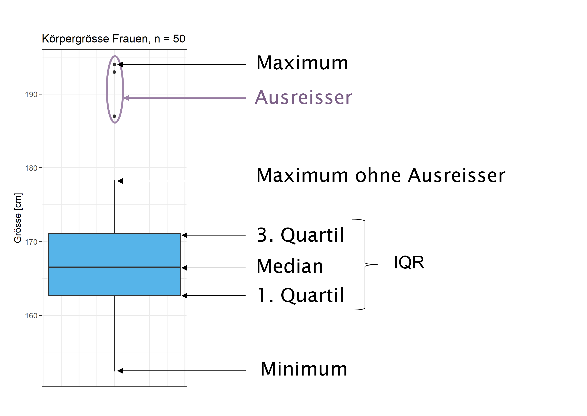

```{r setup-01, include=F}
rm(list = ls())

knitr::opts_chunk$set(echo = FALSE, 
                      warning = FALSE, 
                      message = FALSE,
                      fig.align = "center")

library(openintro)
library(tidyverse)
library(knitr)
library(patchwork)
library(kableExtra)

ggred <- "#F8766D"
ggblue <- "#00BFC4"
gggreen <- "#7CAE00"
ggviolet <- "#C77CFF"

data(COL)
library(scales)
show_col(COL[1:20])

# Deskriptive Statistik
# openintro_palettes 
# Hex for openintro COLs
# Probleme beim rendern: https://stackoverflow.com/questions/66305776/got-knit-issue-with-r, solution:
# tinytex::tlmgr_install("pdfcrop")
# install ghostscript https://www.ghostscript.com/download/gsdnld.html
# Sys.setenv(R_GSCMD="C:/Program Files/gs/gs9.54.0/bin/gswin64.exe")

```

# Deskriptive Statistik {#sec-deskriptive-statistik}

> Ein Bild sagt mehr als tausend Worte.

Jede statistische Analyse beginnt mit der Beschreibung und der Zusammenfassung der vorliegenden Daten. Es ist eine sehr gute Angewohnheit, Daten immer zuerst zu visualisieren, bevor man mit Berechnungen beginnt.

```{r, fig.align='center', fig.dim = c(8, 3)}
#| label: fig-plot-intro
#| fig-cap: "Falscher Wert"

set.seed(123)
bs <- rnorm(99, 178, 15)
bs.df <- data.frame(bs = c(bs, 1.78))
ggplot(bs.df, aes(x = bs)) + geom_histogram() +
  labs(x = "Körpergrösse [cm]", y = "Absolute Häufigkeit")
```

Angenommen, Sie analysieren die Körpergrösse von 100 Studierenden. Alleine durch die Berechnung des Mittelwerts (in diesem Fall $\bar{x} = `r round(mean(bs.df[,1]),1)`$) würden Sie kaum merken, dass aus Versehen bei einer Person die Grösse in Meter und nicht in Zentimeter angegeben wurde. Durch die Visualisierung der Daten wird dieser Fehler hingegen schnell offensichtlich, wie @fig-plot-intro zeigt (der korrekte Mittelwert ist $\bar{x} = `r round(mean(bs),1)`$ ).

In diesem Kapitel geht es darum, wie die verschiedenen Datentypen durch Grafiken und Kennzahlen zusammengefasst und präsentiert werden können.

## Lernziele

::: callout-important
1.  Beschreibe Daten mit den Begriffen Beobachtungseinheit, Beobachtungsmerkmal (= Variable), Ausprägung von Beobachtungsmerkmalen.
2.  Unterscheide quantitative und qualitative Daten.
    -   Unterscheide bei quantitativen Daten zwischen kontinuierlichen (= stetigen) und diskreten Variablen.
    -   Unterscheide bei qualitativen Daten zwischen nominalen (= kategoriale) und ordinalen Variablen.
3.  Erwähne bei der Beschreibung von quantitativen Daten die Form der Verteilung und die Kennzahlen der Lage und der Streuung.
    -   Beschreibe die Verteilung einer Variable als symmetrisch, rechtsschief oder linksschief.
    -   Nenne Kennzahlen der Lage: Mittelwert $\bar{x}$, Median $m$ und Quartile.
    -   Nenne Kennzahlen der Streuung: Varianz $s^2$, Standardabweichung $s$, Variationsbreite\
        (= Spannweite) und Interquartilabstand ($IQR$, engl. interquartile range).
4.  Verwende Histogramme und Boxplots um die Verteilung von quantitativen Daten zu visualisieren.
5.  Definiere *robuste statistische Kennzahlen* wie Median und IQR als Kennzahlen, die wenig von der Verteilungsform und von Extremwerten (Ausreissern) beeinflusst werden.
6.  Verwende Kreuztabellen und Balkendiagramme zur Beschreibung von qualitativen Daten (absolute und relative Häufigkeiten).
7.  Berechne die obenstehenden Statistiken in `R`.
8.  Erstelle Balkendiagramme, Histogramme und Boxplots in `R`.
:::

## Grundbegriffe

Wir verwenden in diesem Kapitel einen Datensatz mit biometrischen Merkmalen von Studierenden.

Codebook zum Datensatz (@tbl-overview-stud):

-   `ID`: Student:in\
-   `Kohorte`: Jahrgang: 14, 15, 16, 17\
-   `Klasse`: Klasse: 1, 2 (jede Kohorte wird aufgeteilt in zwei Klassen)\
-   `Geschlecht`: Geschlecht: m = männlich, w = weiblich\
-   `Augenfarbe`: Farbe: blau, grün, braun\
-   `Groesse`: Körpergrösse in cm\
-   `Gewicht`: Körpergewicht in kg\
-   `Statistik`: Interesse am Fach Statistik $^a$\
-   `Geschwister`: Anzahl Geschwister

$^a$ Frage: "Statistik interessiert mich"\
Auswahlitems:\
1 trifft nicht zu\
2 trifft kaum zu\
3 trifft etwas zu\
4 trifft eher zu\
5 trifft sehr zu

```{r}
#| label: tbl-overview-stud
#| tbl-cap: "Daten der ersten 5 Studierenden im Datensatz stud.csv, (n = 228)"

library(rio)
df.stud <- import("data/01-physio.csv")
df.stud <- df.stud %>% 
  mutate(Kohorte = extract_numeric(Kohorte),
         Groesse = as.numeric(Groesse),
         Gewicht = as.numeric(Gewicht),
         Geschwister = as.integer(sample(0:4, nrow(df.stud), prob = c(0.2,0.3,0.3,0.1,0.1), replace = TRUE)),
         Kohorte = as.factor(Kohorte),
         Geschlecht = as.factor(Geschlecht),
         Augenfarbe = as.factor(Augenfarbe),
         Klasse = as.factor(Klasse))

library(tidyverse)
library(kableExtra)
head(df.stud, 5) %>%
  kableExtra::kable() %>% 
  kableExtra::kable_classic(full_width = FALSE) %>% 
  kable_styling(latex_options = "HOLD_position")
```

In der Statistik beobachten wir typischerweise verschiedene **(Beobachtungs-)Merkmale**, wie das Geschlecht, die Körpergröße oder die Zugehörigkeit zu einer Klasse, an **Beobachtungseinheiten**, im vorliegenden Fall an Studierenden (in einem Laborversuch könnte eine Beobachtungseinheit z.B. auch eine Maus sein). Solche Merkmale bezeichnen wir als **Variablen** und die Werte, welche die Variablen annehmen können als **Merkmalsausprägungen**.

Bei der Datenerhebung in Studien werden die Daten in Tabellen erfasst. In diesen Datentabellen (Datensätzen) wird für jedes erhobene Merkmal eine separate Spalte erstellt. Jede Beobachtungseinheit wird in einer separaten Zeile erfasst, in der die jeweilige Ausprägung der Merkmale eingetragen wird. Zwar kann es sein, dass diese Datenstruktur für gewisse Analysen verändert wird, sie stellt aber die Grundform der Daten dar. Sie erhalten Datensätze für Übungen grundsätzlich immer in diesem Format als [csv-Datei](https://de.wikipedia.org/wiki/CSV_(Dateiformat)). Ein Fehler der häufig gemacht wird, ist der, dass pro Zelle mehr als eine Ausprägung erfasst wird, was die spätere Auswertung der Daten erheblich erschwert oder sogar unmöglich macht [@wickham2014].

Hinweise zur Notation: In der Regel werden für die Bezeichnung einer Variablen Grossbuchstaben gebraucht und für deren Ausprägungen Kleinbuchstaben. Wenn eine Variable $X$ aus den möglichen Werten 1, 2 und 3 besteht, dann schreiben wir $X = \{1,2,3\}$. Man nennt diese Menge den Träger von $X$. Eine Stichprobe mit Grösse $n$ schreiben wir dann $\{X_1=x_1,X_2=x_2,...,X_n=x_n\}$ ($n$ "Realisierungen" von $X$), z.B. $\{X_1=2,X_2=2,X_3=3...,X_n=1\}$. Grosse $X$ stehen hier für Zufallsvariablen, kleine $x$ für die *konkrete* oder *realisierte* Stichprobe.

## Quantitative und qualitative Daten

Als erste Eigenschaft unterscheiden wir zwischen qualitativen und quantitativen Variablen, je nachdem, welche Werte die Variable annehmen und wie man mathematisch damit umgehen kann.

**Quantitative** Variablen sind Beobachtungsmerkmale, die wir durch Messen oder Zählen ermitteln. Mit quantitativen Daten können wir sinnvolle mathematische Operationen durchführen, wie z.B. einen Durchschnitt bestimmen.

Bei quantitativen Daten unterscheiden wir zwei Unterkategorien:

-   quantitativ-**kontinuierliche** Variablen werden durch Messung erhoben. Sie werden auch als *numerische* oder *stetige* Variablen bezeichnet. Im stud-Datensatz sind `Groesse`, `Gewicht` und `Schuhgroesse` kontinuierliche Variablen. In `R` werden solche Variablen als `numeric` klassifiziert.

    ```{r, echo=T}
    # Mit dem Befehl class() kann der in R hinterlegte Datentyp abgefragt werden
    class(df.stud$Groesse)
    ```

<!-- -->

-   quantitativ-**diskrete** Variablen werden durch Zählen erhoben. Sie können nur ganzzahlige Werte annehmen. Beispiele sind Anzahl roter Blutkörperchen pro ml Blut oder die Anzahl Geschwister einer Person. Ganzzahlige Werte werden in `R` als `integer` klassifiziert. Im stud-Datensatz ist die Variable Geschwister quantitativ-diskret skaliert.

    ```{r, echo=TRUE}
    class(df.stud$Geschwister)
    ```

**Qualitative** Variablen sind Beobachtungsmerkmale, die wir nicht durch messen oder zählen, sondern durch direkte Anschauung ermitteln. Qualitative Daten lassen sich nicht sinnvoll addieren oder subtrahieren, d.h. wir können z.B. keinen Durchschnitt wie bei quantitativen Daten berechnen. Qualitative Daten eignen sich jedoch für Vergleiche, z.B. für den Vergleich der durchschnittlichen Körpergrösse von Männern und Frauen.

Auch bei qualitativen Daten unterscheiden wir zwei Unterkategorien:

-   qualitativ-**nominal**: Die Variable gibt eine Gruppenzugehörigkeit an. Im stud- Datensatz sind die Variablen `ID`, `Kohorte`, `Klasse`, `Augenfarbe` und `Geschlecht` diesem Variablentyp zuzuordnen.\
-   qualitativ-**ordinal**: Bei diesem Typ sind die Kategorien, im Gegensatz zu nominalen Daten, logisch geordnet, wie z.B. der Schweregrad einer Krankheit oder die Antworten „stimme nicht zu", „stimme teilweise zu", „stimme zu" in einer Umfrage. Im stud-Datensatz entspricht die Variable `Statistik` diesem Variablentyp.

In `R` empfiehlt es sich, qualitative Variablen als sogenannte Faktoren (`factor`) zu hinterlegen, wobei bei ordinalen Daten zusätzlich die Reihenfolge definiert werden muss.

```{r, echo=TRUE}
class(df.stud$Geschlecht)

# Beispiel, wie man die Reihenfolge bei ordinalen Variablen definiert
x <- factor(df.stud$Statistik, levels = c(1,2,3,4,5), labels = c("trifft nicht zu",
                                                         "trifft kaum zu",
                                                         "trifft etwas zu",
                                                         "trifft eher zu",
                                                         "trifft sehr zu"))
table(x)
```

## Quantitative Daten zusammenfassen

Mit Hilfe von **Kennzahlen** lassen sich Variablen zusammenfassen. Kennzahlen der zentralen Tendenz (Lagemasse) geben Auskunft über den "Schwerpunkt" einer Variablen und Kennzahlen der Streuung vermitteln uns einen Eindruck darüber, wie die Variablenwerte um diesen Schwerpunkt verteilt sind. In vielen Fällen sind Grafiken (engl. plots) einfacher lesbar als umfangreiche Tabellen.

### Kennzahlen der Lage (Lagemasse)

#### **Mittelwert**

Das gebräuchlichste Lagemass ist der Mittelwert (auch Durchschnitt). Der Mittelwert ist derjenige Wert, der die Daten auf einer „Waage" ausbalanciert. Wir nehmen dabei an, dass die Waage kein Gewicht hat und alle Beobachtungen gleich schwer sind. Weit entfernte Beobachtungen haben eine starke „Hebelkraft", also einen starken Einfluss auf den Mittelwert.

Sei $X$ eine Variable mit $n$ Beobachtungen $\{x_1, x_2,..., x_n\}$. Der empirische oder arithmetische Mittelwert (engl. mean) von diesen $n$ Werten von $X$ ist

$$
\bar{x} = \frac{(x_1 + x_2 + ... + x_n)}{n} = \frac{1}{n} \sum_{i=1}^n x_i = n^{-1} \sum_{i=1}^n x_i .
$$

Hinweise: der Index $_i$ unter dem Summenzeichen $\Sigma$ in der Formel ist ein Platzhalter für die "Nummer" alle Werte, das heisst, man summiert alle Werte von $i = 1$ bis $i = n$ auf. Diese Schreibweise hat den Vorteil, dass sie für alle Variablen gilt, egal welcher Wert $n$ hat. Sie werden dieser Schreibweise noch einige Male begegnen.

```{r, fig.align='center', fig.dim = c(6, 2)}
#| label: fig-plot-outlier
#| fig-cap: "Einfluss von Ausreissern beim Mittelwert"
alter <- c(18, 19, 20, 21, 21, 22, 22, 23, 23, 24, 26, 18, 19, 20, 21, 21, 22, 22, 23, 23, 36, 37)

gruppe <- factor(c(rep("a", 11), rep("b", 11)))
alter_tib <- tibble(
  Alter = alter,
  gruppe = gruppe
)

m_alter <- alter_tib %>% 
  group_by(gruppe) %>% 
  summarise(
    m = round(mean(Alter), 1),
    median = median(Alter)
    )

p1 <- alter_tib %>% 
  filter(gruppe == "a") %>% 
  group_by(gruppe) %>% 
  ggplot(., aes(x = Alter)) +
  geom_dotplot(binwidth = 1, fill = ggblue) +
  ylab("") +
  scale_y_continuous(breaks = NULL) +
  xlim(c(18, 37)) +
  theme_grey()

p1m <- p1 +
  geom_text(x=23.8, y=.5, label= m_alter$m[1], color = ggred, size = 6) +
  geom_vline(xintercept = m_alter$m[1], color = ggred)

p2 <- alter_tib %>% 
  filter(gruppe == "b") %>% 
  group_by(gruppe) %>% 
  ggplot(., aes(x = Alter)) +
  geom_dotplot(binwidth = 1, fill = ggblue) +
  ylab("") +
  scale_y_continuous(breaks = NULL) +

  xlim(c(18, 37)) +
  theme_grey()

p2m <- p2 +
    geom_text(x=26, y=.5, label= m_alter$m[2], color = ggred, size = 6) +
    geom_vline(xintercept = m_alter$m[2], color = ggred)

(p1m | p2m)
```

In @fig-plot-outlier ist erkennbar, dass wenn die zwei höchsten Werte aus der Abbildung links nach rechts verschoben werden, also höhere Werte annehmen, sich auch der Mittelwert nach rechts verschiebt und somit grösser wird.

Den Mittelwert einer Variable in `R` berechnen:

```{r rfun_mean, echo=TRUE}

# Daten generieren   
x <- c(2, 2, 3, 3, 4)

# Mittelwert von x berechnen
mean(x)

# Umgang bei fehlenden Werten
x <- c(2, 2, 3, 3, 4, NA)
mean(x, na.rm = TRUE)
```

#### **Median**

Der Median beschreibt die „Mitte", den „50 %-Punkt" der Daten. Als Spezialfall eines Quantils (siehe @sec-quantile) ist der Median definiert als ein Wert, der die Daten in zwei gleiche Hälften teilt, als der Wert mit 50% kumulierter relativer Häufigkeit.

Bestimmung des Medians:

-   Gegeben ist eine konkrete Stichprobe einer Variablen $X$: $\{X_1=3, X_2=2, X_3=2, X_4=2, X_5=4\}$
-   Werte der Stichprobe nach Grösse sortieren (das heisst, die Variable muss mindestens ordinalskaliert sein): $2, 2, 2, 3, 4$
-   Der Wert, der die Zahlenreihe halbiert ist der Median: $Median = 2$

Wenn die Variable eine geradzahlige Anzahl an Werten hat, bestimmen wir das arithmetische Mittel der beiden mittleren Werte:

-   Stichprobe aus $X$: $\{3, 2,2,2,4,4\}$
-   Werte nach Grösse sortieren: $2, 2, 2, 3, 4, 4$
-   Die beiden mittleren Werte sind $2$ und $3$, das arithmetische Mittel ist 2.5, d.h. $Median = 2.5$

Den Median einer Variable in `R` berechnen:

```{r rfun-median, echo=TRUE}


# Daten generieren   
x <- c(2, 2, 2, 3, 4)

# Median von x berechnen
median(x)

# Höchsten Wert von x erhöhen   
x <- c(2, 2, 2, 3, 20)  

# Median von x berechnen   
median(x)  

# Variable x mit geradzahliger Anzahl an Werten 
x <- c(3, 2, 2, 2, 4, 4)

# Median von x berechnen   
median(x)  
```

Einfluss extremer Werte auf den Median:

```{r, fig.align='center', fig.dim = c(6, 2)}
#| label: fig-plot-median
#| fig-cap: "Einfluss von Ausreissern beim Median"

p3 <- p1 +
  geom_text(x=23.8, y=.5, label= m_alter$median[1], color = ggred, size = 6) +
  geom_vline(xintercept = m_alter$median[1], color = ggred)

p4 <- p2 +
  geom_text(x=23.8, y=.5, label= m_alter$median[2], color = ggred, size = 6) +
  geom_vline(xintercept = m_alter$median[2], color = ggred)

(p3 | p4)
```

@fig-plot-median zeigt, dass eine Verschiebung der beiden höchsten Werte in der Abbildung links keinen Einfluss auf den Median hat. Die Eigenschaft, dass eine Kennzahl oder Methode nicht stark von einzelnen Werten abhängt, bezeichnet man als **robust**.

> Merke: Der Mittelwert ist empfindlich für Extremwerte, der Median hingegen ist *robust*.

**Mittelwert oder Median**

Die Auswahl der Kennzahl der Lage ist abhängigig davon, wie die Daten verteilt sind und welchen Aspekt der Verteilung mit der Kennzahl dokumentiert werden soll.

Wir illustrieren das am Beispiel der Verteilung des monatlichen Einkommens von Schweizer Frauen im Jahr 2018 (Quelle: [Bundesamt für Statistik](https://www.bfs.admin.ch/bfs/de/home/statistiken/arbeit-erwerb/loehne-erwerbseinkommen-arbeitskosten/lohnniveau-schweiz/verteilung-nettoloehne.html)).

```{r fig.dim = c(4, 3)}
#| label: fig-plot-einkommen
#| fig-cap: "Monatliches Einkommen, Frauen CH, 2018. Mittelwert (rot) = CHF 4600, Median (orange) = CHF 4000. "   


# https://www.bfs.admin.ch/bfs/de/home/statistiken/arbeit-erwerb/loehne-erwerbseinkommen-arbeitskosten/lohnniveau-schweiz/verteilung-nettoloehne.html 
income <- import("../data/01-income-ch-f-2018.csv")

# für jedes Lohnband gemäss Prozentangaben Daten erstellen
code <- income$code
prozent <- income$prozent
income <- vector()
for (i in 1:21){
  inc <- code[i]
  mal <- prozent[i] * 10
  x <- rep(inc, times = mal)
  income <- c(income, x)
}
einkommen <- tibble(Einkommen = income)

# Mittelwert und Median berechnen
sum <- einkommen %>% 
  summarise(
    M = mean(Einkommen),
    Median = median(Einkommen)
  )
sum <- round(sum, 1)

# Histogramm erstellen
ggplot(einkommen, aes(x = Einkommen)) +
  geom_histogram(fill = ggblue, color = "white", binwidth = 1) +
  xlab("CHF (in Tausend)") +
  ylab("Häufigkeit") +
  geom_vline(xintercept = sum$M, color = ggred, lwd = 1) +
  geom_vline(xintercept = sum$Median, color = "orange", lwd = 1) +
  theme_grey()
```

Das monatliche Einkommen ist rechtsschief verteilt. Es beträgt im Durchschnitt CHF 4600.-, der Median liegt mit CHF 4000.- um CHF 600.- (13%) tiefer. Der Mittelwert ist vergleichsweise hoch, weil einige wenige sehr gut verdienende Personen diesen "nach oben" ziehen. Für die Einzelperson hat daher der Mittelwert wenig Aussagekraft, informativer ist für diese der Median. Die Steuerbehörde interessiert sich eher für den Mittelwert, der es z.B. erlaubt, das totale Einkommen der Stadt und die zu erwartenden Steuern zu berechnen.

Ob zur Charakterisierung einer Variablen der Mittelwert oder Median verwendet werden soll, ist von den Antworten auf die folgenden Fragen abhängig:

-   Soll ein typischer (Median) oder durchschnittlicher (Mittelwert) Wert als Repräsentant der Variablen angegeben werden.
-   Was hat die Verteilung für eine Form? Ist sie schief oder symmetrisch?
-   Welche inferenzstatistischen Auswertungsmethoden werden für die Variable gewählt? Wenn parametrische Verfahren (t-Tests) durchgeführt werden wird eher der Mittelwert angegeben, wenn nicht-parametrische Verfahren (Rangtests) durchgeführt werden wird eher der Median berichtet.

#### **Quantile** {#sec-quantile}

Das $\alpha$-Quantil ($Q_{\alpha}$) ist **der** Wert, bei dem $\alpha \times 100\%$ der Werte kleiner und $(1-\alpha)\times 100\%$ der Werte grösser sind. $\alpha \in (0,1)$ ist dabei das gewünschte Quantilniveau.

- Allgemein schreiben wir $Q_{\alpha}$, z.B. $Q_{0.3546}$
- Bei Perzentilen $P$ ist $\alpha\times 100$ ganzzahlig z.B. $P_{13}=Q_{0.13}$  
- Bei Dezilen $D$ ist $\alpha\times 10$ ganzzahlig, z.B. $D_4=Q_{0.4}$ 
- Bei Quartilen ist $\alpha$ 0.25, 0.5 oder 0.75 und wir schreiben dann $Q_{0.25},Q_{0.5},Q_{0.75}$. 
- $Q_{0.5}$ ist natürlich der Median, also das fünfte Dezil oder die 50. Perzentile.


Einfacher geht es mit einem Beispiel: Uns interessiert, wo die Grenze zwischen dem unteren und dem mittleren Drittel beim Einkommen von Frauen in der Schweiz liegt. Das bedeutet, wir müssen das 33%-Quantil (d.h. $Q_{0.33}$) der Einkommensverteilung bestimmen.

```{r Rquantile, echo=TRUE}


# 33. Quantil berechnen
quantile(einkommen$Einkommen, .33)
```

Interpretation: Wir erhalten für das 33%-Quantil den Wert 3. Die Angaben sind jeweils mit 1000 zu multiplizieren. Die 33% Frauen mit dem niedrigsten monatlichen Einkommen verdienen zwischen 0 und 3000 CHF.

<!-- **Quartile** sind spezielle Quantile, welche eine Variable in vier gleiche Teile unterteilen. Das 1. Quartil (auch unteres Quartil) ist das 25%-Quantil, das 2. Quartil ist das 50%-Quantil (also der Median) und das 3. Quartil (auch oberes Quartil) ist das 75%-Quantil. -->

```{r Rquartiles, echo=TRUE}


# Quartile berechnen
quantile(einkommen$Einkommen, c(.25, .5, .75))
```

Intepretation:

-   25% der Frauen verdienen CHF 3000.- oder weniger
-   25% der Frauen verdienen zwischen CHF 3000.- und 4000.-.
-   25% der Frauen verdienen zwischen CHF 4000.- und 6000.-.
-   25% der Frauen verdienen CHF 6000.- oder mehr.

### Exkurs: Der Mittelwert als Kleinst-Quadrat-Modell

Im Hinblick auf das Streuungsmass Varianz und später erläuterte statistische Methoden (insbesondere die lineare Regression) wird hier ergänzend ein etwas anderes Konzept des Mittelwerts vorgestellt.

Beispiel: Wie viele Freunde haben Statistik-Lehrer?

Aus einer kleinen Umfrage liegen uns die Daten für fünf Statistiklehrer vor:

```{r}
#| label: tbl-statlehrer-freunde
#| tbl-cap: "Anzahl Freunde von Statistiklehrern"
mw_tib <- tibble(
  ID = seq(from = 1, to = 5, by = 1),
  Freunde = c(1, 2, 3, 3, 4)
) 
mw_tib %>% 
  kbl() %>% 
  kable_classic(full_width = FALSE) %>% 
  kable_styling(latex_options = "HOLD_position")
```

```{r fig.dim=c(4, 3), fig.align='center'}
#| label: fig-plot-statlehrer-scatter
#| fig-cap: "Streudiagramm Anzahl Freunde"
mw_point <- ggplot(mw_tib, aes(x = ID, y = Freunde)) +
  geom_point(color = ggblue, size = 3) +
  theme_grey()
mw_point
```

Aus @fig-plot-statlehrer-scatter schätzen wir den Mittelwert. Als erstes entscheiden wir uns für einen Kandidaten $a= 2$

```{r fig.align='center', fig.dim=c(4, 3)}
#| label: fig-plot-statlehrer-mw2   
#| fig-cap: "Geschätzter Mittelwert = 2"   

mw_tib_est1 <- mw_tib %>% 
  mutate(
    Est = 2,
    e = Freunde - Est,
    e_sq = e^2
  )

ggplot(mw_tib_est1, aes(x = ID, y = Freunde)) +
  geom_point(color = ggblue, size = 4) +
  theme_grey() +
  geom_hline(yintercept = 2) +
  geom_segment(aes(xend = ID, yend = Est), color = ggred, size = 1) 
```

Die horizontale schwarze Linie zeigt einen falschen Mittelwert-Kandidaten von $a = 2$ an. Die Länge der roten Linien gibt die Grösse des Abstands $e_i$ vom Messwert $i$ zum Mittelwert-Kandidaten $a$ an. Aus der Definition des wahren Mittelwertes folgt, dass für diesen die Summe der Abstände immer Null ist, $\sum_i^n (x_i-\bar{x})=0$, darum nehmen wir die Summe der quadrierten Fehler $e_i^2$ als ein Mass für den totalen Fehler. 


```{r}
#| label: tbl-fehler-mw2
#| tbl-cap: "Fehler e und Fehlerquadrate e_sq bei Mittelwert-Kandidat = 2"
mw_tib_est1 %>% 
  kbl() %>% 
  kable_classic(full_width = FALSE) %>% 
  kable_styling(latex_options = "HOLD_position")
# 
# mw_tib_est1 %>% 
#   summarise(
#     Fehlersumme = sum(e),
#     Fehlerquadratsumme = sum(e_sq)
#   )  %>% 
#   kbl() %>% 
#   kable_styling(full_width = FALSE)
```

Wir addieren aus @tbl-fehler-mw2 die Werte der quadrierten Fehler $e^2$ (= e_sq) und erhalten für unser $a = 2$ eine **Fehlerquadratsumme** von 7. Wir können jetzt unseren Fehler mit der Zahl 7 quantifizieren.

Vielleicht gibt es aber einen besseren Mittelwert-Kanditaten und als nächstes berechnen wir die Quadratsumme für  $a = 4$.

```{r fig.align='center', fig.dim=c(4, 3)}
#| label: fig-plot-statlehrer-mw4
#| fig-cap: "Geschätzter Mittelwert = 4"   
#| 
mw_tib_est2 <- mw_tib %>% 
  mutate(
    Est = 4,
    e = Freunde - Est,
    e_sq = e^2
  )

ggplot(mw_tib_est2, aes(x = ID, y = Freunde)) +
  geom_point(color = ggblue, size = 4) +
  theme_grey() +
  geom_hline(yintercept = 4) +
  geom_segment(aes(xend = ID, yend = Est), color = ggred, size = 1) 
```

```{r}
#| label: tbl-fehler-mw4
#| tbl-cap: "Fehler und Fehlerquadrate für Mittelwert-Kandidat = 4"
mw_tib_est2 %>% 
  kbl() %>% 
  kable_classic(full_width = FALSE) %>% 
  kable_styling(latex_options = "HOLD_position")
```

Bei einem geschätzten Mittelwert $a = 4$ ergibt sich gemäss @tbl-fehler-mw4 eine Fehlerquadratsumme von 15.

Jetzt setzen wir den wahren Mittelwert $\bar{x} = 2.6$ ein und machen das ganze noch einmal.

```{r fig.align="center", fig.dim=c(4, 3)}
#| label: fig-plot-statlehrer-truemw   
#| fig-cap: "Fehler bei wahrem Mittelwert = 2.6"
mw_tib_est3 <-  mw_tib %>% 
  mutate(
    Est = 2.6,
    e = Freunde - Est,
    e_sq = e^2
  )

ggplot(mw_tib_est3, aes(x = ID, y = Freunde)) +
  geom_point(color = ggblue, size = 4) +
  theme_grey() +
  geom_hline(yintercept = 2.6) +
  geom_segment(aes(xend = ID, yend = Est), color = ggred, size = 1) 
```

```{r fehler-truemw}
#| label: tbl-fehler-truemw
#| tbl-cap: "Fehler und Fehlerquadrate beim wahren Mittelwert = 2.6"
mw_tib_est3 %>% 
  kbl() %>% 
  kable_classic(full_width = FALSE) %>% 
  kable_styling(latex_options = "HOLD_position")

# summarise(mw_tib_est3, sum = sum(e_sq))
```

Der arithmetische Mittelwert ergibt eine Fehlerquadratsumme von 5.2 (@tbl-fehler-truemw). Dieser Wert ist kleiner als die Fehlerquadratsumme für die beiden anderen Lagemasse und wir halten fest:


> Der Mittelwert einer Variable ist **die** Grösse $a$, die die Summe der quadrierten Abstände der $x_i$ zu $a$ minimiert, also die Grösse 
$$
\bar{x} = \arg\min_{a \in \mathbb{R}} \sum_{i=1}^n (x_i - a)^2
$$
Diese Eigenschaft macht den Mittelwert zum optimalen Schätzer im Sinne der Methode der kleinsten Quadrate (dazu mehr später).

Grafisch dargestellt:

```{r fig.align='center', fig.align="center", fig.dim=c(5, 4)}
#| label: fig-plot-mw-ssq
#| fig-cap: "Verteilung der Fehlerquadratsummen"   


est_b0 <- seq(from = 0, to = 5.2, by = .1)
ssq <- vector()
mw_tib_est <- mw_tib
for (i in 1:length(est_b0)){
  mw_tib_est$b0 <- est_b0[i]
  mw_tib_est$sq <- (mw_tib_est$Freunde - mw_tib_est$b0)^2
  ssq[i] <- sum(mw_tib_est$sq)
}

ssq_tib <- tibble(
  x = est_b0,
  y = ssq
)

ggplot(ssq_tib, aes(x = x, y = y)) +
  geom_line(color = ggred) +
  geom_point(color = ggred) +
  coord_cartesian(ylim = c(0, 40)) +
  #geom_vline(xintercept = mean(mw_tib$Freunde)) +
  labs(x = "Schätzer für den Mittelwert", y = "Fehlerquadratsumme") +
  geom_segment(x = 2.6, xend = 2.6, y = 0, yend = min(ssq_tib$y), 
               color = ggred, 
               arrow = arrow(length = unit(0.3, "cm"), type = "closed")) +
  geom_segment(x = 2.6, xend = 0, y = 5.2, yend = 5.2, color = ggred, 
               arrow = arrow(length = unit(0.3, "cm"), type = "closed")) +
  geom_text(x = 2.9, y = 3, label = "2.6", color = ggred, size = 4) +
  geom_text(x = 0.2, y = 7, label = "5.2", color = ggred, size = 4) +
  theme_grey()
```

Der arithmetische Mittelwert $\bar{x} = 2.6$ entspricht der Stelle, an der die Summe der quadrierten Fehler minimal ist: $\sum{e^2_i} = 5.2$.

Das Verfahren der Bestimmung der Fehlerquadratsumme ist ein grundlegendes Prinzip in der Statistik, das bei zahlreichen Verfahren zum Einsatz kommt.

### Kennzahlen der Streuung (Streuungsmasse)

Lagemasse beschreiben einen Aspekt einer Stichprobe oder einer Verteilung. @fig-plot-two-distr verdeutlicht, dass Lagemasse nicht ausreichen, um eine Verteilung genügend zu charakterisieren. Beide Stichproben haben einen Mittelwert von 0 (senkrechte Linie), trotzdem würden wir nicht behaupten, dass sie aus der gleichen Verteilung stammen: Die Beobachtungen in der oberen Stichprobe „streuen" mehr, sie sind im Mittel weiter weg vom Mittelwert. Kennzahlen der Streuung quantifizieren diese Eigenschaft.

```{r fig.align='center', fig.dim=c(7, 1.5)}
#| label: fig-plot-two-distr
#| fig-cap: "Zwei Variablen mit Mittelwert 0"
set.seed(2)
data <- tibble(
  set = c(rep("SP1", 20), rep("SP2", 20)),
  x = c(rnorm(20, mean = 0, sd = 0.2), rnorm(20, mean = 0, sd = 1)),
  y = c(rep(1, 20), rep(2, 20))
)

ggplot(data, aes(x = x, y = y, color = set)) +
  geom_point(size = 3, alpha = .6) +
  theme_minimal() +
  ylim(0, 3) +
  theme(legend.position = "none",
        panel.grid = element_blank(),
        axis.title = element_blank(),
        axis.ticks.y = element_blank(),
        axis.text.y = element_blank()) +
  geom_vline(xintercept = 0)

# data %>% 
#   group_by(set) %>% 
#   summarise(
#     M = mean(x),
#     s = sd(x)
#   )
```

**Varianz**

Die Varianz einer Stichprobe (engl. variance) ist die mittlere quadratische Abweichung der Beobachtungen vom Mittelwert:

$$s^2=\frac{(x_1-\bar{x})^2 + (x_2-\bar{x})^2+...+(x_n-\bar{x})^2}{n-1} = 
\frac{1}{n-1} \sum_{i=1}^n (x_i-\bar{x})^2$$

Um die Variabilität der Stichprobe in einer Zahl zusammenzufassen, wäre man auf den ersten Blick versucht, die Abweichungen $x_1-\bar{x}, ..., x_n-\bar{x}$ der Beobachtungen vom Mittelwert zu mitteln. Dies würde allerdings bedeuten, dass sich positive und negative Abweichungen gegenseitig aufheben, und die „Varianz" wäre dann 0. Dieses Vorgehen ist deshalb ungeeignet. Werden die Abweichungen $x_i-\bar{x}$ jedoch quadriert, dann gehen sie alle positiv in die Summe ein, d. h., eine gegebene Abweichung vom Mittelwert nach unten trägt gleichviel bei wie die identische Abweichung vom Mittelwert nach oben. 

Die Verwendung von $n-1$ als Nenner hat einen theoretischen Hintergrund. Damit die Stichprobenvarianz $s^2$ die wahre Populationsvarianz $\sigma^2$ im Schnitt richtig schätzt (man sagt, damit $s^2$ *erwartungstreu* ist), muss man durch $n-1$ statt durch $n$ teilen (hier ohne Beweis). Später werden wird die Grösse $n-1$ *Freiheitsgrade* nennen (Man verliert einen Freiheitsgrad durch die Schätzung des Mittelwerts).  


Berechnung der Varianz einer Variablen $X$ in `R`

```{r Rvariance, echo=TRUE}


# Variable x erzeugen
x <- c(1, 1, 2, 3, 4, 4, 4, 5)

# Varianz von x berechnen  
var(x)
```

**Standardabweichung** $s$

Gemäß ihrer Definition wird die Varianz $s^2$ im Quadrat der Einheit der ursprünglichen Daten angegeben (bei der Körpergröße z. B. $cm^2$ ). Um eine Kennzahl auf derselben Skala wie die Originaldaten zu erhalten, ist es gebräuchlich, die Wurzel aus der Varianz, die (empirische) Standardabweichung $s$ (engl. standard deviation, SD) zu berechnen:

$$s=\sqrt{s^2}$$

Die Standardabweichung hat die gleiche Einheit wie die Originaldaten, beispielsweise bei der Körpergrösse sind es cm. In @fig-plot-two-distr betragen die Standardabweichungen 1.18 für die blaue Stichprobe und 0.21 für die rote Stichprobe.

Berechnung der Standardabweichung einer Variablen $X$ in `R`

```{r Rsd, echo=TRUE}


# Variable x erzeugen
x <- c(1, 1, 2, 3, 4, 4, 4, 5)

# Standardabweichung von x berechnen  
sd(x)

# Standardabweichung als Quadratwurzel der Varianz berechnen
sqrt(var(x))
```

**Spannweite**

Die Spannweite (engl. range), auch Variationsbreite, ist die Differenz zwischen Maximum und Minimum und gibt den Bereich an, in dem die Daten liegen.

$$Spannweite = Maximum - Minimum$$

Die Spannbreite wird nur durch die Extremwerte einer Stichprobe bestimmt und ist daher sehr empfindlich für Extremwerte und damit wenig robust.

Berechnung der Spannbreite einer Variablen $X$ in `R`

```{r Rrange, echo=TRUE}


# Variable x erzeugen
x <- c(1, 1, 2, 3, 4, 4, 4, 5)

# Spannweite von x berechnen  
max(x) - min(x)
```

**Interquartilsabstand**

Der Interquartilsabstand (engl. interquartile range, IQR) ist die Differenz zwischen dem 75%- und dem 25%-Quantil. Der $IQR$ umfasst die Spannweite der mittleren 50% der Daten.

Der IQR beschreibt die Länge der Box im Boxplot, welche die zentralen 50% der Daten umfasst.

Berechnung des IQR einer Variablen $X$ in `R`

```{r R-IQR, echo=TRUE}


# Daten generieren
x <- c(19, 19, 20, 21, 21, 21, 22, 23, 23, 27, 27, 29, 29, 31)

# IQR für x berechnen
IQR(x)

# Quartile für x berechnen
quantile(x, c(.25, .75))
```

### Grafiken für quantitative Daten

Grafiken sind elementare Werkzeuge der Datenanalyse. Sie eignen sich auch dafür, Muster in den Daten einem grösseren Publikum vorzustellen. Mit geeigneten grafischen Darstellungen können die Eigenschaften einer Verteilung rasch beurteilt und mehrere Stichproben leicht miteinander verglichen werden.

**Histogramm**

Mit einem Histogramm wird die Verteilung von quantitativen Daten visualisiert. Dazu wird der Bereich der Daten in gleiche, anliegende aber sich nicht überlappende Intervalle (Klassen) zerlegt. Dann zählt man die Anzahl der Beobachtungen in jedem Intervall und erstellt ein Balkendiagramm.

```{r fig.align='center', fig.dim=c(8, 7)}
#| label: fig-plot-stud-groesse
#| fig-cap: "Körpergrösse von Studentinnen, n = 183"
df.stud_w <- import("../data/01-stud-w.csv")

p1 <- ggplot(df.stud_w, aes(x = Groesse)) + 
  geom_histogram(color = "white", fill = "darkgrey", binwidth = 1) +
  xlab("(A) Grösse (cm)") +
  ylab("Anzahl") +
  theme_grey()

p2 <- ggplot(df.stud_w, aes(x = Groesse)) + 
  geom_histogram(color = "white", fill = "darkgrey", binwidth = 2) +
  xlab("(B) Grösse (cm)") +
  ylab("Anzahl") +
  theme_grey()

p3 <- ggplot(df.stud_w, aes(x = Groesse)) + 
  geom_histogram(color = "white", fill = "darkgrey", binwidth = 5) +
  xlab("(C) Grösse (cm)") +
  ylab("Anzahl") +
  theme_grey()

p4 <- ggplot(df.stud_w, aes(x = Groesse)) + 
  geom_histogram(color = "white", fill = "darkgrey", binwidth = 10) +
  xlab("(D) Grösse (cm)") +
  ylab("Anzahl") +
  theme_grey()

(p1 | p2)/
  (p3 | p4)
```

Die @fig-plot-stud-groesse zeigt vier Histogramme der gleichen Variablen (Körpergrösse von Studentinnen) mit unterschiedlichen Klassenbreiten: (A) Klassenbreite = 1, (B) Klassenbreite = 2, (C) Klassenbreite = 5 und (D) Klassenbreite = 10. Bei der Wahl der Klassenbreite muss man etwas "spielen" um ein aussagekräftiges Bild zu erhalten (oder aber man übernimmt den Default in `R`, dieser ist oft gut zu gebrauchen). Die Anzahl der Klassen sollte von der Grössenordnung $\sqrt{n}$ sein. Wählt man die Klassenbreite zu klein, entsteht ein zu detailliertes Bild, das keine gute Übersicht zulässt und Lücken aufweist; wählt man die Klassenbreite zu gross, verliert man zu viel an Detailinform. Im Gegensatz zum weiter unten vorgestellten Balkendiagramm für qualitative Daten, bestehen zwischen den Balken eines Histogramms keine Lücken (ausser bei fehlenden Daten), da die x-Achse ein kontinuierliches Datenspektrum darstellt. Auch im Gegensatz zu Balkendiagrammen kann man die Reihenfolge der "Balken" in einem Histogramm nicht verändern, da diese an die x-Achse gebunden sind.

Am Histogramm beurteilen wir   

- die Streubreite, d.h. die Variablilität der Daten.  
- die Spitze (-n), d.h. die höchsten Gruppen von Balken.
- die Symmetrie, d.h. ob die Verteilung symmetrisch um ihren Mittelpunkt, links- oder rechtsschief ist.


Ein einfaches Histogramm in `R` erstellen:

```{r Rhisto-fig, echo=TRUE, fig.align="center", fig.dim=c(5, 4)}


# Körpergrösse von 183 Studentinnen
groesse <- c(170, 160, 169, 173, 172, 170, 167, 175, 173, 169, 169, 169, 180, 164, 165, 168, 167, 156, 161, 170, 168, 170, 175, 165, 165, 164, 170, 170, 170, 171, 164, 168, 168, 170, 164, 170, 165, 172, 167, 164, 162, 172, 162, 168, 170, 165, 172, 162, 165, 174, 167, 168, 169, 164, 165, 162, 163, 165, 161, 157, 170, 171, 163, 171, 161, 164, 166, 164, 174, 164, 181, 168, 163, 169, 160, 160, 148, 163, 165, 155, 158, 174, 168, 163, 170, 178, 159, 170, 163, 171, 172, 171, 178, 163, 164, 176, 168, 170, 171, 173, 162, 156, 174, 165, 168, 165, 177, 168, 160, 165, 163, 170, 168, 168, 158, 163, 161, 165, 165, 168, 180, 162, 162, 162, 162, 174, 168, 160, 178, 160, 168, 162, 177, 180, 170, 172, 163, 168, 156, 166, 168, 171, 165, 166, 160, 169, 167, 171, 158, 156, 166, 164, 163, 175, 163, 166, 162, 163, 160, 168, 163, 164, 172, 166, 164, 162, 170, 183, 168, 170, 165, 172, 160, 164, 163, 179, 170, 158, 164, 167, 175, 178, 170)

# Die interessierende Variable ist groesse
hist(groesse)

# mit dem Parameter breaks = kann die Anzahl der Klassen definiert werden
hist(groesse, breaks = 35)

# Anpassung der Beschriftung
hist(groesse,
     main = "Körpergrösse von Studentinnen (n = 183)",
     xlab = "Grösse (cm)",
     ylab = "Anzahl")
```

**Boxplot**

Boxplots sind ein weiteres grafisches Hilfsmittel, um die Verteilung von Daten zu visualisieren, verschiedene Gruppen oder Zeitpunkte zu vergleichen und auffällige Werte zu entdecken. Boxplots gehören zu den bevorzugten Grafiken, da sie eine grosse Menge an Informationen enthalten.

Die „Box" im Boxplot (engl. box and whiskers plot) gibt den Bereich vom **25%-** zum **75%-Quantil** an, der horizontale Strich in der Box den **Median**. Die Stäbe (engl. **whiskers**), die aus der Box herausragen, sind nicht einheitlich definiert. Bei einfachen Boxplots reichen sie zum Minimum und zum Maximum. Eine verbreitete Definition, die auf [John W. Tukey](https://en.wikipedia.org/wiki/John_Tukey) zurückgeht, besteht darin, die Länge der Whiskers auf maximal das 1,5-fache der Boxlänge zu beschränken. Beobachtungen ausserhalb dieses Bereichs werden als **Ausreisser** gekennzeichnet.



Die Abbildung illustriert die Definitionen des Boxplots an der Grösse von 50 Frauen.

Am Boxplot beurteilen wir:   

- die Spannweite
- die Lage der zentralen 50% der Daten (IQR)
- die Lage des Medians
- die Verteilung der Daten.

Liegt der Median etwa in der Mitte zwischen dem 25%- und dem 75%-Quantil, können wir von einer symmetrischen Verteilung der Daten ausgehen. Liegt der Median näher am 25%-Quantil, spricht dies eher für eine rechtsschiefe Verteilung, liegt er näher am 75%-Quantil, spricht dies eher für eine linksschiefe Verteilung.

Boxplots eignen sich sehr gut für den Vergleich von Gruppen.

```{r fig.dim=c(5, 4)}
#| label: fig-plot-boxplot-gruppen
#| fig-cap: "Körpergrösse von Studierenden"
ggplot(df.stud, aes(y = Groesse, x = Geschlecht)) +
  geom_boxplot() +
  theme(axis.title.x = element_blank(),
        axis.ticks.x = element_blank(),
        axis.text.x = element_blank()) +
  theme_grey()
```

```{r}
#| echo: false
#| eval: false

df.stud %>% 
  group_by(Geschlecht) %>% 
  summarise(X = IQR(Groesse))
```


Die @fig-plot-boxplot-gruppen zeigt die Verteilung der Körpergrösse von Studentinnen und Studenten. Auf den ersten Blick ist erkennbar, dass die Studentinnen im Durchschnitt kleiner sind als die Studenten. Die Grösse bei den Frauen liegt etwa zwischen 148 cm (Minimum) und 183 cm (Maximum), bei den Männern etwa zwischen 169 cm und 198 cm. Der Median bei Frauen liegt bei 167.5 cm und bei Männern bei 180 cm. 50% der Frauen sind zwischen 163 cm und 170 cm gross ($IQR = 7$), 50% der Männer sind zwischen 175 cm und 189 cm gross ($IQR = 9$). Der Median liegt nicht exakt in der Mitte der Box und ist bei beiden Geschlechtern leicht zum 75%-Quantil verschoben, was ein Hinweis auf eine leicht linksschiefe Verteilung sein könnte.

Einen einfachen Boxplot in `R` erstellen

Wir verwenden den Datensatz `PlantGrowth`, der bereits mit `R` mitgeliefert wird. Er umfasst die Ergebnisse eines Experiments, das den Einfluss von zwei verschiedenen Düngern auf die Ernte einer Pflanze untersucht. Der Datensatz besteht aus zwei Variablen:

-   *`weight`*: Trockengewicht der Pflanzen
-   *`group`*: 3 Gruppen: ctrl = Kontrollgruppe, trt1 = Dünger 1, trt2 = Dünger 2
-   Jede Gruppe umfasst n = 10 Messungen.

```{r Rfun_boxplot, echo=TRUE, fig.width=c(5, 4)}


# Datensatz laden
data("PlantGrowth")

# Boxplot für die Verteilung des Gewichts erstellen
boxplot(PlantGrowth$weight)

# Boxplot für die Verteilung des Gewichts nach Gruppe erstellen
boxplot(weight ~ group, data = PlantGrowth)   

# Boxplot beschriften  
boxplot(weight ~ group, data = PlantGrowth,
        main = "Trockengewicht, n = 10 pro Gruppe",
        xlab = "Gruppe",
        ylab = "Gewicht (g)")  

# Extra: Boxplots einfärben  
boxplot(weight ~ group, data = PlantGrowth,
        main = "Trockengewicht, n = 10 pro Gruppe",
        xlab = "Gruppe",
        ylab = "Gewicht (g)",
        col = c("blue", "green", "red"))  
```

**Kumulative Häufigkeitsverteilung**

Mit Hilfe einer kumulativen Häufigkeitsverteilung können Quantile noch genauer als mit einem Boxplot grafisch dargestellt werden. Auf der y-Achse befindet sich die kumulative relative Häufigkeit, auf der x-Achse der Wert der Variable.

```{r fig.width=c(5, 4)}
#| label: fig-plot-kum-freq
#| fig-cap: "Kumulative Häufigkeitsverteilung der Körpergrösse"
ggplot(df.stud_w, aes(x = sort(Groesse), 1:nrow(df.stud_w)/nrow(df.stud_w))) + geom_point(size = 0.2) +
  geom_line() + 
  labs(x = "Körpergrösse in cm", y = "Kumulative Häufigkeit", ) + 
  geom_segment(x = 140, xend = 167, y = 0.5, yend = 0.5, 
               color = ggred, 
               arrow = arrow(length = unit(0.3, "cm"), type = "closed")) + 
  geom_segment(x = 167, xend = 167, y = 0.5, yend = 0, color = ggred, 
               arrow = arrow(length = unit(0.3, "cm"), type = "closed"))
  
```

In der @fig-plot-kum-freq sieht man leicht, dass 50% der Studentinnen unter dem $median = `r round(median(df.stud_w[, "Groesse"]), 1)`$ sind und 50% darüber. In der Grafik lassen sich beliebige Quantile ablesen.

## Qualitative Daten zusammenfassen

Bei diskreten Daten interessiert man sich für die Häufigkeiten der vorkommenden Kategorien. Diese Häufigkeiten können absolut (Anzahl) oder relativ (in Prozentzahlen) angegeben werden. Werden relative Häufigkeiten angegeben, sollten immer auch die absoluten Häufigkeiten dargestellt werden.

### Kreuztabellen

Qualitative Daten können in einer Kreuztabelle (engl. contingency table) zusammenfassend dargestellt werden.

```{r}
#| label: tbl-kreuz-stud   
#| tbl-cap: "Augenfarben von 228 Studierenden"

df.stud %>% 
  group_by(Augenfarbe) %>% 
  summarise(
    n = n()
  ) %>% 
  mutate(
    Prozent = 100 * n/sum(n)
  ) %>% 
  add_row(Augenfarbe = "Total", n = 228, Prozent = 100) %>% 
  kable(digits = 1) %>% 
  kable_classic(full_width = FALSE) %>% 
  row_spec(4, bold = TRUE) %>% 
  kable_styling(latex_options = "HOLD_position")
```

In @tbl-kreuz-stud sind die Augenfarben von 228 Studierenden in einer Kreuztabelle zusammengefasst. Die Spalte *n* gibt die absoluten Häufigkeiten an, die Spalte *Prozent* die relativen Häufigkeiten in Prozent.

```{r}
#| label: tbl-kreuz-sex-stud
#| tbl-cap: "Augenfarben nach Geschlecht" 
df.stud %>% 
  select(ID, Geschlecht, Augenfarbe) %>% 
  group_by(Geschlecht, Augenfarbe) %>% 
  summarise(
    n = n(),
    .groups = "drop"
  ) %>% 
  spread(Geschlecht, n) %>% 
  mutate(
    Summe = m + w
  ) %>% 
  add_row(Augenfarbe = "Total", m = 45, w = 183, Summe = 228) %>% 
  kable() %>% 
  kable_classic(full_width = FALSE)  %>% 
  row_spec(4, bold = TRUE) %>% 
  kable_styling(latex_options = "HOLD_position")
```

Bei der Berechnung von Prozentzahlen (relativen Häufigkeiten) gilt es immer genau zu überlegen, welche Anzahl als 100% festgelegt werden soll: Wir können Prozentzahlen bezüglich der Spalten- oder Zeilentotale der @tbl-kreuz-sex-stud sowie der totalen Anzahl Beobachtungen in der Tabelle berechnen. Welche Zahlen berechnet werden sollen, hängt von der Fragestellung ab.

### Balkendiagramme

Eine geeignete grafische Darstellung von @tbl-kreuz-stud ist ein Balkendiagramm. Da die x-Achse getrennte Kategorien bezeichnet, liegen die Balken nicht aneinander, sondern werden mit einem kleinen Abstand dazwischen gezeichnet. Theoretisch kann man die Anordnung der Balken auch verändern, da es ja keine logische Reihenfolge der Ausprägungen gibt.

```{r fig.dim=c(5, 4)}

#| label: fig-plot-bar-stud
#| fig-cap: "Augenfarben von Studierenden, n = 228"
ggplot(df.stud, aes(x = Augenfarbe)) +
  geom_bar(fill = "darkgrey") +
  ylab("Anzahl") +
  theme_grey()
```

Die Höhe der Balken entspricht der Anzahl Beobachtungseinheiten in einer Kategorie. Für jede Kategorie wird ein separater Balken erstellt.

Balkendiagramme in `R` erstellen

```{r, echo=TRUE}


barplot(table(df.stud$Augenfarbe))
```

Eine Alternative zu Balkendiagrammen sind Tortendiagramme. Allerdings sind Tortendiagramme visuell schwierig zu beurteilen, da das menschliche Auge Längenunterschiede besser beurteilen kann als Flächenunterschiede. **Von Tortendiagrammen wird daher abgeraten.**

```{r}
#| label: fig-pies
#| fig-cap: "Kuchendiagramme vs. Balkendiagramme"


slices1 <- c(17, 18, 20, 22, 23) 
slices2 <- c(20, 20, 19, 21, 20)
slices3 <- c(23, 22, 20, 18, 17)
colrs <- c(COL[1], COL[2], COL[3], COL[4], COL[5])

par(mfrow = c(2, 3)) 
pie(slices1, col = colrs)
pie(slices2, col = colrs)
pie(slices3, col = colrs)
barplot(slices1, col = colrs)
barplot(slices2, col = colrs)
barplot(slices3, col = colrs)
par(mfrow = c(1, 1))
```

In den Tortendiagrammen sind die Grössenunterschiede der fünf Kategorien kaum zu differenzieren, ganz im Gegensatz zu den Balkendiagrammen.

Hier noch ein nicht ganz ernst gemeintes Tortendiagramm:

```{r, fig.dim=c(5, 4)}
#| label: fig-pie-funny
#| fig-cap: "Pyramide - R Code in der Helpdatei zu pie()"

## (original by FinalBackwardsGlance on http://imgur.com/gallery/wWrpU4X)
pie(c(Sky = 78, "Sunny side of pyramid" = 17, "Shady side of pyramid" = 5),
    init.angle = 315, col = c("deepskyblue", "yellow", "yellow3"), border = FALSE)
```

## Grundregeln für die Erstellung von Grafiken

Effektive Datenvisualisierungen sind die Voraussetzung jeder Datenanalyse, da sie allgemeine Muster in den Daten zeigen, was bei der reinen Betrachtung von Rohdaten nicht der Fall ist. Datenvisualisierungen werden von unserem Gehirn besser verarbeitet als einzelne Zahlen oder Zahlentabellen. Deshalb sind für die Präsentation von Daten Grafiken, wenn immer möglich, Zahlentabellen vorzuziehen. Mittels moderner Software kann eine Vielzahl von Grafiken erstellt werden, allerdings ist nicht jede Grafik auch eine gute Grafik. Die zahllosen Gestaltungsmöglichkeiten können schnell zur Erstellung von "fancy" Grafiken verleiten die zwar effektvoll aussehen, jedoch wenig bis keine Information über die Daten selbst vermitteln. Deshalb hier ein paar Grundregeln für die Erstellung von Grafiken für statistische Zwecke:

1.  Die Daten stehen im Mittelpunkt. Eine gute Grafik visualisiert die Daten und hilft dem Auge, Muster zu erkennen. Sie erleichtert die Beurteilung der Verteilung der Daten und den Vergleich von Messungen in verschiedenen Gruppen.
2.  Es sollen alle relevanten Informationen mit möglichst wenigen grafischen Elementen dargestellt werden.
3.  Keep it simple! Vermeide Ablenkung wie 3D-Effekte, Schatten, unnötige Farben, unruhige Hintergründe.
4.  Es soll klar ersichtlich sein, was dargestellt ist: Eine gute Grafik enthält

-   Prägnante Überschrift oder Legende
-   Achsenbeschriftungen, gegebenenfalls mit der Angabe von Einheiten
-   Angaben zu Stichprobenumfang, Erhebungszeitpunkt, Gruppen

5.  Die Daten werden möglichst unverzerrt dargestellt.

```{r}
#| label: fig-plot-expl-plots
#| fig-cap: "Serotoninspiegel von Heuschrecken in engem Habitat, n = 10"


grp1 <- c(3.5, 3.2, 3.8, 4.0, 4.3, 4.5, 4.8, 5.1, 13, 18)
grp2 <- c(4.6, 5, 5.1, 6.3, 6, 5.3, 6, 9, 15, 19)
grp3 <- c(6, 6.5, 7, 7.4, 8.8, 9.1, 12, 13, 17, 22)
serotonin <- c(grp1, grp2, grp3)
trt <- c(rep("0", 10), rep("1", 10), rep("2", 10))

d_tib <- tibble(
  serotonin = serotonin,
  trt = trt
)

set.seed(1)
p1 <- ggplot(d_tib, aes(y = serotonin, x = trt)) +
  stat_boxplot(geom ='errorbar', width = .3) +
  geom_boxplot(coef = 1.5) +
  geom_jitter(size = 3, color = ggblue, width = .1, alpha = .6) +
  stat_summary(fun= mean, geom = "point", size = 3, color = ggred) +
  xlab("Dauer (Stunden)") +
  ylab("Serotonin (pmol)") +
  ggtitle("Serotoninspiegel", subtitle = "rote Punkte: Mittelwerte") +
  theme_grey()

p2 <- ggplot(d_tib, aes(y = serotonin, x = trt)) +
  stat_summary(fun = mean, geom = "bar", fill = ggblue) +
  xlab("Dauer (Stunden)") +
  ylab("Serotonin (pmol)") +
  ggtitle("Mittelwerte Serotoninspiegel") +
  theme_grey()

(p1 | p2)
```

In der linken Grafik in @fig-plot-expl-plots ist die Streuung der Daten zu den drei Messzeitpunkten leicht zu erkennen. Jeder blaue Punkt stellt eine Messung dar und wir erkennen, dass die Mehrheit der Punkte unter dem Mittelwert liegen. Der Boxplot zeigt die Verteilung der Daten und den Median, der rote Punkt gibt den Mittelwert an. Wir erkennen dass mit zunehmender Behandlungsdauer der durchschnittliche Serotoninspiegel ansteigt. Die rechte Grafik zeigt nur die Mittelwerte zu den drei Messzeitpunkten. Der Informationsgehalt dieser Grafik ist minimal.

Häufige Fehler bei der Erstellung von Grafiken für statistische Zwecke

-   Mangelhafte Beschriftung (Achsenbeschriftungen fehlen oder sind ungenau, Stichprobenumfänge nicht angegeben, Titel fehlt)
-   Skalenfehler wie z.B. unterschiedliche Skalen bei vergleichenden Grafiken, y-Achse beginnt nicht bei 0 bei Histogrammen oder Balkendiagrammen.

```{r, fig.dim=c(7, 4), fig.align='center'}
#| label: fig-plot-apple
#| fig-cap: "Schlusskurse der Apple-Aktie 1.1. bis 24.11.2021"

# library(tidyquant)
# aapl <- tq_get('AAPL',
#                from = "2021-01-01",
#                to = "2021-11-25",
#                get = "stock.prices")
# 
# aapl <- aapl %>% 
#   select(date, close)
# write_csv(aapl, file = "./../data/02_aapl.csv")

aapl <- import("../data/01-aapl.csv")

aapl1 <- ggplot(aapl, aes(x = date, y = close)) +
  geom_line(color = ggred) +
  xlab("Datum") +
  ylab("Schlusskurs")


aapl2 <- ggplot(aapl, aes(x = date, y = close)) +
  geom_line(color = ggred) +
  ylim(0, 170) +
  xlab("Datum") +
  ylab("Schlusskurs")

(aapl1 | aapl2)
```

Beide Grafiken in @fig-plot-apple visualisieren die Schlusskurse der Appleaktie (AAPL) im Jahr 2021. In der linken Abbildung ist die y-Achse ist auf den Datenbereich zwischen 115 und 165 beschränkt. Die Kursausschläge wirken extrem und suggerieren eine Verdoppelung des Aktienwerts zwischen der ersten und der zweiten Jahreshälfte. In der Abbildung rechts, beginnt die y-Achse bei 0 und die Ausschläge wirken eher moderat. Wenn es darum geht, absolute Unterschiede darzustellen, kann die linke Grafik durchaus Sinn machen. Wenn es jedoch wichtig ist, Grössenverhältnisse darzustellen, ist die rechte Grafik besser geeignet.

Geeignete Darstellungen von Daten

-   für eine nominale Variable: Kreuztabelle, Balkendiagramm
-   für eine quantitative Variable: Histogramm, Boxplot, Liniendiagramm
-   Zusammenhang zwischen zwei nominalen Variablen: Kreuztabelle, gruppiertes Balkendiagramm
-   Zusammenhang zwischen quantitativen Variablen: Streudiagramm
-   Zusammenhang zwischen einer quantitativen Variablen und einer nominalen Variablen: Gruppierte Boxplots oder mehrere Histogramme (Achte auf gleiche Skalierung der Achsen).

```{r, fig.dim=c(7, 5), fig.align='center'}
#| label: fig-plot-iris
#| fig-cap: "Länge der Kelchblätter von drei Iris-Spezies, n = 50/Spezies"
data(iris)

iris1 <- ggplot(iris, aes(x = Species, y = Sepal.Length)) +
  geom_boxplot() +
  theme_grey()

iris2 <- ggplot(iris, aes(x = Sepal.Length)) +
  geom_histogram(fill = ggblue, color = "white", bins = 8) +
  facet_grid(rows = vars(Species)) +
  theme_grey()

(iris1 | iris2)
```

Im Iris-Datensatz (Bestandteil von R) ist `Species` eine nominale Variable und die Länge der Kelchblätter `Sepal.Length` eine kontinuierliche Variable. Die @fig-plot-iris zeigt zwei Möglichkeiten des Zusammenhangs: Links als gruppierter Boxplot und rechts als Histogramm.

```{r, eval=FALSE, include=FALSE}
# If needed...
x <- rbeta(10000, 5, 2)
y <- rbeta(10000, 1.4, 4)
df <- data.frame(x,y)

p1 <- ggplot(df, aes(x = x)) + 
  geom_histogram(bins = 20) +
  labs(x = "") +
  scale_x_continuous(limits = c(0,1))+
  scale_y_continuous(limits = c(0,1300))+
  theme(axis.text.x = element_text(size = 10)) +
  theme_grey()

p2 <- ggplot(df, aes(x = y)) + 
  geom_histogram(bins = 20) +
  labs(x = "", y = "") +
  scale_x_continuous(limits = c(0,1))+
  scale_y_continuous(limits = c(0,1300))+
  theme(axis.text.x = element_text(size = 10)) +
  theme_grey()

p3 <- ggplot(df, aes(x = x)) + 
  geom_boxplot() +
  labs(x = "", y = "") +
  scale_x_continuous(limits = c(0,1))+
  theme(axis.text.x = element_text(size = 10)) +
  theme(axis.text.y = element_text(color = "white"))

p4 <- ggplot(df, aes(x = y)) + 
  geom_boxplot() +
  labs(x = "", y = "") +
  scale_x_continuous(limits = c(0,1))+
  theme(axis.text.x = element_text(size = 10)) +
  theme(axis.text.y = element_text(color = "white")) 
  

(p1 | p2)/
  (p3 | p4)
```

## Anhang: hilfreiche `R` Codes für die deskriptive Statistik

```{r, echo=TRUE, eval=FALSE}

library(medicaldata)
df.sc <- supraclavicular # Dieser Datensatz befindet sich im Package medicaldata (info hier: https://www.causeweb.org/tshs/datasets/Supraclavicular%20Data%20Dictionary.pdf)


# Datensatz anschauen
View(df.sc) # Quasi "Excel-Ansicht" (Danach oben wieder ins Skript wechseln)
str(df.sc) # Zeigt die Grundstruktur des Datensatzes an (n, Anzahl Variablen, Variablennamen Skala und Ausprägungsgerade)
head(df.sc) # Zeigt die ersten 6 Zeilen des Datensatzes an
head(df.sc, 20) # Zeigt die ersten 20 Zeilen des Datensatzes an
tail(df.sc) # Zeigt die letzten 6 Zeilen des Datensatzes an
tail(df.sc, 3) # Zeigt die letzten 3 Zeilen des Datensatzes an

# Skala ändern
class(df.sc$gender) # Diese Variable ist momentan in R als "numeric" hinterlegt. Ein Faktor wäre besser...
df.sc$gender <- factor(df.sc$gender, levels = c(0, 1), labels = c("F", "M")) # Die Variable als Faktor festlegen
levels(df.sc$gender) # Nun stimmt es und die Reihenfolge der Levels stimmt (wurde oben mit levels = c() festgelegt)

# Einzelne Zeilen und Spalten (Variablen) auswählen
df.sc[1, ] # Zeigt die erste Zeile des Datensatzes an
df.sc[, 2] # Zeigt die zweite Spalte des Datensatzes an
df.sc$bmi # Zeigt die Variable "bmi" des Datensatzes an

# Neue Variable erstellen und dem Datensatz hinzufügen
df.sc$new_variable <- rep("x", nrow(df.sc)) # Diese Variale sagt natürlich nicht viel aus...
head(df.sc) # Die neue Variable wurde am Ende hinzugefügt

# Anzahl Zeilen und Spalten
ncol(df.sc) # Anzahl Spalten
nrow(df.sc) # Anzahl Zeilen

# Häufigkeitsverteilungen
table(df.sc$gender) # Absolute Häufigkeiten der Ausprägungsgerade einer Variable
n <- nrow(df.sc) # Anzahl Zeilen = Anzahl Personen
table(df.sc$gender)/n # Relative Häufigkeiten der Ausprägungsgerade einer Variable

# Kreuztabellen: Geschlecht nach Gruppe
table(df.sc$gender, df.sc$group)

# Häufigkeitsverteilungen graphisch darstellen
barplot(table(df.sc$gender)) # Balkendiagramm

#Histogramme
hist(df.sc$bmi)
hist(df.sc$bmi, probability = TRUE) # Y-Achse = relative statt absolute Häufigkeit

#Boxplots
boxplot(df.sc$opioid_total)
boxplot(df.sc$opioid_total, range = 0) # Ausreisser werden nicht separat angezeigt

# Summe einer Variable
sum(df.sc$opioid_total)

# Mittelwert einer Variable
mean(df.sc$bmi) # geht nicht weil fehlender Wert
mean(df.sc$bmi, na.rm = TRUE) # so geht es (gilt auch für andere Funktionen wie sd(), var(), usw.)

# Median
median(df.sc$bmi, na.rm = TRUE)

# Quantile
quantile(df.sc$bmi, na.rm = TRUE) # Standardmässig werden die Quartile angegeben (sollten mit dem Boxplot übereinstimmen)
quantile(df.sc$bmi, probs = c(0.05, 0.12, 0.189), na.rm = TRUE) # Bei Bedarf kann man die Quantile selbst definieren

# Minimum, Maximum, Range und Interquartilsabstand
min(df.sc$bmi, na.rm = TRUE) 
max(df.sc$bmi, na.rm = TRUE)
range(df.sc$bmi, na.rm = TRUE)
IQR(df.sc$bmi, na.rm = TRUE)

# Varianz
var(df.sc$bmi, na.rm = TRUE)

# Standardabweichung
sd(df.sc$bmi, na.rm = TRUE)

# Kumulative Verteilung
n <- length(df.sc$opioid_total)
plot(sort(df.sc$opioid_total), (1:n)/n, type="l", ylim=c(0,1),
     xlab = "Opioid consumption",
     ylab = "Cumulative frequency")

# Subsets
df.sc.females <- subset(df.sc, gender == "F") # Teildatensatz erstellen (nur die übergewichtigen)
df.sc.females$gender
df.sc$opioid_total[df.sc$gender == "M"] # Opioidverbrauch der Männer

```
