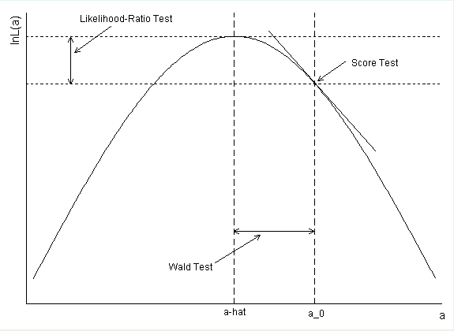

```{r setup-06, include=FALSE}
rm(list = ls())

knitr::opts_chunk$set(echo = FALSE, 
                      warning = FALSE, 
                      message = FALSE,
                      fig.align = "center",
                      fig.dim = c(5, 4))

library(openintro)
library(tidyverse)
library(knitr)
library(patchwork)
library(Hmisc)       # for errorbars in ggplot
library(kableExtra)
library(graphics)
library(rio)
library(mlbench)


```


```{r}
#knitr::write_bib(c(.packages(), "openintro"), "packages.bib")
```

# Logistische Regression {#sec-logistic-regression}

Wenn wir diskrete oder kategorielle Grössen modellieren
wollen, ist das allgemeine lineare Modell nicht geeignet, da dieses
eine kontinuierliche abhängige Variable voraussetzt. Oft haben wir zum
Beispiel eine zweiwertige kategorielle abhängige Variable (mit den
Werten Event und kein Event). Gibt es eine Möglichkeit, diesen
Wertebereich auf ein Kontinuum abzubilden? Kann man das Allgemeine
Lineare Modell (LM) verallgemeinern und damit Modelle für diskrete und
kontinuierliche abhängige Variable in einer einzigen statistischen Methodologie
zusammenführen? 

Die Antwort darauf hat den Namen **Generalisierte Lineare Modelle
  (GLM)** (also nicht zu verwechseln mit dem Allgemeinen Linearen
Modell (LM)). Dazu gehören zum Beispiel die **Poisson-Regression** (die wir später behandeln werden) sowie die **logistische Regression**, die wir hier studieren. Zu den GLM gehören als Spezialfall aber auch die bereits eingeführte multiple Regression und Varianzanalyse als Vertreter der Linearen Modelle.

Ein Beispiel für eine logistische Regression ist, wenn man z.B. mit Hilfe der Variablen Geschlecht, Krankheitsstadium, Tumorgrösse und Alter die Wahrscheinlichkeit bestimmen möchte, ob jemand seine Krebserkrankung überlebt, oder nicht.


## Notation und `R`

 - $O$: Odds
 - $OR$: Odds Ratio
 - $\pi$: Wahrscheinlichkeit, Risiko
 - $\mathrm{logit}(\pi)$: $\log\frac{\pi}{1-\pi}=\log Odds$
 - $\exp(x)$: $e^x$
 - $X \sim \mathcal{B}(n,\pi)$: $X$ ist binomialverteilt mit Parameter $n$ und $\pi$
 - $E(X)$: Erwartungswert einer Zufallsvariable  $X$ 
 - $\eta=\beta_0+\beta_1x_{1}+\beta_2x_{2}+\dots+\beta_m x_{m}$: linearer Prädiktor

 - `R`: `packet::funktion()`: Alternative Syntax zu `library(packet)` gefolgt von `funktion()`
 - `R`: `glm()`: Funktion zum Anpassen von GLM's.


## Lernziele

Beachten Sie im Folgenden die überaus wichtigen Rechenregeln bezüglich der $\log$ und $\exp$-Funktion, die wir bereits kennengelernt haben. Sie werden uns auf Schritt und Tritt verfolgen:


$$
\begin{aligned}
\log(ab) &= \log(a) + \log(b) \\
\log\left(\frac{a}{b}\right) &= \log(a) - \log(b) \\
\exp(a + b) &= \exp(a)\exp(b) \\
\exp(a - b) &= \frac{\exp(a)}{\exp(b)}
\end{aligned}
$$


::: callout-important

# Lernziele


1.  Wenden Sie eine logistische Regression an, wenn anhand einer oder mehrerer Prädiktorvariablen die Odds $O_i$ und die Wahrscheinlichkeit $\pi_i$ für ein Ereignis (d.h. bei binärer abhängigen Variable) für die Einheit $i$ geschätzt werden sollen.

2.  Beachten Sie, dass bei einer logistischen Regression die $\mathrm{logit}(\pi_i):=\log Odds_i$ modelliert werden. Der lineare Prädiktor $\eta_i$ ist dann der transformierte Erwartungswert,

$$
\boxed{\mathrm{logit}(\pi_i) = \eta_i=\beta_0 + \beta_1x_{i1}+\dots+\beta_m x_{im}.}
$$

3.  Berechnen Sie die geschätzten $\mathrm{logit}(\hat{\pi}_i)$ durch Einsetzen der geschätzten Regressionskoeffizienten $\hat{\beta}_k (k=0,\dots,m)$ sowie der Werte für die Prädiktoren der Einheit $i$ in die Regressionsgleichung.

4.  Interpretieren Sie $\beta_0$ (intercept) als $\mathrm{logit}(\pi_i)$ für das Ereignis, wenn alle unabhängigen quantitativen Variablen den Wert 0 annehmen und die Kategorie der unabhängigen kategoriellen Variablen die Referenzkategorie ist. 

5.  Interpretieren Sie die $\beta_k$ ($k=1,\dots,m$) als einen Unterschied auf der $\mathrm{logit}$-Skala für zwei Subpopulationen, die sich auf $x_k$ um eine Einheit unterscheiden, während die anderen unabhängigen Variablen konstant gehalten werden. Die Nullhypothesen sind dann meistens $H_0: \beta_k = 0$, $k=1,...,m$.

6.  Eine Differenz auf der $\mathrm{logit}$ Skala entspricht einem $\log(OR)$.

7.  Interpretiere die $\exp(\beta_k)$ ($k=1,\dots,m$) als das $OR_k$ für das Ereignis für zwei Subpopulationen, die sich auf $x_k$ um eine Einheit unterscheiden, während die anderen unabhängigen Variablen konstant gehalten werden. Die Nullhypothesen sind dann meistens $H_0: OR_k = 1$, $k=1,...,m$.


8.  Berechnen Sie die Wahrscheinlichkeiten $\pi_i$ aus dem linearen Prädiktor mit der logitistischen Funktion,

$$
    \boxed{\pi_i = \frac{O_i}{1+O_i}=\frac{\exp(\eta_i)}{1+\exp(\eta_i)}.}
$$

9.  Führen Sie eine logistische Regression in `R` durch und interpretieren Sie die Regressionskoeffizienten sowie deren inferenzstatistischen Angaben.

10.  Erklären Sie den zentralen Begriff der Likelihood: Die Likelihood eines Parameterwertes $L(\theta)$ ist die Wahrscheinlichkeits(dichte) der beobachteten Daten $x$, gesehen als eine Funktion des Parameters $\theta$,

$$
L(\theta)=p(x;\theta).
$$

11. Sie wissen, dass man im Falle der logistischen Regression Parameter mit der Maximum-Likelihood-Methode geschätzt und getestet werden.

12. Sie können zwei verschachtelte logistische Regressionsmodelle mit einem Likelihood Ratio Test vergleichen mit $H_0$: Das reduzierte Modell stimmt.
:::


## Vorhersage von Diabetes {#sec-der-chi2-test}

Wir verwenden für dieses Kapitel einen Datensatz von Pima-Indianern. Dieser Datensatz stammt ursprünglich vom National Institute of Diabetes and Digestive and Kidney Diseases. Ziel ist es, auf Grundlage verschiedener Prädiktoren diagnostisch vorherzusagen, ob eine Patientin Diabetes hat oder nicht.

-   Zu didaktischen Zwecken wurde der Datensatz vereinfacht (Entfernung aller Beobachtungseinheiten mit fehlenden Werten) bzw. werden nicht alle Variablen berücksichtigt.

-   Die Variable `pregnant_bin` existiert im Originaldatensatz nicht, sie wurde zu didaktischen Zwecken aus der Variable `pregnant` erstellt (0 = Nein, \>0 = Ja).

```{r }
library(mlbench)
data("PimaIndiansDiabetes2")
diabetes <- na.omit(PimaIndiansDiabetes2)
#diabetes$diabetes<-as.numeric(diabetes$diabetes)-1
diabetes$pregnant_bin <- factor(ifelse(diabetes$pregnant == 0, "No", "Yes"))
```
 

Code book zum Datensatz ($n$ = 392)

|                |                                                      |
|----------------|------------------------------------------------------|
| **Variable**   | **Beschreibung**                                     |
| `pregnant`     | Anzahl bisheriger Schwangerschaften                  |
| `pregnant_bin` | Schon eine Schwangerschaft gehabt (0 = Nein, 1 = Ja) |
| `glucose`      | Plasma-Glukose-Konzentration (mg/dl)                 |
| `pressure`     | Diastolischer Blutdruck (mmHg)                       |
| `triceps`      | Faltendicke beim Triceps (mm)                        |
| `mass`         | Body Mass Index (kg/m\^2)                            |
| `pedigree`     | Diabetes Pedigree Funktion (PDF)                     |
| `age`          | Alter (Jahre)                                        |
| `diabetes`     | Diabetes (`neg`, `pos`)                  |
 
 
```{r eval=FALSE,include=FALSE}
str(diabetes)
```

-  Die abhängige Variable `diabetes` ist hier eine zweiwertige nominale Variable, $Y_i=\{0,1\}$. 
-  Bemerkung: Bei **gruppierten Daten** ist $Y_i$ manchmal die Anzahl Ereignisse in einer Gruppe $i$ mit $n_i$ Einheiten.


## Warum keine lineare Regression? {#sec-warum-keine-lineare-regression}

Wenn die abhängige Variable binär ist (also nur die Werte 0 und 1 annehmen kann), ist es zwar möglich, eine lineare Regression durchzuführen – aber nicht empfehlenswert. Hier sind die Gründe:

- Ungültige Vorhersagen: Die lineare Regression kann Werte ausserhalb des Bereichs [0, 1] vorhersagen, was bei Wahrscheinlichkeiten keinen Sinn ergibt.
- Verletzung statistischer Annahmen: Die Fehlerterme sind bei binären Daten nicht normalverteilt und die Varianz ist nicht konstant (Heteroskedastizität).
- Nicht optimale Schätzungen: Die lineare Regression liefert bei binären Daten oft verzerrte und ineffiziente Schätzwerte.


```{r, fig.align='center'}
#| label: fig-plot-line-reg-bin
#| fig-cap: "Lineares Modell für Diabetes"
  ggplot(data=diabetes,aes(glucose, as.numeric(diabetes)-1)) +
  geom_point(alpha = 0.4, aes(color = diabetes)) +
  geom_smooth(method = "lm", se = FALSE, color = "darkgrey") +
  labs(
    x = "Plasma-Glukose-Konzentration",
    y = "Wahrscheinlichkeit für Diabetes"
    )

# example from http://www.sthda.com/english/articles/36-classification-methods-essentials/151-logistic-regression-essentials-in-r/

# write.csv(diabetes, "../data/09_diabetes.csv", row.names = FALSE)
```

In @fig-plot-line-reg-bin sehen wir, dass Personen mit Diabetes (mit 1 kodiert) grundsätzlich höhere Blutzuckerwerte haben als Personen ohne Diabetes. Die Variable `glucose` scheint also hilfreich zu sein, um den Diabetesstatus, wenn auch nicht perfekt, vorherzusagen. Die graue Gerade ist das statistische Modell, der lineare Prädiktor. In der Grafik wird verdeutlicht, dass sich eine lineare Regression nicht eignet, um die Wahrscheinlichkeit für Diabetes vorherzusagen. Personen mit tiefer Blutzuckerkonzentration hätten eine negative Wahrscheinlichkeit, Diabetes zu haben. Personen mit einer Konzentration von $>220$ hätten eine Wahrscheinlichkeit $>1$ Diabetes zu haben. Eine Wahrscheinlichkeit muss aber per Definition im Intervall $[0; 1]$ liegen.

Der Wertebereich der zu modellierenden abhängigen Variablen in einer linearen Regression ist in der Regel **nicht beschränkt** (theoretisch von $-\infty$ bis $\infty$), Wahrscheinlichkeiten aber sind durch 0 und 1 begrenzt. Wenn man statt der Wahrscheinlichkeit die Odds $O_i$ modelliert, dann erhält man Werte im Intervall $[0; \infty)$. Wenn man zusätzlich noch den Logarithmus nimmt, also die $\log Odds_i:=\mathrm{logit}(\pi_i)$ modelliert, dann erhält man Werte im Intervall $(-\infty; \infty)$, weil $\log(0) = -\infty$ und $\log(\infty) = \infty$. $\mathrm{logit}(\pi)$ ist dann **nicht beschränkt**!

Die folgende Grafik zeigt nun die lineare Regression für $\mathrm{logit}(\pi)$ auf Blutzucker:

```{r, fig.align='center'}
#| label: fig-plot-line-reg-bin-log
#| fig-cap: "Lineare Regression mit den log(Odds) für Diabetes als abhängige und Blutzucker als unabhängige Variable (n = 392)."

model1 <- glm(diabetes ~ glucose, data = diabetes, family = binomial())
pred1 <- model1$fitted.values
logOdds1 <- log(pred1/(1-pred1))


df <- data.frame(glucose = diabetes$glucose,
                 logOdds1,
                 diabetes = ifelse(diabetes$diabetes == "neg", -3.8, 2.4),
                 Diabetes = diabetes$diabetes)


ggplot(df, aes(x = glucose, y = logOdds1)) +
  geom_line(color = "darkgray", lwd = 1) +
  geom_point(aes(x = glucose, y = diabetes, color = Diabetes), alpha = 0.4) +
  labs(
    x = "Plasma-Glukose-Konzentration",
    y = expression(paste("logit(",pi,")"))
    ) +
  geom_segment(aes(x = 170, y = -4, xend = 170, yend = 1.116049), color = "orange") +
  geom_segment(aes(x = 50, y = 1.116049, xend = 170, yend = 1.116049), color = "orange")

```

Auf den ersten Blick unterscheiden sich @fig-plot-line-reg-bin und @fig-plot-line-reg-bin-log kaum. Der einzige aber entscheidende Unterschied ist, dass die y-Achse dieses Mal die $\mathrm{logit}(\pi)$ für Diabetes repräsentiert. Wir erhalten durch Exponieren und Umrechnen die Wahrscheinlichkeit, dass bei einer gegebenen Blutzuckerkonzentration ein Diabetes vorliegt. Nehmen wir einen Blutzuckerwert von 170 (orange Linie). Für diesen Wert prognostiziert das Modell $\mathrm{logit}(\pi) = 1.116$. Somit sind die Odds für Diabetes bei einer Blutzuckerkonzentration von 170 $\exp(1.116) = 3.0526$. Diese Odds können wir in eine Wahrscheinlichkeit umrechnen,

$$
\hat{\pi} = \frac{\hat{O}}{1+\hat{O}} = \frac{3.0526}{1+3.0526} = 0.7532.
$$

Wiederholen Sie diese Rechnung für ein paar andere Blutzuckerwerte und Sie werden  merken, dass die Wahrscheinlichkeit immer zwischen 0 und 1 liegt (dazu muss man die $\mathrm{logit}(\pi_i)$ von Auge schätzen, weil wir ja die Regressionskoeffizienten noch nicht kennen).

Mit dem Computer kann man dies für alle beliebigen Blutzuckerwerte durchrechnen und eine neue Grafik mit den Blutzuckerwerten auf der x-Achse und der Wahrscheinlichkeit $\pi$ für Diabetes auf der y-Achse erstellen:

```{r, fig.align='center'}
#| label: fig-plot-log-reg
#| fig-cap: "Logistischer Zusammenhang zwischen Blutzucker und Wahrscheinlichkeit für Diabetes (n = 392)."

diabetes %>%
  mutate(prob = ifelse(diabetes == "pos", 1, 0)) %>%
  ggplot(aes(glucose, prob)) +
  geom_point(alpha = 0.2, aes(color = diabetes)) +
  geom_smooth(method = "glm", se = FALSE, method.args = list(family = "binomial"), color = "darkgrey") +
  labs(
    x = "Plasma-Glukose-Konzentration",
    y = expression(pi)
    ) +
 geom_segment(aes(x = 170, y = 0, xend = 170, yend = 0.7532), color = "orange") +
  geom_segment(aes(x = 50, y = 0.7532, xend = 170, yend = 0.7532), color = "orange")
```

In @fig-plot-log-reg sehen wir den logistischen (nicht linearen) Zusammenhang zwischen Blutzucker und der Wahrscheinlichkeit für Diabetes.  **Fazit:** Eine lineare Regression ist nicht optimal, um die Wahrscheinlichkeit für ein Ereignis zu modellieren.


## Einfache logistische Regression

Die **logistische Regression** ist ein Modell zur Analyse binärer abhängiger Variablen, bei denen die Zielgrösse typischerweise nur zwei Ausprägungen hat (z. B. Erfolg/Misserfolg). Anders als bei der linearen Regression wird hier nicht direkt der Erwartungswert der Zielvariable modelliert, sondern dessen **Transformation**.

### Verteilung

Die Verteilung der $Y_i$ ist binomial mit Parametern $\pi_i$ und $n=1$ (Bernoulli-Verteilung). Wir notieren 
$$
Y_i\sim \mathcal{B}(n=1,\pi_i)
$$

Die Binomialverteilung hat für den Spezialfall einer einzelnen Beobachtung (Bernoulli) die Wahrscheinlichkeitsmasse $p(y_i) = \pi_i^{y_i} (1 - \pi_i)^{1 - y_i}$, was äquivalent ist zur Aussage: $Y_i \in \{0,1\}$ mit $\pi_i = \Pr(Y_i = 1)$ und $1-\pi_i = \Pr(Y_i = 0)$.

Abbildung @fig-bernoulli zeigt Bernoulli-Verteilungen für verschiedene $\pi$.


```{r echo=FALSE, fig.dim=c(5,5)}
#| label: fig-bernoulli
#| fig.cap: "Bernoulli-Verteilung mit $\\pi=0.2,0.5,0.7$ und $\\pi=1$"
par(mfrow=c(2,2))
x<-0:1
p<-c(0.2,0.5,0.7,1)
for (i in 1:4){
h <- dbinom(x,size=max(x),prob=c(p[i]))
barplot(h,names.arg=x,ylab="Masse",ylim=c(0,1))
}
```


### Erwartungswert

Sei $X$ eine diskrete Zufallsvariable mit Werten $x_1,
\dots,x_k$ und Wahrscheinlichkeitsmasse $p(x)$. Der Erwartungswert von $X$ ist der Mittelwert der möglichen Werte, wobei jede Ausprägung entsprechend ihrer Wahrscheinlichkeit gewichtet wird.

\begin{equation}
  \label{eq:ExpDisc}
  E(X) = \sum_{i=1}^k x_i\, p(x_i).
\end{equation}

Für den Spezialfall $X \sim \mathcal{B}(1,\pi)$ (Bernoulli-Verteilung mit Parameter $\pi$) ergibt sich:
$$
E(X) = 0 \cdot (1 - \pi) + 1 \cdot \pi = \pi
$$


### Link Funktion

 Der Erwartungswert einer binomialverteilten Variable $Y$ mit $n=1$ ist also $E(Y)=\pi$.  
 
Dieser Erwartungswert (hier eine Wahrscheinlichkeit) soll nun so transformiert werden, dass er **nicht mehr beschränkt** ist, d.h. der lineare Prädiktor sollte dann alle Werte zwischen $-\infty$ und $+\infty$ annehmen können. Dazu müssen wir die **logit**- und die **logistische** Funktion einführen. Diese beiden Funktionen sind zentral für das Verständnis einer logistischen Regression.


:::{.callout-note}
## Logit und Logistische Funktion

$$\text{logit}(x):[0,1]\rightarrow \mathbb{R},\quad x \mapsto
    \log\frac{x}{1-x}
$$

$$\text{logistic}(x): \mathbb{R} \rightarrow [0,1],\quad x \mapsto
    \frac{\exp(x)}{\exp(x)+1}
$$

Die beiden wichtigen Funktionen sind in der Abbildung @fig-logitAndLogistic dargestellt.

```{r fig.dim=c(8,5)}
#| label: fig-logitAndLogistic
#| fig-cap: "Logit-Funktion und logistische Funktion"
par(mfrow=c(1,2))
curve(log(x/(1-x)),from=0,to=1,xlab=expression(pi),ylab=expression(paste("logit(",pi,")")),main="logit-Funktion")
curve(exp(x)/(1+exp(x)),from=-4,to=4,xlab=expression(paste("logit(",pi,")")),ylab=expression(pi),main="logistische Funktion")
```

:::


Da der Erwartungswert $E(Y)=\pi$ zwischen 0 und 1 liegt, wird dieser über die **logit-Funktion** transformiert:

$$
\text{logit}(\pi) = \log\left(\frac{\pi}{1 - \pi}\right) = \eta
$$

Somit wird der **transformierte Erwartungswert** (der Logit von $\pi$) als linearer Prädiktor $\eta$ dargestellt. Man nennt diese Transformation **Link**-Funktion. Angewandt auf den Erwartungswert haben wir dann für den linearen Prädiktor


$$
\mathrm{logit}\, \pi_i=\log Odds_i=\log\frac{\pi_i}{1-\pi_i}=\eta_i= \beta_0 + \beta_1x_i, 
$$

und schreiben sehr oft kurz für eine einfache logistische Regression:

:::{.callout-note}
## Einfache logistische Regression

$$
\boxed{\mathrm{logit}(\pi_i)=\beta_0 + \beta_1x_i}
$$ {#eq-linPredLog}

:::

::: callout-note
## Deterministischer und stochastischer Teil eines Modells
(Lineare) Modelle beinhalten einen deterministischen Teil (der lineare Prädiktor) und einen stochastischen Teil (die Wahrscheinlichkeitsverteilung). In der logistischen Regression nehmen wir die Binomialverteilung (stochastischer Teil) in  @eq-linPredLog oft stillschweigend an und schreiben nur den linearen Prädiktor.
:::


###  Rückblick lineare Regression

Zum Vergleich noch einmal die einfache lineare Regression, das Modell war $$Y_i=\beta_0 + \beta_1x_i+\epsilon_i$$ mit $\epsilon_i\sim \mathcal{N}(\mu,\sigma^2)$. Dort war die Verteilung die Normalverteilung und die Link-Funktion  war die Identität (keine Transformation des Erwartungswerts nötig),

$$
Y_i\sim \mathcal{N}(\mu_i,\sigma^2),\quad  \quad E(Y_i)=\mu_i=\beta_0 + \beta_1x_i.
$$ 


### Interpretation 

Der Parameter $\beta_1$ in @eq-linPredLog ist zu interpretieren als der Unterschied in **Logits** für zwei Populationen, die sich auf $x$ um eine Einheit unterscheiden. Das ist analog zur linearen Regression, da die Logit-Skala ebenfalls ein Kontinuum darstellt. 
Zusätzlich lässt sich $\exp⁡(\beta_1)$ als **Odds Ratio** interpretieren: Es gibt an, um welchen Faktor sich die Odds (also das Verhältnis von Erfolgs- zu Misserfolgswahrscheinlichkeit) verändern, wenn sich $x$ um eine Einheit erhöht. Ein Wert von $\exp(\beta_1)>1$ bedeutet, dass die Erfolgswahrscheinlichkeit mit steigendem $x$ zunimmt, während ein Wert kleiner als 1 auf eine abnehmende Erfolgswahrscheinlichkeit hinweist.

Fassen wir die Unterschiede zum linearen Modell nochmal zusammen:

### Lineare vs. Logistische Regression


| Model                                  | Lineare Regression                                    | Logistische Regression                                                                               |   |
|----------------------------------------|-------------------------------------------------------|------------------------------------------------------------------------------------------------------|---|
| **Verteilung der Zielvariable**        | Normalverteilung: $Y \sim \mathcal{N}(\mu, \sigma^2)$ | Bernoulli-Verteilung: $Y \in \{0,1\},\ \pi = P(Y=1)$                                                 |   |
| **Erwartungswert**                     | $E(Y) = \mu$                                          | $E(Y) = \pi$                                                                                         |   |
| **Linearer Prädiktor**                 | $\mu = \beta_0 + \beta_1 x$                           | $\eta = \beta_0 + \beta_1 x$                                                                         |   |
| **Transformation (Link-Funktion)**     | Identität: $\mu = \eta$                               | Logit: $\text{logit}(\pi) = \log\left(\frac{\pi}{1 - \pi}\right) = \eta$                             |   |
| **Interpretation von $\beta_1$**       | Änderung des Erwartungswerts $E(Y)$ pro Einheit $x$   | Änderung der Log-Odds von $Y=1$ pro Einheit $x$                                                      |   |
| **Interpretation von $\exp(\beta_1)$** | –                                                     | Multiplikativer Faktor für die Odds: $\exp(\beta_1)$ ist die Odds Ratio für eine Einheit mehr in $x$ |   |


### Wahrscheinlichkeit

Die Wahrscheinlichkeit für das Ereignis erhalten wir dann mit der Umkehrfunktion der $\mathrm{logit}$-Funktion, der **logistischen** Funktion, die auf den linearen Prädiktor $\eta_i=\beta_0+\beta_1x_i$ angewandt wird,

$$
\boxed{\pi_i=\frac{O_i}{1+O_i}=\frac{\exp(\mathrm{logit}(\pi_i))}{1+\exp(\mathrm{logit}(\pi_i))}=\frac{\exp(\eta_i)}{1+\exp(\eta_i)}}.
$${#eq-expit}


### Dichotomer Prädiktor: Schwangerschaft und Diabetes

Wir verwenden weiterhin den Diabetes-Datensatz und untersuchen nun, ob es einen Zusammenhang gibt zwischen Diabetes und ob eine Frau bereits eine Schwangerschaft hatte oder nicht. Für dieses Beispiel lässt sich eine Vierfeldertabelle darstellen:

```{r}


tab<-table(diabetes$diabetes, diabetes$pregnant_bin, dnn = c("Diabetes", "Pregnant"))
tab<-t(tab)
tab
```


```{r results="hide"}
ptab<-proportions(tab,1)
ptab
ptab[,2]/ptab[,1]
```

Anhand der Vierfeldertabelle kann man die Wahrscheinlichkeiten für das Ereignis und Nicht-Ereignis bei Kondition pregnant und not pregnant schätzen:


Die geschätzten Wahrscheinlichkeiten sind

$$
\hat{\pi}_{pregnant} = \frac{111}{111+225} = `r ptab[2,2]`, 
$$
und
$$
\hat{\pi}_{not.pregnant} = \frac{19}{19+37} = `r ptab[1,2]`
$$

Die geschätzten Odds sind
$$
\hat{O}_{pregnant} = \frac{111}{225} = 0.493,
$$
$$
\hat{O}_{not.pregnant} = \frac{19}{37} = 0.514, 
$$

und somit die geschätzte Odds Ratio
$$
\widehat{OR} = \frac{0.493}{0.514} = 0.96.
$$

Wir schauen uns nun an, was die logistische Regression mit den gleichen Variablen für einen Output liefert. Für logistische Regressionen brauchen wir in `R` die Funktion `glm()`, was für **generalized linear models** steht. Weil diese Modelle eben **verallgemeinert** sind, muss man zusätzlich die **Verteilung** und die **Link-Funktion** angeben, welche gebraucht wird. Weil es in diesem Fall um eine binäre abhängige Variable geht, verwenden wir die Binomialverteilung. Wir tun das mit dem Argument `family = binomial(link="logit")`. Der logit-link ist bei Binomialveteilung zwar defaultmässig eingestellt, `family = binomial()` würde auch genügen. Es ist aber immer besser, am Anfang beides explizit darzustellen. Die Syntax für die Erstellung der Modelle ist dann analog zur linearen Regression:


```{r, echo=TRUE}
# Einfache logistische Regression mit glm()
m.glm1 <- glm(diabetes ~ pregnant_bin, data = diabetes, family = binomial(link="logit")) 
```

Wir schauen das angepasste Modell an und konzentrieren uns auf die geschätzten Regressionskoeffizienten:


```{r echo=TRUE}
summary(m.glm1)$coef
```

$\beta_0$ (das Intercept) steht für die $\mathrm{logit}$ für Diabetes, wenn die unabhängige Variable den Wert 0 (oder die Referenzkategorie "No") annimmt. Wie bei der linearen Regression wird die Variable `pregnant_bin` mit 0 und 1 codiert (dummy coding). Also sind $\hat{\beta}_0$ die $\mathrm{logit}$ für Diabetes, wenn eine Frau noch keine Schwangerschaft hatte. Wenn wir dies exponieren, dann erhalten wir `r exp(m.glm1$coef[1])`. Wir können mit den Angaben aus der Vierfeldertabelle feststellen, dass dies korrekt ist. Mit der logistischen Funktion (@eq-expit) können wir die $\pi_i$ für beide Gruppen abschätzen:

Wenn nun die Variable pregnant_bin den Wert "No" annimmt, haben wir:


$$
\begin{aligned}
\mathrm{logit}(\hat{\pi})_{\text{not pregnant}} &= \hat{\beta}_0 = `r m.glm1$coef[1]` \\
\hat{O}_{\text{not pregnant}} &= \exp(\hat{\beta}_0) = `r exp(m.glm1$coef[1])` \\
\hat{\pi}_{\text{not pregnant}} &= \frac{\exp(\hat{\beta}_0)}{1 + \exp(\hat{\beta}_0)} = `r exp(m.glm1$coef[1])/(1+exp(m.glm1$coef[1]))`
\end{aligned}
$$


Wenn nun die Variable pregnant_bin den Wert "Yes" annimmt, haben wir:


$$
\begin{aligned}
\mathrm{logit}(\hat{\pi})_{\text{pregnant}} &= \hat{\beta}_0 + \hat{\beta}_1 = `r m.glm1$coef[1] + m.glm1$coef[2]` \\
\hat{O}_{\text{pregnant}} &= \exp(\hat{\beta}_0 + \hat{\beta}_1) = `r exp(m.glm1$coef[1] + m.glm1$coef[2])` \\
\hat{\pi}_{\text{pregnant}} &= \frac{\exp(\hat{\beta}_0 + \hat{\beta}_1)}{1 + \exp(\hat{\beta}_0 + \hat{\beta}_1)} = `r exp(m.glm1$coef[1] + m.glm1$coef[2])/(1+exp(m.glm1$coef[1]+m.glm1$coef[2]))`
\end{aligned}
$$


Dies stimmt natürlich auch wieder überein mit den direkten Berechnungen in der Vierfeldertafel.


Mit der `predict()` Funktion können wir uns die geschätzten $\mathrm{logit}$ und $\pi$ direkt ausgeben lassen. Defaultmässig ist die Vorhersage auf dem linearen Prädiktor, mit Argument `type="response"` bekommen wir  Wahrscheinlichkeits-Vorhersagen:

```{r echo=TRUE}
predict(m.glm1,newdata=data.frame(pregnant_bin=c("No","Yes")))
predict(m.glm1,newdata=data.frame(pregnant_bin=c("No","Yes")),type="response")
```

Was bedeutet nun $\hat{\beta}_1$? Im logistischen Modell ist die Steigung als $$\beta_1=\mathrm{logit}_{preg}-\mathrm{logit}_{nonpreg}=\log\frac{O_{preg}}{O_{nonpreg}}=\log(OR)$$ zu interpretieren. Somit ist $\hat{\beta}_1=`r m.glm1$coef[2]`$ der geschätzte Unterschied auf $\mathrm{logit}$-Skala und $\exp(\hat{\beta}_1)=\exp(`r m.glm1$coef[2]`)=`r exp(m.glm1$coef[2])`$ die geschätzte Odds Ratio, was wiederum mit den Berechnungen auf Basis der Vierfeldertabelle übereinstimmt. 


### Intervallschätzung

Wie bei der linearen Regression können wir mit dem Befehl `confint()` die 95% Konfidenzintervalle der Regressionskoeffizienten abrufen:

```{r, echo=TRUE}
confint(m.glm1)
```

Die Schranken sind hier auf $\log(OR)$-Skala. Für eine inhaltlich sinnvolle Interpretation ist es daher oft empfehlenswert, die Grenzen des Intervalls zu exponieren, um Konfidenzintervalle für $OR$ zu erhalten.
 
```{r, echo=TRUE}
exp(confint(m.glm1))

```


```{r include=FALSE}
parameters::model_parameters(m.glm1)
parameters::model_parameters(m.glm1,exponentiate=TRUE)
```


Wir sehen, dass das 95% Konfidenzintervall für das $OR$ von `r exp(confint(m.glm1))[2,1]` bis `r exp(confint(m.glm1))[2,2]` geht. Wir können also zu 95% darauf vertrauen, dass das wahre $OR$ von diesem Intervall überdeckt wird. Da dieses Intervall stark mit dem Nullwert (welcher bei $OR=1$ oder $\log(OR)=0$ liegt) überlappt, besteht keine Evidenz gegen $H_0$. Dies ist auch dem hohen P-Wert im Output zu entnehmen ($p=`r summary(m.glm1)$coef[2,4]`$). Der diesbezügliche $z$-Test ist ein **Wald-Test**; diesen sowie die hier berechneten **Likelihood-Intervalle** führen wir in @sec-likelihood ein. 

Eine Schwangerschaft scheint also die Odds für Diabetes nicht zu erhöhen. (Inhaltliche Anmerkung: Dies gilt nur für die Variable `pregnant_bin`, jedoch nicht für die Variable `pregnant`.)


Mit `parameters()` aus dem gleichnamigen Packet können wir uns direkt die exponierten Koeffizienten mit Intervallschätzung und Tests herausgeben lassen: 

```{r echo=TRUE}
parameters::parameters(m.glm1,exponentiate=TRUE,digits=3)
```


### Exkurs: Risk Ratios versus Odds Ratios

Eine Einschränkung der logistischen Regression ist, dass die Effekte (log) Odds Ratios und nicht (log) Risk Ratios darstellen. Das ist dann problematisch, wenn ausdrücklich Risiko-Verhältnisse gewünscht werden, da sich Chancenverhältnisse von Risiko-Verhältnissen stark unterscheiden können, insbesondere wenn das Ereignis häufig ist. Bei seltenem Ereignis ist $OR$ eine gute Schätzung für das Risk Ratio. Eine Möglichkeit, Risk Ratios als Effekte zu erhalten, ist das **Log-Binomiale** Modell.

In diesem Modell wird jetzt der $\log$ als Link-Funktion an Stelle von $\mathrm{logit}$ gebraucht mit der Konsequenz, dass $\beta_1$ ein $\log$ Risk Ratio und $\exp(\beta_1)$ ein Risk Ratio darstellt.

Wie Sie aus @sec-inferenz-fuer-nominale-daten wissen, kann man obige 2x2 Tabelle mit Hilfe der `riskratio()` Funktion aus dem Paket `epitools` analysieren. Der Output sieht wie folgt aus (es wird nur ein Teil davon gezeigt):


```{r echo=TRUE}
tab
epitools::riskratio(tab,method="wald")$measure
```

Das Risk Ratio beträgt 0.974, mit einem 95% CI von \[0.655; 1.447\].

`riskratio()` entspricht einem Log-Binomial Modell mit zweiwertigem Prädiktor:

```{r, echo=TRUE}
m.logBin<-glm(diabetes~pregnant_bin,family=binomial(link="log"),data=diabetes)
parameters::parameters(m.logBin,exponentiate=TRUE,ci_method="wald",digits=3) 
```

Der $\log$-Link hat aber den Nachteil, dass er Wahrscheinlichkeiten nur auf $\mathcal{R^+}$ statt auf $\mathcal{R}$ abbildet. Bei diesen Modellen gibt es oft Konvergenzprobleme, die sind bei Log-binomialen Modellen oft auf die Schwierigkeit zurückführen, die Wahrscheinlichkeiten im Bereich von [0, 1] zu halten, sowie auf die inhärente Komplexität der Likelihood-Oberfläche, insbesondere bei bestimmten Datenstrukturen. 

Ein weitere Methode, um als Effektgrössen Risk Ratios zu bekommen, ist die **Robuste Poisson Regression**, auf die wir hier an dieses Stelle nicht eingehen. 


### Kontinuierlicher Prädiktor: Blutzucker und Diabetes

Wir greifen das Beispiel "Blutzucker und Diabetes" aus @sec-warum-keine-lineare-regression wieder auf. Anhand dieses neuen Beispiels wird gezeigt, wie eine einfache logistische Regression mit einer quantitativen Prädiktorvariable interpretiert wird. Das Modell kann nun geschrieben werden als

$$
\mathrm{logit}(\pi_i) = \beta_0+\beta_1 glucose_i.
$$


Da bei einer kontinuierlichen Eingangsgrösse eine Darstellung als Vierfeldertabelle nicht mehr möglich ist, passen wir direkt ein Modell an

```{r echo=TRUE}
m.glm2 <- glm(diabetes ~ glucose, data = diabetes, family = binomial())
```
und schauen uns die Punktschätzung, Standardfehler, Konfidenzintervall, $z$-Werte und $p$-Werte an. In die Theorie bezüglich Tests und Intervallschätzung in der logistischen Regression werden wir in @sec-likelihood eingehen.

```{r echo=TRUE}
summary(m.glm2)$coef
confint(m.glm2)
```
von Hand zusammengefasst,

```{r echo=TRUE}
cbind(summary(m.glm2)$coef,confint(m.glm2))
```
oder einfacher mit `parameters()` auf $logit$-Skala:

```{r  echo=TRUE}
parameters::parameters(m.glm2,exponentiate=FALSE) ##Default
```

und auf $OR$-Skala:

```{r  echo=TRUE}
parameters::parameters(m.glm2,exponentiate=TRUE)
```

$\hat{\beta}_0$ ist das geschätzte $\mathrm{logit}$ für Diabetes, bei einem Blutzucker von 0 mg/dl. Es macht inhaltlich keinen Sinn, den Wert zu interpretieren. Daher sind wir auch nicht beeindruckt, dass sich dieser $\mathrm{logit}$ statistisch signifikant von 0, bzw. die Odds statistisch signifikant von 1 unterscheiden. Meistens interessiert dieses Intercept (die Lage des Modells), nicht.

$\hat{\beta}_1$ ist der geschätzte Effekt von Blutzucker auf Diabetes, also das $\log(OR)$. Pro zusätzliches Milligramm Zucker pro Deziliter Blut steigt (das Vorzeichen ist positiv) das $\mathrm{logit}$ für Diabetes um `r m.glm2$coef[2]`. Anhand des sehr kleinen $p$--Wertes wissen wir bereits, dass es einen statistisch signifikanten Zusammenhang zwischen `glucose` und `diabetes` gibt. Das $OR$ von `r exp(m.glm2$coef[2])` unterscheidet sich also statistisch signifikant von 1. Diese Grösse ist der Effekt pro Milligramm Zucker pro Deziliter Blut. 

Bei einem Unterschied von 10mg/dl beträgt das $OR$ also schon `r round(exp(m.glm2$coef[2])^10,3)` (Versuchen Sie, dies aufgrund der Linearität nachzuvollziehen mit $\exp(10x)=(\exp(x))^{10})$.


### Vorhersage

Anhand der geschätzten Regressionskoeffizienten können wir nun die Regressionsgleichung benutzen, um die Odds für Diabetes bei einer bestimmten Blutzuckerkonzentration, z.B. 170 mg/dl, zu schätzen:

$$
\mathrm{logit}(\hat{\pi})_{gluc=170} = `r m.glm2$coef[1]` + `r m.glm2$coef[2]` \times 170 = `r m.glm2$coef[1]+m.glm2$coef[2]*170`,
$$

$$
\hat{O}_{gluc=170} = \exp(`r m.glm2$coef[1]` + `r m.glm2$coef[2]` \times 170) = `r exp(m.glm2$coef[1]+m.glm2$coef[2]*170)`,
$$

und somit

$$
\hat{\pi}_{gluc=170} = \frac{\exp(`r m.glm2$coef[1]` + `r m.glm2$coef[2]` \times 170)}{1+\exp(`r m.glm2$coef[1]` + `r m.glm2$coef[2]` \times 170)} = `r exp(m.glm2$coef[1]+ m.glm2$coef[2]*170)/(1+exp(m.glm2$coef[1]+ m.glm2$coef[2]*170))`
$$


```{r include=FALSE}
predict(m.glm2,newdata=data.frame(glucose=170))
predict(m.glm2,newdata=data.frame(glucose=170),type="response")
```

Es handelt sich dabei genau um den Wert des Einführungsbeispiels aus @sec-warum-keine-lineare-regression:

```{r}
#| label: fig-plot-log-reg-2
#| fig-cap: "Zusammenhang zwischen Blutzucker und Diabetes. Links die log(Odds), rechts die Wahrscheinlichkeit auf der y-Achse (n = 392)."

pred1 <- m.glm2$fitted.values
logOdds1 <- log(pred1/(1-pred1))

df <- data.frame(glucose = diabetes$glucose, 
                 logOdds1,
                 diabetes = ifelse(diabetes$diabetes == "neg", -3.8, 2.4),
                 Diabetes = diabetes$diabetes)


p1 <- ggplot(df, aes(x = glucose, y = logOdds1)) + 
  geom_line(color = "darkgray", lwd = 1) +
  geom_point(aes(x = glucose, y = diabetes, color = Diabetes), alpha = 0.4) +
  labs(
    x = "Plasma-Glukose-Konzentration",
    y = "log(Odds), Diabetes-positiv zu sein"
    ) +
  geom_segment(aes(x = 170, y = -4, xend = 170, yend = 1.116049), color = "orange") +
  geom_segment(aes(x = 50, y = 1.116049, xend = 170, yend = 1.116049), color = "orange") +
  theme(legend.position = "none")

p2 <- diabetes %>%
  mutate(prob = ifelse(diabetes == "pos", 1, 0)) %>%
  ggplot(aes(glucose, prob)) +
  geom_point(alpha = 0.2, aes(color = diabetes)) +
  geom_smooth(method = "glm", se = FALSE, method.args = list(family = "binomial"), color = "darkgrey") +
  labs(
    x = "Plasma-Glukose-Konzentration",
    y = "Wahrscheinlichkeit, Diabetes-positiv zu sein"
    ) +
 geom_segment(aes(x = 170, y = 0, xend = 170, yend = 0.7532), color = "orange") +
  geom_segment(aes(x = 50, y = 0.7532, xend = 170, yend = 0.7532), color = "orange")

p1 | p2
```


## Multiple logistische Regression {#sec-multiple-logistische-regression}

Wie bei der linearen Regression, kann man auch bei einer logistischen Regression zusätzliche Prädiktorvariablen in das Model einfliessen lassen, um entweder 

* interessierende Effekte für **potentielle Confounder** zu kontrollieren 
* um ein **optimales Model** zu entwickeln.
* Effekte **bedingt auf andere Eingangsgrössen** zu quantifizieren.

Für $m$ unabhängige Variablen lautet das Modell (der lineare Prädiktor) dann

$$
\boxed{\mathrm{logit}(\pi_i) = \beta_0 + \beta_1x_{i1}+\dots+\beta_m x_{im}.}
$$

Die wahren $\beta$'s werden wie immer geschätzt anhand von Stichprobendaten (Auf die Schätzmethode werden weiter unten eingehen):

$$
\mathrm{logit}(\hat{\pi}_i) = \hat{\beta}_0 + \hat{\beta}_1 x_{i1}+\dots+\hat{\beta}_m x_{im},
$$

$$
\hat{O_i} = \exp(\hat{\beta}_0 + \hat{\beta}_1 x_{i1}+\dots+\hat{\beta}_m x_{im}),
$$

und folglich

$$
\hat{\pi}_i = \frac{\exp(\hat{\beta}_0 + \hat{\beta}_1 x_{i1}+\dots+\hat{\beta}_m x_{im})}{1+\exp(\hat{\beta}_0 + \hat{\beta}_1 x_{i1}+\dots+\hat{\beta}_m x_{im})}. 
$$

Wir erstellen zuerst ein multiples Modell mit allen Prädiktoren und schauen uns den Output an:

```{r, echo = TRUE}

# Erstellen des multiplen logistischen Regressionsmodell
m.glmF <- glm(diabetes ~ pregnant_bin + glucose + pressure +
                triceps + insulin + mass + pedigree + age,
              data = diabetes, family = binomial())

round(summary(m.glmF)$coef,3)
```


Mit Ausnahme vom Intercept ($\mathrm{logit}$ für Diabetes, wenn alle Eingangsgrössen 0) sehen wir für jede der acht unabhängigen Variablen einen Effekt mit geschätztem $\log(OR)$, Standardfehler, $z$-Statistik und $p$-Wert für den test der jeweiligen $H_0:\beta_k=0, k=1,\dots,8$. 

Interessieren wir uns beispielsweise für das $OR$ bzgl. `glucose`, kann der entsprechende Wert exponiert werden, was ein $OR$ von `r exp(m.glmF$coef[3])` ergibt. Pro zusätzliches Milligramm Zucker pro Deziliter Blut steigen (das Vorzeichen ist positiv) die Odds für Diabetes um diesen Faktor. Dies unter Berücksichtigung aller anderen Prädiktorvariablen, d.h. das ist der Effect von `glucuse`, der über den Effekt der anderen Eingangsgrössen im Modell hinausgeht. Beachten Sie, dass das OR für `glucose` im multiplen Modell verschieden ist als im einfachen Modell (1.039 vs. 1.043). Dies, weil im einfachen Modell der Effekt von `glucose` isoliert, im multiplen Modell jedoch unter Berücksichtigung aller anderen Variablen berechnet wird, für diese **kontrolliert** wird. Das Gleiche gilt für die Interpretation aller anderen Koeffizienten.


Mit `parameters()` aus dem Packet `parameters` kann man sich wieder -- alternativ -- mit `exponentiate=TRUE` direkt geschätzte $OR$, Standardfehler, 95\% KI, $z$- und $p$-Wert herausgeben lassen:

```{r echo=TRUE}
parameters::parameters(m.glmF,exponentiate=TRUE,digits=3)
```

### Vorhersage

Was ist die Wahrscheinlichkeit gemäss Modell für einen Diabetes für eine Frau mit den folgenden Werten?

```{r}
#| label: tbl-ex-mlr
#| tbl-cap: "Was ist die Wahrscheinlichkeit, dass diese Frau Diabetes hat?"
diabetes %>% 
  select(-c(pregnant)) %>% 
  select(c(pregnant_bin, glucose:age)) %>% 
  slice(4) %>% 
  kbl(row.names = FALSE) %>% 
  kable_classic()
```

Wir setzen als erstes die Koeffizienten sowie die Werte der jeweiligen Prädiktoren in die Regressionsgleichung ein, um den Wert des linearen Prädiktors zu berechnen:


$$
\begin{aligned}
\mathrm{logit}(\hat{\pi}) =&\;
`r m.glmF$coef[1]`
+ `r m.glmF$coef[2]`
+ `r m.glmF$coef[3]`\times 197 \\
&+ `r m.glmF$coef[4]`\times 70
+ `r m.glmF$coef[5]`\times 45
+ `r m.glmF$coef[6]`\times 543 \\
&+ `r m.glmF$coef[7]`\times 30.5
+ `r m.glmF$coef[8]`\times 0.158
+ `r m.glmF$coef[9]`\times 53 \\
=&\; `r (lg <- predict(m.glmF, newdata = data.frame(diabetes[4,])))`
\end{aligned}
$$


Durch Exponieren erhalten wir die Odds:

$$
\hat{O} = \exp(`r lg`) = `r exp(lg)`
$$

Die Wahrscheinlichkeit ist schliesslich

$$
\hat{\pi} = \frac{\exp(`r lg`)}{1+\exp(`r lg`)} = `r exp(lg)/(1+exp(lg))`
$$


Eine Frau mit den Werten aus @tbl-ex-mlr hat eine Wahrscheinlichkeit von 90.5% für einen Diabetes. Die Werte entsprechen denjenigen der 4. Person im Datensatz. Tatsächlich hat diese Person Diabetes.

```{r}

diabetes %>% 
  select(-c(pregnant)) %>% 
  select(c(pregnant_bin, glucose:age, diabetes)) %>% 
  slice(4) %>% 
  kbl(row.names = FALSE) %>% 
  kable_classic()
```

Wenn man ein logistisches Modell in `R` rechnet, dann ist die Vorhersage bzgl. dem linearen Prädiktor und bzgl. der Wahrscheinlichkeit für das Ereignis für jede Person bereits hinterlegt. Mit `$linear.predictors` und `$fitted.values` können diese aufgerufen werden.

```{r, echo=TRUE}
m.glmF$linear.predictors[4] # Der lineare Prädiktor für die 4. Person
m.glmF$fitted.values[4] # Die Wahrscheinlichkeit von Diabetes für die  4. Person
```

Die Wahrscheinlichkeit ist dann die logistische Funktion evaluiert beim Wert des linearen Prädiktors $\eta$, 

$$
\hat{\pi}_i=\frac{\exp(\hat{\eta}_i)}{1+\exp(\hat{\eta}_i)},
$$

```{r echo=TRUE}
eta<-m.glmF$linear.predictor[4]
exp(eta)/(1+exp(eta))
```

Hinweis: die *9* im header kommt davon, dass die Person die ID *9* hat.


<!-- Mit der `effects` package kann man einfach Modellvorhersagen visualisieren: -->
<!-- ```{r fig.dim = c(9,7)} -->
<!-- library(effects) -->
<!-- plot(predictorEffects(m.glmF),axes=list(y=list(type="response")),main="") -->
<!-- ``` -->


## Exkurs: Schätzmethoden {#sec-recapLM}

Es gibt drei grundlegende Methoden, um unbekannte Parameter (einer Verteilung) zu schätzen: 

 * Methode der kleinsten Quadrate
 * Momentenmethode
 * Maximum Likelihood Methode 
 
 Die erste haben wir im Rahmen der linearen Regression schon angetroffen, die zweite wird hier der Vollständigkeit halber aufgeführt, **die Maximum Likelihood Methode ist die häufigste und wichtigste Methode**.

Ziel dieses Abschnitts ist es, in das Prinzip der Methoden, insbesondere der dritten, der Maximum Likelihood Methode, einzutauchen. Wir wollen ein Gespür dafür entwickeln, wie man aus Daten Schätzer konstruiert. 


<!-- Es geht darum, dass der/die interessierte Leser:in das Prinzip der Schätzmethoden für Vertrauensintervalle und p-Werte bei der logistischen Regression (und später auch bei der Poisson Regression) nachvollziehen kann. Hier werden die Methoden an einem sehr einfachen Beispiel gezeigt. Es kann darum sein, dass Sei sich denken: "warum so kompliziert, wenn es auch einfach geht". Die "einfache Situation" wird hier gebraucht, damit man die komplexen Methoden besser nachvollziehen kann. Der Mehrwert der komplexen Methoden liegt aber darin, dass sie eben auch dann funktionieren, wenn die Situation nicht mehr einfach ist (z.B. bei multiplen logistischen Regressionsmodellen). -->


### Methode der kleinsten Quadrate {#sec-LeastSquares}

Diese Methode wurde bereits in der multiplen Regression angewandt. Da sie grundlegend ist, wollen wir sie hier kurz wiederholen. Wir fangen an mit einem grundlegenden Schätzproblem, das Schätzen eines wahren Durchschnitts $\mu$. Der Kleinste-Quadrate-Schätzer (Least Squares, LS-Schätzer) von $\mu$ ist der Wert, der die Fehler-Quadratsumme


$$
\mathrm{SS}(\mu)
=
\sum_{i=1}^{n} (X_i - \mu)^2
$$


minimiert. Aus der Schule erinnern wir uns: Gelöst werden solche Probleme in der Regel, indem man $ss(\mu)$ nach $\mu$ **ableitet und null setzt**,

$$
\frac{\text{d} ss}{\text{d} \mu}=-2(\sum_{i=1}^nX_i-n\mu)=0.
$$ 

Daraus folgt für den Schätzer (Variable) und Schätzwert (Zahl):

$$
\hat{\mu}_{LS}=\frac{\sum_{i=1}^nX_i}{n}=\bar{X}, \qquad \hat{\mu}_{LS}=\frac{\sum_{i=1}^nx_i}{n}=\bar{x}
$$

Man notiert beide, $\bar{X}$ und $\bar{x}$, mit $\hat{\mu}$. Aus dem Kontext wird meistens klar, ob mit $\hat{\mu}$ ein Schätzer oder ein Schätzwert gemeint ist. 


```{r }
set.seed(3)
x<-round(rnorm(20,4,2),2)
xbar<-mean(x)
ss<-function(mu){sum((x-mu)^2)}
diffss<-function(mu){-2*(sum(x)-length(x)*mu)}
mulist<-as.list(mu<-seq(xbar-2,xbar+2,.01))
```


Beispiel: Seien die Daten einer Stichprobe aus $X$: $`r x`$ mit $\bar{x}=`r xbar`$. 

Der Schätzer von $\mu$ mit minimaler Fehlerquadratsumme ist
$\hat{\mu}_{LS}=\bar{X}$ und der Schätzwert damit $`r xbar`$. Es gibt keine andere Statistik (d.h. keine andere Grösse, die wir aus den Daten berechnen können), für die die Summe der Abweichungsquadrate $ss(\mu)$ kleiner ist. 


Abbildung @fig-LS zeigt
die Summe der Abweichungsquadrate bei diesen Daten als Funktion von $\mu$.


```{r echo=FALSE}
#| fig-cap: "Summe der Abweichungsquadrate als Funktion von $\\mu$"
#| label: fig-LS
plot(mu,sapply(mulist,ss),type="l",lty=1,ylab="ss",xlab=expression(mu))
abline(v=xbar,h=ss(xbar),lty=2)
```

Diese Methode wird sehr häufig -- wie wir gesehen haben -- in der **linearen Regression** gebraucht. Dort hing der Erwartungswert $\mathbb{E}(Y_i)=\mu_i$ von gesuchten Parametern
ab, z.B. den Parametern $\alpha$ und $\beta$ in der einfachen
lineare Regression ($Y_i=\alpha+\beta x_i+\epsilon_i$) also
$\mathbb{E}(Y_i)=\mu_i=\alpha+\beta x_i$. Minimiert wird hier die Summe der Fehlerquadrate

$$
\sum_{i=1}^n\hat{\epsilon}_i^2=\sum_{i=1}^n
(Y_i-\mu_i)^2=\sum_{i=1}^n (Y_i-\alpha-\beta x_i)^2,
$$ 

um Schätzer $\hat{\alpha}$ und $\hat{\beta}$ für $\alpha$ und $\beta$ zu finden.


### Momentenmethode

Wir möchten den Therapieerfolg einer neuen Behandlung schätzen und führen zu diesem Zweck die neue Behandlung an 100 Personen durch. Jede Person stellt dabei ein unabhängiges Bernoulli-Experiment dar, welches den Ausgang "Erfolg" oder "Misserfolg" haben kann. Man sagt auch, dass man dann $n$ Bernoulli Variablen $X_1,\dots,X_n$ mit unbekanntem Paramteter $\pi$ hat. Beobachtet wurden nun 37 Erfolge. Wir wollen jetzt einen Schätzer für $\pi$.

Das Moment der Ordnung $k$ von $X$ ist definiert als

$$
m_k:=\mathbb{E}(X^k).
$$


Die Momentenmethode besteht darin, die $k$ Momente als Funktionen von $k$ unbekannten Parametern auszudrücken


$$
\begin{aligned}
\mathbb{E}(X) &= g_1(\theta_1, \theta_2, \dots, \theta_k) \\
\mathbb{E}(X^2) &= g_2(\theta_1, \theta_2, \dots, \theta_k) \\
&\vdots \\
\mathbb{E}(X^k) &= g_k(\theta_1, \theta_2, \dots, \theta_k)
\end{aligned}
$$


Diese $k$ Gleichungen werden dann nach den $k$ Parametern aufgelöst. Solche Probleme kennen wir vielleicht noch aus der Schulzeit. Hier haben wir nur einen unbekannten Parameter, $\pi$, brauchen also nur das erste Moment

$$
E(X)=g(\pi)
$$

Der Erwartungswert einer $\mathcal{B}(\pi,1)$ verteilten Variablen ist bekannterweise schon das erste Moment, also haben wir 

$$g(\pi)=\pi.$$

Wir ersetzen nun das theoretische Moment durch das Stichprobenmoment. Der Schätzer und Schätzwert sind dann

$$
\hat{\pi}_{MM}=\frac{1}{n}\sum_{i=1}^n X_i, \qquad \hat{\pi}_{MM}=\frac{1}{n}\sum_{i=1}^n x_i=\frac{37}{100}
$$

Die geschätzte Wahrscheinlichkeit (Punktschätzung), dass die Therapie erfolgreich ist, ist gemäss der Momentenmethode  0.37. Wir wissen  bereits, dass bei Wiederholung der Studie die neue Schätzung aufgrund leicht anderer Beobachtungen nicht zwingend wieder 37% ergeben wird (Stichprobenvariation). Der Schätzer hat ja selber eine Verteilung, über die man dann Konfidenzintervalle konstruieren kann (siehe @sec-proportionen). Eine Methode zur Konstruktion von Konfidenzintervallen werden wir bei der Maximum Likelihood Methode sehen.


### Maximum Likelihood Methode {#sec-maxLik}


Eine wichtige Grösse – für viele sogar die fundamentalste Grösse in der Statistik – ist die **Likelihood**. Die Maximum-Likelihood-Methode (ML) ist die wichtigste Methode zur Schätzung unbekannter Modellparameter aus Daten. Sie erfordert jedoch Kenntnisse über die Verteilung der Daten.

<!-- Betrachten wir $X_i$ als unabhängig und identisch verteilt (i.i.d.) gemäß einer Verteilung, z.B. binomial, $f(x_i) = \mathcal{B}(\pi, n)$ (mit bekanntem $n$), Das Ziel ist es, den Parameter $\pi$ zu schätzen. -->


#### Likelihood-Funktion

Die Wahrscheinlichkeitsdichte (oder -masse) $p(x;\theta)$ beschreibt die Verteilung der Variable $X$ für fixierten Parameter $\theta$. Das Ziel ist nun die Inferenz bezüglich $\theta$ bei vorliegenden Daten $x$. Im obigen Beispiel war das die Inferenz bezüglich $\pi$ bei vorliegenden $x=37$ aus $n=100$.

Eine zentrale Rolle spielt nun die **Likelihood-Funktion** 

$$
\boxed{L(\theta;x)=p(x;\theta)}
$$

gesehen als **Funktion von $\theta$ bei vorliegendem $x$**. Wir schreiben dafür in der Folge nur noch kurz $L(\theta)$.

Die Likelihood-Funktion für einen Binomialparameter $\pi$ bei vorliegenden Daten $x=37$ und $n=100$ kann man berechnen mit `dbinom()`. Dabei wird für jedes mögliche $\pi \in [0,1]$ die Wahrscheinlichkeit $p(x)$ berechnet und vertikal aufgetragen. 


```{r echo=TRUE,fig.dim=c(8,6)}
wk<-seq(0,1,.001)##Kandidaten für pi
L<-dbinom(x=37,size=100,prob=wk)##Likelihood von pi (als Funktion von pi!)
plot(wk,L,type="l",xlab=expression(pi),ylab=expression(L(pi)))
```

::: callout-important
## Likelihood-Funktion versus Wahrscheinlichkeitsverteilung
Die Likelihood-Funktion ist keine Wahrscheinlichkeitsverteilung, die Fläche unter $L(\pi)\neq 1$. Sie ist eine Funktion von $\pi$ und nicht eine Funktion von $x$.
:::


Die Maximum-Likelihood-Schätzung (MLE) $\hat{\theta}_{ML}$ eines Parameters $\theta$ wird durch Maximierung der Likelhood-Funktion erreicht:

**Likelihood**: Für unabhängige Daten ($X_1,\dots,X_n$) ist die Likelihood von $\theta$, d.h. die Wahrscheinlichkeitsdichte (oder -masse) der Daten gegeben $\theta$, gleich dem Produkt der $n$ Wahrscheinlichkeitsdichten (oder -massen) $p(x_i)$, wobei $p(x_i)$ die Dichten (oder Massen) sind,

\begin{equation} 
L(\theta)=\prod_{i=1}^n p(x_i). 
\end{equation}

**Log-Likelihood**: Aus numerischen Gründen wird dann meistens die Log-Likelihood $l(\theta)$ verwendet. Aus einem Produkt von Likelihoods wird dann eine Summe von Log-Likelihoods, was numerisch leichter zu handhaben ist,


\begin{equation} 
l(\theta)=\log L(\theta)=\sum_{i=1}^n \log p(x_i). 
\end{equation}


**Relative Likelihood und relative Log-Likelihood**: Es ist oft nützlich, die Likelihood- oder Log-Likelihood relativ zu ihrem Wert beim MLE zu betrachten. Die relative Likelihood ist

\begin{equation} 
\tilde{L}(\theta)=\frac{L(\theta)}{L(\hat{\theta}_{ML})}
\end{equation}

Folgende Schwellen werden of gebraucht bezüglich Plausibilität von $\theta$


$$
\begin{aligned}
1 &\ge \tilde{L}(\theta) > \frac{1}{3} &\quad& \theta &\text{ very plausible} \\
\frac{1}{3} &\ge \tilde{L}(\theta) > \frac{1}{10} &\quad& \theta &\text{ plausible} \\
\frac{1}{10} &\ge \tilde{L}(\theta) > \frac{1}{100} &\quad& \theta &\text{ less plausible} \\
\frac{1}{100} &\ge \tilde{L}(\theta) > \frac{1}{1000} &\quad& \theta &\text{ barely plausible} \\
\frac{1}{1000} &\ge \tilde{L}(\theta) > 0 &\quad& \theta &\text{ not plausible}
\end{aligned}
$$


Die relative Log-Likelhood ist dann


$$
\tilde{l}(\theta)
=
l(\theta) - l(\hat{\theta}_{\mathrm{ML}})
=
\log\!\left(
\frac{L(\theta)}{L(\hat{\theta}_{\mathrm{ML}})}
\right)
$$


Dabei gilt $-\infty <\tilde{l}(\theta)\leq 0$ und $\tilde{l}(\hat{\theta}_{ML})=0$.


@fig-binlik zeigt die verschiedenen Arten der Likelihood für unser Binomialmodell bei vorliegenden Daten $n = 100$ und $x = 37$. Der Maximum-Likelihood-Schätzer ist gut ablesbar als $\hat{\pi}_{ML}=0.37$. 

```{r fig.dim=c(8,8)}
#| label: fig-binlik
#| fig-cap: "Likelihood-Funktion für das Binomialmodel mit n = 100 and x = 37"
binomLikDemo<-function(x,n)
{
    mle<-x/n
    pi<-seq(0,1,by=.001)
    L<-dbinom(x=x,size=n,prob=pi)
    lL<-log(L)
    RelL<-L/max(L)
    ll<-log(RelL)
    par(mfrow=c(2,2))
    plot(pi,L,type="l",xlab=expression(pi),ylab=expression(L(pi)),main="Likelihood")
    abline(v=mle,lty=2)
    plot(pi,RelL,type="l",xlab=expression(pi),ylab=expression(tilde(L)(pi)),main="Relative Likelihood")
    abline(v=mle,lty=2)
    plot(pi,lL,type="l",xlab=expression(pi),ylab=expression(l(pi)),main="Log-Likelihood")
    abline(v=mle,lty=2)
    plot(pi,ll,type="l",xlab=expression(pi),ylab=expression(tilde(l)(pi)),main="Relative Log-Likelihood")
    abline(v=mle,lty=2)
}
binomLikDemo(x=37,n=100)
```

#### Score und Information

Die **erste Ableitung** der Log-Likelihood-Funktion wird als **Score**-Funktion bezeichnet,

$$
S(\theta)=\frac{dl(\theta)}{d\theta}.
$$

Die Berechnung des Maximum-Likelihood-Schätzers (MLE) erfolgt typischerweise durch das Lösen der Score-Gleichung $S(\theta) = 0$.

Die **negative zweite Ableitung** der Log-Likelihood-Funktion (die negative Krümmung, die misst, wie schnell eine Kurve an einem bestimmten Punkt ihre Richtung ändert), wird als **Fisher-Information** bezeichnet,

$$
I(\theta)=-\frac{d^2 l(\theta)}{d\theta^2}=-\frac{dS(\theta)}{d\theta}.
$$


#### Beispiel: Binomial model

Unter Binomialverteilung haben wir (für die Interessierten):

* $L(\pi)={n \choose x}\pi^x(1-\pi)^{n-x}$

* $l(\pi)=x \log(\pi)+(n-x) \log(1-\pi)$

* $S(\pi)=\frac{x}{\pi}-\frac{n-x}{1-\pi}$

* $\hat{\pi}_{ML}=\frac{x}{n}$

* $I(\pi)=\frac{x}{\pi^2}+\frac{n-x}{(1-\pi)^2}$


#### Varianz des MLE als Inverse der Fisher-Information


Die Fisher Information evaluiert am MLE $\hat{\pi}_{ML}$ ist 

$$
I(\hat{\pi}_{ML})=\frac{n}{\hat{\pi}_{ML}(1-\hat{\pi}_{ML})}
$$


Man kann zeigen, dass die Varianz  $\mathrm{Var}(\hat{\pi}_{ML})$ approximativ dem Kehrwert der Fisher-Information entspricht. Je grösser die Information, umso kleiner die Varianz und umgekehrt. Das macht auch intuitiv Sinn.

$$
\mathrm{Var}(\hat{\pi}_{ML})=\frac{1}{I(\hat{\pi}_{ML})} 
$$

Damit haben wir einen Standardfehler für den MLE

$$
SE(\hat{\pi}_{ML})=\sqrt{\frac{1}{I(\hat{\pi}_{ML})}}=\sqrt{\frac{\hat{\pi}_{ML}(1-\hat{\pi}_{ML})}{n}}.
$$


#### Quadratische Approximation


::: callout-important
## Quadratische Approximation der Log-Likelihood

Die quadratische Approximation an die relative Log-Likelihood ist


$$
\tilde{l}(\theta)
=
l(\theta) - l(\hat{\theta}_{\mathrm{ML}})
\approx
- \frac{1}{2}
I(\hat{\theta}_{\mathrm{ML}})
(\theta - \hat{\theta}_{\mathrm{ML}})^2
$$

:::


::: {.proof} 
(Für die Interessierten!) Die Taylor Approximation zweiten Grades entwickelt um MLE ist:

$$
\begin{aligned}
l(\theta)
&\approx
l(\hat{\theta}_{\mathrm{ML}})
+ \frac{d l(\hat{\theta}_{\mathrm{ML}})}{d \theta} (\theta - \hat{\theta}_{\mathrm{ML}})
+ \frac{1}{2} \frac{d^2 l(\hat{\theta}_{\mathrm{ML}})}{d \theta^2} (\theta - \hat{\theta}_{\mathrm{ML}})^2 \\[6pt]
&=
l(\hat{\theta}_{\mathrm{ML}})
+ S(\hat{\theta}_{\mathrm{ML}}) (\theta - \hat{\theta}_{\mathrm{ML}})
- \frac{1}{2} I(\hat{\theta}_{\mathrm{ML}}) (\theta - \hat{\theta}_{\mathrm{ML}})^2 \\[6pt]
&=
l(\hat{\theta}_{\mathrm{ML}})
+ 0
- \frac{1}{2} I(\hat{\theta}_{\mathrm{ML}}) (\theta - \hat{\theta}_{\mathrm{ML}})^2 \\[6pt]
&=
l(\hat{\theta}_{\mathrm{ML}})
- \frac{1}{2} I(\hat{\theta}_{\mathrm{ML}}) (\theta - \hat{\theta}_{\mathrm{ML}})^2
\end{aligned}
$$

:::


Beispiel. Für $I(\hat{\theta}_{ML})=10$ und $\hat{\theta}_{ML}=5$, haben wir $y=-0.5\times 10(x-5)^2$. Dies ist eine einfache quadratische Funktion von $\theta$ zentriert um $\hat{\theta}_{ML}=5$ mit negativer Krümmung $I(\hat{\theta}_{ML})=10$.

```{r out.width="50%"}
I<-10
x0<-5
curve(-0.5*I*(x-x0)^2,from=0,to=10,xlab=expression(theta),ylab=expression(tilde(l)(theta)))
abline(v=5,lty=2)
```


Wir brauchen nun obiges Resultat, dass die Varianz vom MLE der Kehrwert der Information ist, 

$$
\mathrm{Var}(\hat{\theta}_{ML})=1/I(\hat{\theta}_{ML}),
$$ 
und können die relative Log-Likelihood schreiben als


::: callout-important
## Quadratische Approximation der Log-Likelihood

$$
\large
\tilde{l}(\theta)\approx -\frac{1}{2}\left(\frac{\hat{\theta}_{ML}-\theta}{SE(\hat{\theta}_{ML})}\right)^2
$$

:::


**Normalverteilung und quadratische Approximation**: 
Bei Normalverteilung mit bekanntem $\sigma^2$ haben wir

* $L(\mu)=\prod_{i=1}^n\frac{1}{\sqrt{2\pi\sigma^2}} 
    \exp\left(-\frac{(x-\mu)^2}{2\sigma^2}\right)$
* $l(\mu)=-\frac{1}{2\sigma^2}\sum_{i=1}^n(x_i-\mu)^2$
* $S(\mu)=\frac{1}{\sigma^2}\sum_{i=1}^n(x_i-\mu)$
* $\hat{\mu}_{ML}=\bar{x}$
* $I(\mu)=\frac{n}{\sigma^2}$

Wir haben dann für die relative Log-Likelihood:


$$
\begin{aligned}
\tilde{l}(\mu)
&=
l(\mu) - l(\hat{\mu}) \\
&=
- \frac{1}{2\sigma^2}
\left[
\sum_{i=1}^{n} (x_i - \mu)^2
-
\sum_{i=1}^{n} (x_i - \hat{\mu})^2
\right] \\[6pt]
&=
- \frac{1}{2} \frac{n}{\sigma^2} (\hat{\mu} - \mu)^2 \\[6pt]
&=
- \frac{1}{2}
\left(
\frac{\hat{\mu} - \mu}{\sigma / \sqrt{n}}
\right)^2
\end{aligned}
$$


**Die Approximation ist also bei Normalverteilung exakt**! 

Wir sehen, dass die Log-Likelihood bei Normalverteilung eine quadratische Funktion ist und dass die Information (negative Krümmung) und damit die Varianz nicht von $\mu$ abhängt (homogene Varianz).

::: callout-important
## Normalverteilung und quadratische Approximation

Die quadratische Approximation der Log-Likelihood ist bei Normalverteilung **exakt**! Das bedeutet:

- Normalverteilung impliziert quadratische Log-Likelihood
- Eine quadratische Approximation der Log-Likelihood impliziert approximative Normalverteilung

:::

<!-- $ -->
<!-- p(x)=\frac{1}{\sqrt{2\pi}\sigma}\exp\left(-\frac{1}{2}\frac{(x-\mu)^2}{\sigma^2}\right) -->
<!-- $$ -->

<!-- i.e., $\hat{\mu}_{ML} = \frac{\sum{i=1}^n X_i}{n} = \bar{x}$. -->


 
<!-- ```{r normalLik} -->
<!-- normalLikDemo<-function(x=rnorm(100),sigma=1,approx=FALSE) -->
<!-- { -->
<!--     mle<-mean(x) -->
<!--     n<-length(x) -->
<!--     info<-n/sigma^2 -->
<!--     se<-sqrt(1/info) -->
<!--     mu<-seq(mle-1,mle+1,.01) -->
<!--     L<-dnorm(x=mean(x),mean=mu,sd=se) -->
<!--     Lrel<-L/max(L) -->
<!--     l<-log(Lrel) -->
<!--     par(mfrow=c(2,2)) -->
<!--     plot(mu,L,type="l") -->
<!--     abline(v=mle,lty=2) -->
<!--     plot(mu,Lrel,type="l") -->
<!--     abline(v=mle,lty=2) -->
<!--     plot(mu,l,type="l") -->
<!--     abline(v=mle,lty=2) -->
<!--     ci<-confint(glm(x~1,family="gaussian")) -->
<!--     plotrix::ablineclip(h=-1.96,x1=mle-1.96*se,x2=mle+1.96*se,lty=1,col="red") -->
<!--     if (approx==TRUE) -->
<!--     { -->
<!--     plot(mu,l,type="l") -->
<!--     abline(v=mle,lty=2) -->
<!--     lines(mu,-0.5*((mu-mle)/(se))^2,col="red") -->
<!--     } -->
<!-- } -->
<!-- normalLikDemo(approx=TRUE) -->
<!-- ``` -->


Die Vorteile der quadratischen Approximation der relativen Log-Likelihood liegen darin, dass wir **nur den MLE und die beobachtete Fisher-Information** kennen müssen, unabhängig davon, wie die tatsächliche Log-Likelihood aussieht.


### Likelihood Inferenz {#sec-likelihood}

Wir betrachten nun Statistiken, mit denen wir Hypothesen testen können. Aus der Likelihood-Theorie kann man die asymptotische Verteilung von drei Statistiken ableiten, um Hypothesen der Form


$$
H_0: \theta=\theta_0
$$

zu testen und Konfidenzintervalle für $\theta$ zu konstruieren:

Wir wollen diese drei Statistiken und deren Verteilung unter der $H_0$ jetzt aufführen (ohne Herleitung)


* **Wald-Statistik**
* **Score-Statistik**
* **Likelihood-Ratio Statistik**


#### Wald Tests

::: callout-important 
## Wald-Statistik


$$
\frac{\hat{\theta}_{\mathrm{ML}} - \theta_0}{\mathrm{SE}(\hat{\theta}_{\mathrm{ML}})}
\;\overset{\mathrm{a}}{\sim}\;
\mathcal{N}(0, 1)
$$


:::


Tests einzelner Koeffizienten, die auf der approximativen Normalverteilung basieren, werden als **Wald**-Tests bezeichnet, wobei eine grobe Annahme über die Form der Likelihood getroffen wird. Tests im Output von logistischen Regressionen sind Beispiele für Wald Tests.

Durch das Invertieren von Tests können wir Konfidenzintervalle konstruieren:

Die Menge

$$
\left(\theta: z_{\alpha/2}\leq \frac{\hat{\theta}_{ML}-\theta}{SE(\hat{\theta}_{ML})} \leq z_{1-\alpha/2}\right)
$$

führt nicht zu einer Verwerfung von $H_0: \theta=\theta_0$. Diese Werte bilden also ein approximates $(1-\alpha)\times 100$ **Wald Konfidenzintervall** für $\theta$. Das ist dann äquivalent zur bereits bekannten Formel

$$
\boxed{\hat{\theta}_{ML}\pm z_{1-\alpha/2} SE(\hat{\theta}_{ML})}.
$$


#### Likelihood Ratio Tests{#sec-likelihood-ratio-tests}

Eine sehr wichtige Statistik ist die **Likelihood-Ratio-Statistik**, diese führt zum Likelihood-Ratio-Test. Der Likelihood-Ratio-Test ein Hypothesentest, bei dem die Güte der Anpassung zweier konkurrierender statistischer Modelle verglichen wird. Typischerweise wird dabei ein Modell betrachtet, das durch **Maximierung über den gesamten Parameterraum** gefunden wird, und ein weiteres, das nach der **Auferlegung einer Einschränkung** bestimmt wird. 

Dieser Test basiert auf dem Verhältnis ihrer Likelihoods. Wenn das stärker eingeschränkte Modell (d.h. die Nullhypothese) durch die beobachteten Daten gestützt wird, sollten sich die beiden Likelihoods nicht stärker unterscheiden als es durch Stichprobenfehler erklärbar wäre. 

Der Likelihood-Ratio-Test prüft also, ob dieses Verhältnis signifikant von Eins abweicht, oder äquivalent dazu, ob sein natürlicher Logarithmus signifikant von Null abweicht.


Likelihood-Ratio-Tests verwenden die Likelihood, wie sie ist. Daher sind LR-Tests in der Regel den Wald-Tests überlegen. Sie sind asymptotisch aber äquivalent. 

Unter der Nullhypothese ist die Likelihood-Ratio-Statistik ist $\chi^2$-verteilt mit **einem Freiheitsgrad** (wenn nur ein Parameter geschätzt wird). Die $\chi^2$-Verteilung haben wir in @sec-der-chi2-test bereits kennengelernt:


::: callout-important 
## Likelihood-Ratio Statistik

$$
\Large
-2 \tilde{l}(\theta_0)=-2(l(\theta_0)-l(\hat{\theta}_{ML}))\overset{a}\sim \chi^2(1).
$$

:::


**Beispiel Binomialverteilung**: Wir testen 

$$H_0: \pi=0.2$$


mit den Daten $x=37$ und $n=100$. Die Log-Likelihood beim MLE $\hat{\pi}=0.37$ ist `r dbinom(37,100,0.37,log=TRUE)`. Die Log-Likelihood bei  $\pi_0=0.2$ ist `r dbinom(37,100,0.2,log=TRUE)`. Die Likelihood-Ratio Statistik ist dann

$$
LR=-2(l(\pi_0)-l(\hat{\pi}_{ML}))=
`r (LR <- -2*(dbinom(37,100,0.20,log=TRUE)-dbinom(37,100,0.37,log=TRUE)))`
$$

und die Wahrscheinlichkeit für $LR>`r LR`$ ist kleiner als 5\%:

```{r echo=TRUE}
llMLE<-dbinom(x=37,size=100,prob=0.37,log=TRUE)
ll0<-dbinom(x=37,size=100,prob=0.20,log=TRUE)
LR<- -2*(ll0-llMLE)
p<-1-pchisq(LR,1)
round(c(llMLE=llMLE,ll0=ll0,LR=LR,p=p),4)
```

Wir haben somit Evidenz gegen $H_0$.


Die Menge 

$$
\left(\pi:\tilde{l}(\pi)\geq -\frac{1}{2}\chi^2_{1-\alpha}(1)\right)
$$

bildet ein approximates $(1-\alpha)\times 100$ percent **Likelihood-Ratio Konfidenzintervall** für $\pi$. Für ein 95\% Konfidenzintervall ist das die Menge $\left(\pi:\tilde{l}(\pi)\geq `r -0.5*qchisq(.95,1)` \right)$. In unserem Beispiel wäre dies 

```{r echo=TRUE}
pi<-seq(0,1,by=.0001)
l<-dbinom(x=37,size=100,prob=pi,log=TRUE)
rl<-l-max(l)
range(pi[-2*rl < qchisq(0.95,1)])
```

```{r include=FALSE}
DescTools::BinomCI(x=37,n=100,method="lik")
```


#### Score Tests

::: callout-important 

##  Score-Statistik

$$
\Large 
\frac{S(\theta_0)}{\sqrt{I(\theta_0)}}\overset{a}\sim \mathcal{N}(0,1)
$$
:::


Auf die Score-Tests und diesbezüglich Intervallschätzungen gehen wir hier nicht näher direkt ein. Für den Score-Test muss nur die Likelihood bei $\theta=\theta_0$ berechnet werden. Der Score ist ja die Steigung der Likelhood. Je grösser die Steigung der Likelhood bei $\theta_0$, umso extremer ist die Statistik. Beim MLE ist der Score Null.  Wir haben  in @sec-berechnungen-von-proportionen-mit-r  `prop.test()` für Tests von Proportionen gesehen, das war ein Beispiel für einen Score-Test. 


#### Zusammenfassung


Die drei klassischen Tests für die Hypothese $H_0: \theta = \theta_0$ basieren auf unterschiedlichen Prinzipien, sind aber asymptotisch äquivalent:

- **Wald-Test**: basiert auf der Schätzung $\hat{\theta}_{ML}$ und deren Standardfehler.
- **Score-Test**: verwendet die Ableitung der Log-Likelihood an der Nullhypothese.
- **Likelihood-Ratio-Test**: vergleicht die Likelihood unter $H_0$ und unter der Maximum-Likelihood-Schätzung.

| Test                     | Teststatistik                                                                 |
|-------------------------|-------------------------------------------------------------------------------|
| **Wald-Test**          | $W = \dfrac{\hat{\theta}_{ML} - \theta_0}{SE(\hat{\theta}_{ML})} \overset{a}{\sim} \mathcal{N}(0,1)$ |
| **Score-Test**         | $Z_S = \dfrac{S(\theta_0)}{\sqrt{I(\theta_0)}} \overset{a}{\sim} \mathcal{N}(0,1)$       |
| **Likelihood-Ratio-Test** | $LR = -2 \log \left( \dfrac{L(\theta_0)}{L(\hat{\theta}_{ML})} \right) \overset{a}{\sim} \chi^2(1)$ |

Notation:

- $\hat{\theta}_{ML}$: Maximum-Likelihood-Schätzer
- $SE(\hat{\theta}_{ML})$: Standardfehler des Schätzers
- $S(\theta_0)$: Score-Funktion (erste Ableitung der Log-Likelihood an $\theta_0$)
- $I(\theta_0)$: Fisher-Information an $\theta_0$
- $L(\theta)$: Likelihood-Funktion

::: {.callout-note}

Alle drei Tests sind für grosse Stichproben asymptotisch äquivalent. Für kleine Stichproben können die Ergebnisse abweichen.

:::

@fig-trin illustriert die auf der Likelihood-Theorie basierenden asymptotischen Tests für ein Ein-Parameter-Modell mit zu schätzendem Parameter $\theta$ und dem reduzierten Modell mit fixiertem $\theta=\theta_0$.

* Für den Wald-Test muss nur das nicht reduzierte Modell geschätzt werden. 
* Für den Score-Test muss nur das reduzierte Modell geschätzt werden.
* Für den LR-Test müssen das nicht reduzierte und das reduzierte ($H_0$)-Model berechnet werden.

<!-- {#fig-trin} -->


```{r fig.dim=c(8,5)}
#| label: fig-trin
#| fig-cap: "Log-Likelihood Funktion mit Wald-, Score- und LR-Test"
# Load necessary library
library(ggplot2)

# Define the log-likelihood function
log_likelihood <- function(MLE,theta, sigma) {
  -0.5 * ((MLE - theta)^2 / sigma^2)
}

# Parameters
theta_MLE <- 0
sigma <- 1
theta_seq <- seq(-3, 3, length.out = 100)
theta_0 <- 1.5  # Null value for theta

# Calculate log-likelihood values
ll_values <- log_likelihood(theta_seq, theta_MLE, sigma)
ll_MLE <- log_likelihood(theta_MLE, theta_MLE, sigma)
ll_null <- log_likelihood(theta_0, theta_MLE, sigma)

# Slope of the tangent line at theta_0
slope <- (theta_MLE - theta_0) / sigma^2

# Define the range for the tangent line around theta_0
tangent_range <- seq(theta_0 - 0.5, theta_0 + 0.5, length.out = 100)
tangent_line <- ll_null + slope * (tangent_range - theta_0)

# Create a data frame for plotting
data <- data.frame(
  theta = theta_seq,
  ll = ll_values
)

# Create a data frame for the tangent line
tangent_data <- data.frame(
  theta = tangent_range,
  ll = tangent_line
)

# Plot the log-likelihood function
ggplot(data, aes(x = theta, y = ll)) +
  geom_line() +
  geom_vline(xintercept = theta_MLE, linetype = "dashed", color = "blue") +
  geom_vline(xintercept = theta_0, linetype = "dashed", color = "red") +
  geom_hline(yintercept = 0, linetype = "dotted",color="black") +
  geom_hline(yintercept = ll_null, linetype = "dotted",color="black") +
  geom_segment(aes(x = theta_MLE, y = -3, xend = theta_0, yend = -3), 
               arrow = arrow(type = "closed", ends = "both", length = unit(0.2, "cm")), color = "blue",lwd=1.5) +
  geom_segment(data = tangent_data, aes(x = theta, y = ll, xend = theta + 0.02, yend = ll + 0.01 * slope),  lwd=1.5,color = "red") +
  geom_segment(aes(x = theta_0+.5, y = ll_null, xend = theta_0+.5, yend = ll_MLE), 
               arrow = arrow(type = "closed", ends = "both", length = unit(0.2, "cm")), lwd=1.5,color = "black") +
  labs(x = expression(theta),y = "Log-Likelihood") +
  theme_gray() +
  scale_x_continuous(breaks = c(theta_0, theta_MLE), labels = c(expression(theta[0]), expression(hat(theta)[MLE]))) +
  annotate("text", x = theta_MLE+1, y = -3, label = "Wald-Test", color = "blue", vjust = -1, hjust = 1.5) +
  annotate("text", x = theta_0+0.1, y = ll_null-0.5, label = "Score-Test", color = "red", vjust = -1, hjust = -0.5) +
  annotate("text", x = theta_0+.5, y = (ll_null + ll_MLE) / 2, label = "LR-Test", color = "black", vjust = -1, hjust = -0.5)


```
 
Eine Shiny-App dazu kann man in `R` laufen lassen mit

```{r eval=FALSE,echo=TRUE}
shiny::runGitHub("Trinity","mcdr65")
```

oder direkt betrachten über [Asymptotic Tests](https://0194d044-fbd2-1d4d-b675-497b1b36f69b.share.connect.posit.cloud/).


#### Vergleich von Wald und LR-Konfidenzintervallen


@fig-confint zeigt die relative Log-Likelihood für $\pi$ für unsere Beobachtung $x=37$ auf $n=100$. Die gestrichelte Linie ist die quadratische Approximation, die blaue Linie ist das Wald Konfidenzintervall und die schwarze das Likelihood Ratio Konfidenzintervall. Wald-Intervalle sind oft ungeeignet, vor allem an der Grenze vom Parameterraum oder bei kleinen Stichproben.


```{r waldLRIntFunc}
inter<-function(x,n,...)
{
    mle<-x/n
    se<-sqrt(mle*(1-mle)/n)
l<-function(prob){log(dbinom(x=x,size=n,prob)/dbinom(x=x,size=n,prob=mle))}
qa<-function(prob){-0.5*((mle-prob)/se)^2}
lw<-DescTools::BinomCI(x=x,n=n,method="wald")[2]
uw<-DescTools::BinomCI(x=x,n=n,method="wald")[3]
lwl<-DescTools::BinomCI(x=x,n=n,method="lik")[2]
uwl<-DescTools::BinomCI(x=x,n=n,method="lik")[3]
    p<-seq(0,1,.01)
plot(p,l(p),type="l",lty=1,ylim=c(-10,0),main=paste("x=",x,",","n=",n),xlab=expression(pi),ylab=expression(tilde(l)(pi)),...)
lines(p,qa(p),type="l",lty=2,col="blue")
plotrix::ablineclip(h=-1.87,x1=lw,x2=uw,lty=1,col="blue")
    plotrix::ablineclip(h=-1.97,x1=lwl,x2=uwl,lty=1)
        abline(v=mle,lty=2)

}
```

```{r fig.dim=c(8,8)}
#| label: fig-confint
#| fig-cap: "Wald und Likelihood Konfidenzintervalle"
par(mfrow=c(2,2))
inter(x=37,n=100,xlim=c(.1,.7))
inter(x=6,n=7)
inter(x=3,n=5)
inter(x=120,n=200)
```

Die Funktion `confint()` konstruiert Likelihood-Konfidenzintervalle, wenn ein GLM-Objekt als Argument übergeben wird. 


<!-- ```{r } -->
<!-- x <- c(rep(1, 37), rep(0, 63)) -->
<!-- # Wir rechnen eine logistische Regression ohne Prädiktorvariable (darum dieses ~ 1) -->
<!-- m <- glm(x ~ 1, family = binomial()) -->
<!-- # Wir exponieren die Schranken des 95% CIs und rechnen die Odds in eine Proportion um -->
<!-- exp(confint(m))/(1+exp(confint(m))) -->
<!-- ##Wir können Auch folgende Funktion brauchen -->
<!-- DescTools::BinomCI(x=37,n=100,method="wilson") -->
<!-- prop.test(37,100,correct=FALSE) -->
<!-- ``` -->


### Zusammenfassung Likelihood

Die wichtigsten Punkte hier noch einmal zusammengefasst:
 
-   Die Likelihood eines Parameterwertes $L(\theta)$ ist die Wahrscheinlichkeits(dichte) der beobachteten Daten $x$, gesehen als eine Funktion des unbekannten Parameters $\theta$,

$$
L(\theta)=p(x;\theta).
$$

-   Aus mathematischen und numerischen Gründen ist man oft nicht an $L$ interessiert, sondern an der Log-Likelihood.

-   Der Likelihood Approach ist eine generelle Methode, um Parameter zu schätzen und Hypothesen zu testen. Der beste Schätzwert für den Parameter ist jener, welcher die Likelihood-Funktion maximiert (Maximum Likelihood estimate $MLE$).

-   Parameter in Regressionsmodellen wie der logistischen oder der Poisson Regression werden auf diese Art geschätzt.

-  Die Likelihood-Theorie führt zur Wald-, LR-, und Score-Statistik. Mit diesen Statistiken können Tests bezüglich den Parametern gemacht und Konfidenzintervalle konstruiert werden.

-   Der Vorteil des Likelihood Approaches ist, dass er auf komplexe Modelle mit vielen Parametern generalisiert werden kann.

-   Wenn der Stichprobenumfang gross genug ist, kann die Likelihood durch eine quadratische Funktion approximiert werden. Mittels dieser quadratischen Approximation können Standardfehler, Konfidenzintervalle und P-Werte einfacher berechnet werden. Bei Normalverteilung ist diese Approximation sogar exakt. Hypothesentests auf Grundlage der quadratischen Approximation nennt man Wald Tests.

-   P-Werte in den Outputs von logistischen oder einer Poisson Regressionen sind Beispiele für Wald Tests.


## Verschachtelte Modelle

Wie bereits bei der multiplen linearen Regression gehen wir auch hier nicht im Detail darauf ein, wie man die Prädiktorvariablen für eine multiple logistische Regression auswählt. In den Übungen und ggf. in der Prüfung können wir jeweils der Aufgabenstellung entnehmen, welche Variablen in das Modell eingeschlossen werden sollen. Zu Illustrationszwecken wird hier der gleiche, stark vereinfachte Ansatz wie in @sec-wahl-der-prädiktoren verfolgt:

1.  Zuerst wird eine komplexes Modell mit allen Prädiktoren erstellt, unter Berücksichtigung, dass $n \ge 10p$, wobei $p$ = Anzahl geschätzter Regressionsparameter [@harrell2015].

2.  Schrittweise wird jeweils der Prädiktor mit dem höchsten P-Wert entfernt.

3.  Das reduzierte Modell wird mit dem komplexen Modell verglichen.

4.  Falls sich das reduzierte Modell nicht vom komplexen Modell unterscheidet, fährt man bei 2. fort.

Wir schauen uns als erstes das komplexe Modell mit allen acht Prädiktorvariablen an, welches wir weiter oben (@sec-multiple-logistische-regression) bereits erstellt haben:

```{r echo=TRUE}
summary(m.glmF)
```
Zum Begriff der **Devianz** im Output kommen wir weiter unten.
Obwohl die Stichprobe ($n$ = 392) gross genug wäre um neun Regressionsparameter zu schätzen ($\beta_0$ plus die Effekte $\beta_1,\dots,\beta_8$), scheinen einige Variablen nicht im Zusammenhang mit Diabetes zu stehen. Es ist darum sinnvoll, das Modell zu vereinfachen. Wir entfernen als erstes die Variable `pregnant_bin`. Das geht einfach mit der `update()` Funktion. 

```{r echo=TRUE}
m.glmF2<-update(m.glmF,.~.-pregnant_bin)
```

Anschliessend wird das reduzierte Modell mit dem ersten Modell verglichen. Dies kann mit einem Likelihood ratio Test gemacht werden:

* $H_0$: Reduziertes Modell with $p_{reduz}$ Parametern ist wahr.
* $H_1$: Nicht-reduziertes Modell mit  $p_{gross}$ Parametern ist wahr.

"Das reduzierte Modell ist wahr" bedeutet ja: $\beta_{pregnant.bin}=0$.  Hier wird zuerst im grossen Modell *ein* Parameter fixiert, $\beta_{pregnant_bin}=0$, darum hat die LRT-Statistik einen Freiheitsgrad. 

In Multiparameter-Modellen gilt dann für den **verallgemeinerten Likelihood-Ratio Test**, dass die Anzahl Freiheitsgrade sich immer ergibt als  der Differenz der zu schätzenden Parameter im nicht-reduzierten relativ zum reduzierten Modell. 

Die verallgemeinerte Likelihood-Ratio Statistik ist dann

::: callout-important
## Verallgemeinerte Likelihood-Ratio Statistik

$$
\Large
-2(l_{reduz}-l_{gross}) \overset{a}\sim \chi^2_{p_{gross}-p_{reduz}}
$$

:::

Die Grösse $-2(l_{reduz}-l_{gross})$ ist der Unterschied in der **Devianz** zwischen dem reduzierten und dem nicht reduzierten Modell. 

Die Devianz eines Modells ist $-2(l_{reduz}-l_{saturated})$ mit $l_{saturated}$ als der Log-likelihood des maximalen Modells (ein Modell mit einem Parameter für jede Beobachtung $i$, also der bestmögliche Fit)


$$
\begin{aligned}
D_{\text{small}} - D_{\text{large}}
&=
-2 (l_{\text{small}} - l_{\text{saturated}})
- \bigl[-2 (l_{\text{large}} - l_{\text{saturated}})\bigr] \\
&=
-2 (l_{\text{small}} - l_{\text{large}})
\end{aligned}
$$


Hier wird die Funktion `lrtest()` aus dem `lmtest` Package dazu verwendet (`anova()` wäre hier äquivalent). Wir schreiben `anova(kleines Modell, grosses Modell)`:


```{r echo=TRUE}
library(lmtest)
lrtest (m.glmF2, m.glmF)
# anova(m.glmF2, m.glmF,test="Chisq") # äquivalent
```


Wir haben keine Evidenz gegen das Nullmodell (das reduzierte Modell). Aus statistischer Sicht kann man also gut auf die Variable `pregnant_bin` verzichten. Im nächsten Schritt wird zusätzlich die Variable `pressure` entfernt. Anschliessend erfolgt wiederum der Vergleich mit dem ersten Modell.

```{r }
m.glmF3 <- update(m.glmF2,.~.-pressure)
lrtest(m.glmF3,m.glmF)
```


Dem Output entnehmen wird, dass das Modell ohne die Variablen `pregnant_bin` und `pressure` (im Output `Model 1`) nicht verworfen werden kann.

Wenn man dieses Prozedere nun weiterführt, dann kann man nebst den Variablen `pregnant_bin` und `pressure` auch auf die Variablen `triceps`, `insulin` und `pedigree` verzichten (d.h. ohne dass man das jeweils reduzierte Modell verwerfen kann).


```{r}
m.glmF4<-update(m.glmF3,.~.-triceps)
lrtest(m.glmF4, m.glmF)
## 
m.glmF5<-update(m.glmF4,.~.-insulin)
lrtest(m.glmF5,m.glmF)
## 
m.glmF6<-update(m.glmF5,.~.-pedigree)
lrtest(m.glmF6, m.glmF)
```

Erst durch die Wegnahme von `mass` ist das neue reduzierte Modell zu verwerfen:

```{r}
m.glmF7<-update(m.glmF6,.~.-mass)
lrtest(m.glmF7, m.glmF)
```

::: callout-important 
## Modellvergleich

Letzteren Modellvergleich können wir reproduzieren mit:

```{r echo=TRUE}
(dl<-deviance(m.glmF))
(ds<-deviance(m.glmF7))
(LR<-ds-dl)
1-pchisq(LR,6)
```
:::


Somit beinhaltet das finale Modell die Prädiktoren `glucose`, `mass` und `age`:

```{r}
summary(m.glmF6)
```


Wir berechnen anhand dieses Modells noch einmal die Wahrscheinlichkeit, dass die vierte Person im Datensatz Diabetes hat. Die Werte für diese Person sind:

```{r echo=TRUE}
diabetes[4,c("glucose","mass","age")]
```
Der lineare Prädiktor ist dann


$$
\begin{aligned}
\mathrm{logit}(\hat{\pi})
&=
`r m.glmF6$coef[1]`
+ `r m.glmF6$coef[2]` \times 197
+ `r m.glmF6$coef[3]` \times 30.5
+ `r m.glmF6$coef[4]` \times 53 \\
&=
`r predict(m.glmF6, newdata = data.frame(diabetes[4,]))`
\end{aligned}
$$


Die geschätzten Odds für Diabetes sind dann

$$
\hat{O} = \exp(2.70776) = 14.9956,
$$

und die geschätzte Wahrscheinlichkeit 

$$
\hat{\pi} = \frac{14.99566}{1+14.99566} = 0.937
$$


<!-- **Exkurs**: Obwohl das Modell stark reduziert wurde, ist die geschätzte Wahrscheinlichkeit für Diabetes ähnlich wie mit dem komplexen Modell (93.5% vs. 90.5%). Dies lässt sich auch grafisch darstellen: -->


<!-- ```{r include=FALSE} -->
<!-- m.glmF6$linear.predictors[4] # Der lineare Prädiktor für die 4. Person -->
<!-- m.glmF6$fitted.values[4] # Der lineare Prädiktor für die 4. Person -->
<!-- ``` -->


<!-- ```{r} -->
<!-- #| label: fig-plot-model-full-vs-model-red -->
<!-- #| fig-cap: "Geschätzte Wahrscheinlichkeit für Diabetes mit dem komplexen Modell (x-Achse) und dem reduzierten Modell (y-Achse). Man sieht, dass das reduzierte Modell kaum mehr Fehler macht als das komplexe Modell." -->
<!-- p1 <- m.glmF$fitted.values -->
<!-- p2 <- m.glmF6$fitted.values -->

<!-- TP1 <- ifelse(diabetes$diabetes == "pos" & p1 >= 0.5, "TP1", "") -->
<!-- TN1 <- ifelse(diabetes$diabetes == "neg" & p1 < 0.5, "TN1", "") -->
<!-- FP1 <- ifelse(diabetes$diabetes == "pos" & p1 < 0.5, "FP1", "") -->
<!-- FN1 <- ifelse(diabetes$diabetes == "neg" & p1 >= 0.5, "FN1", "") -->
<!-- T1 <- paste(TP1, TN1, sep = "") -->
<!-- F1 <- paste(FP1, FN1, sep = "") -->
<!-- M1 <- paste(T1, F1, sep = "") -->


<!-- TP2 <- ifelse(diabetes$diabetes == "pos" & p2 >= 0.5, "TP2", "") -->
<!-- TN2 <- ifelse(diabetes$diabetes == "neg" & p2 < 0.5, "TN2", "") -->
<!-- FP2 <- ifelse(diabetes$diabetes == "pos" & p2 < 0.5, "FP2", "") -->
<!-- FN2 <- ifelse(diabetes$diabetes == "neg" & p2 >= 0.5, "FN2", "") -->
<!-- T2 <- paste(TP2, TN2, sep = "") -->
<!-- F2 <- paste(FP2, FN2, sep = "") -->
<!-- M2 <- paste(T2, F2, sep = "") -->

<!-- M <- paste(M1, M2, sep = "-") -->

<!-- ggplot(data.frame(p1, p2, M), aes(x = p1, y = p2, color = M)) + -->
<!--   geom_hline(yintercept = 0.5, lty = 2, color = "darkgray") + -->
<!--   geom_vline(xintercept = 0.5, lty = 2, color = "darkgray") + -->
<!--   scale_shape_manual(values=1:8) + -->
<!--   geom_point(aes(pch = M)) + -->
<!--   labs(x = "Wahrscheinlichkeit für Diabetes mit Modell 1", -->
<!--        y = "Wahrscheinlichkeit für Diabetes mit Modell 2", -->
<!--        color = "", -->
<!--        pch = "") -->

<!-- ``` -->

<!-- Die @fig-plot-model-full-vs-model-red lässt sich in vier Quadranten aufteilen. Im nordöstlichen sowie im südwestlichen Quadranten stimmen die Resultate der beiden Modelle überein (was nicht heisst, dass sie mit der Wahrheit übereinstimmen!). Die blauen Dreiecke in @fig-plot-model-full-vs-model-red sind alle Personen, welche sowohl von Modell 1 sowie von Modell 2 als richtig-negativ (TN) beurteilt wurden. Die pinken Sternchen repräsentieren alle Personen, welche von beiden Modellen als richtig-positiv (TP) beurteilt wurden, usw. Es gibt aber auch einige falsch-negative (FN) und falsch-positive (FP) Resultate, beide Modelle sind demnach längst nicht perfekt, um Diabetes vorauszusagen. -->

<!-- Man sieht, dass die Modelle insgesamt nur in 13 von 392 Fällen zu unterschiedlichen Resultaten kommen (nordwestlicher und südöstlicher Quadrant). Das reduzierte Modell macht sogar einen Fehler weniger (insgesamt 52 falsch-positive und 28 falsch-negative Resultate) als das komplexe Modell (insgesamt 53 falsch-positive und 28 falsch-negative Resultate). Eine Vereinfachung des Modells durch Wegnahme von Prädiktoren scheint in dieser Situation also vertretbar zu sein. -->


**Modellvergleiche mit Wald-Test**. Tests einzelner Koeffizienten, die im `summary(m.glmF)` ersichtlich sind, sind bekanntlich Wald Tests. Wir können diese auch reproduzieren als explizite Modellvergleiche mit der Wald-Statistik:

```{r echo=TRUE}
m.glmW<-update(m.glmF,.~.-insulin)## Modell ohne Insulin
summary(m.glmF)$coef[6,4]## p-Wert von Insulin
##Wald-Test als Modellvergleich
lmtest::waldtest(m.glmF,"insulin",test="Chisq")$Pr##Wald Test, gleicher p-Wert wie der Z-Test (da Z^2=Chisq(1))
```


## Anhang: Hilfreiche `R` Codes für die logistische Regression

```{r, echo=TRUE, eval=FALSE}
# simulation of data
n <- 200
x1 <- rnorm(n, 50, 10)
x2 <- factor(sample(c("A", "B"), n, TRUE))
p <- plogis(-5 + 0.08 * x1 + 1.5 * (x2 == "B")) 
y <- rbinom(n, 1, p)
data <- data.frame(y, x1, x2)
head(data)

# fit logistic regression
model <- glm(y ~ x1 + x2, data, family = binomial)

# summary output
summary(model) ## compare with true values

# nicer output
parameters::parameters(model,exponentiate=TRUE,digits=3)

# predictions (probability)
predict(model, newdata=data.frame(x1 = 50, x2 = "A"), type="response")

# compare two nested models
model.red <- glm(y ~ x1, data, family = binomial)
library(lmtest)
lrtest (model.red, model)
```


