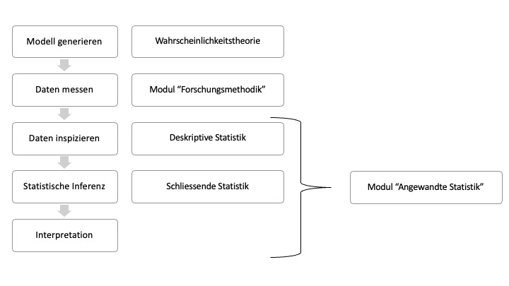

 

{width="15%"}

***  

# Einführung {.unnumbered}

> All models are wrong, but some are useful.
>
> --- George E.P. Box

In den Naturwissenschaften sind Erkenntnisse meist mit einer gewissen Unsicherheit verbunden. Beispiele dafür sind die Wettervorhersage für die nächsten Tage oder das tägliche Verkehrsaufkommen bei einer Brücke. Auch wenn man die Zugfestigkeit von Sehnen experimentell ermittelt, ist das Ergebnis mit Unsicherheit verbunden; einerseits infolge von Messungenauigkeit, andererseits weil eine natürliche Variabilität zwischen Beobachtungseinheiten vorhanden ist (keine zwei Beobachtungseinheiten sind exakt identisch). Die Unsicherheit kann auch durch fehlendes Wissen auftreten, z.B. weil wir nur einen beschränkten Zugriff auf Daten haben (wir können nie den Blutdruck von allen Menschen messen). Wir benötigen daher Methoden, um unsichere Phänomene angemessen zu modellieren, aber auch um Daten richtig zu verstehen. Aus den vorliegenden Daten wollen wir ja (korrekte) Rückschlüsse ziehen, um auf dieser Grundlage Entscheidungen zu treffen. Die Wahrscheinlichkeitsrechnung und die Statistik liefern Methoden, die uns dabei unterstützen.

Was tun Wissenschaftler:innen, die in der Forschung arbeiten, die also versuchen, bestimmte Teilaspekte der uns umgebenden Welt zu verstehen? Manche von ihnen machen das, was die meisten Menschen von Wissenschaftler:innen erwarten: Sie beobachten, zählen, messen, registrieren, katalogisieren. Sie sind die Empiriker:innen. Sie streben danach, möglichst genaue Informationen über die Vorgänge in der Natur zu erhalten.

Das ist die eine Seite der wissenschaftlichen Arbeit. Für die andere Seite sind die Theoretiker:innen zuständig, die versuchen, in den Beobachtungen der Empiriker:innen Gesetzmässigkeiten zu erkennen und diese so zu formulieren, dass sie nicht nur mit den vorhandenen Beobachtungen übereinstimmen, sondern auch die Ergebnisse von Experimenten voraussagen können, die noch gar nicht durchgeführt worden sind. Solche Gesetzmässigkeiten können unterschiedliche Gestalt annehmen: Formeln, Diagramme oder Algorithmen.

Jede wissenschaftliche Theorie ist ein Modell des beobachteten Aspekts der Wirklichkeit. Modelle stellen stets eine Abstraktion oder Idealisierung dar: Sie beschreiben die Realität niemals absolut genau, sondern erfassen bestimmte relevante Aspekte »hinreichend gut«; weniger bedeutende Details für eine bestimmte Fragestellung werden dabei vernachlässigt. So gesehen sind alle Modelle falsch, wie der Statistiker George Box provokant formulierte. Trotzdem sind sie nützlich, weil sie uns helfen, von einzelnen Beobachtungen auf das Ganze zu schliessen. Die Modelle, welche z.B. in der Wettervorhersage verwendet werden, so komplex sie auch immer sein mögen, beruhen auf zahlreichen Vereinfachungen; daher trifft die Wettervorhersage nicht immer zu - aber sie ist oft sehr nützlich.

> Die (komplexe) Realität kann mit Modellen abgebildet werden. Modelle liefern zwar vereinfachende Beschreibungen der Realität, dadurch ermöglichen sie aber allgemeine Aussagen, welche sonst nicht gemacht werden könnten.
>
> --- Marco Waser

In der Statistik geht es darum, aus vorhandenen Daten auf den datengenerierenden Mechanismus zu schliessen. Wir sehen ein paar (wenige) Datenpunkte (z.B. Blutdruckmessungen) und versuchen mit diesem beschränkten Wissen herauszufinden, was wohl ein gutes Modell dafür ist.

Auch wenn wir Experimente durchführen, erhalten wir Daten, die angemessen ausgewertet werden müssen. Wenn wir also einen wissenschaftlichen Fachartikel beurteilen sollen, dann kommt darin wohl fast immer auch eine Datenanalyse vor. Um Fehlschlüsse zu vermeiden und Fehlinterpretationen zu durchschauen, benötigen wir ein Verständnis der theoretischen Grundlagen.

## Zu diesem Skript

Für die Erstellung des Skripts wurden zahlreiche Bücher, Artikel und online-Ressourcen zur Inspiration verwendet. Teilweise wurden Beispiele aus Büchern übernommen und ins Deutsche übersetzt. Die entsprechenden Quellen werden separat pro Kapitel aufgeführt und in einem Literaturverzeichnis zusammengefasst. Für die technische Umsetzung dieses Skripts wurde [Quarto und RStudio](https://quarto.org/) verwendet.

**Dieses Skript dient als Begleitlektüre zum Modul "Angewandte Statistik"**, welches Bestandteil der Masterstudiengänge am Departement Gesundheit der Berner Fachhochschule ist. Es ergänzt den Modulunterricht, ersetzt diesen aber nicht! Idealerweise werden die entsprechenden Kapitel als Vorbereitung für die Unterrichtstage gelesen. Fragen Sie im Unterricht nach, wenn Sie etwas nicht verstehen.

{#fig-intro}

Wie dem Modulnamen zu entnehmen ist, steht die Anwendung grundlegender statistischer Methoden im Vordergrund. Das bedeutet auch, dass wir auf so viel mathematische Details verzichten wie möglich, aber so viel einbeziehen wie nötig. Sie werden deshalb in diesem Modul einigen Formeln begegnen. Formeln sehen auf den ersten Blick komplizierter aus, als sie sind. Versuchen Sie deshalb, die wichtigen Formeln zu verstehen. Wenn Sie Symbole nicht verstehen, dann ist [diese Website](https://www.mathe-online.at/symbole.html) hilfreich.

Wir konzentrieren uns insbesondere auf die deskriptive und die schliessende Statistik von gesundheitsbezogenen Daten. Dennoch werden, zur besseren Verständlichkeit, manchmal auch Beispiele ausserhalb des Gesundheitssektors gebraucht.

Die Wahrscheinlichkeitstheorie oder die Kombinatorik, welche zusammen mit der Statistik das Gebiet der Stochastik darstellen, werden angeschnitten, aber nicht fundiert eingeführt (siehe @fig-intro).

Im Skript finden Sie die wichtigsten R-Codes für die in diesem Modul relevanten Analysen. Auf eine detaillierte `R`-Einführung und auf eine Beschreibung dieser Codes wird in diesem Skript bewusst verzichtet. Die konkrete Umsetzung der statistischen Analysen in `R` sowie ergänzende Erklärungen erfolgen in den `R`-Workshops vor Ort. Für die meisten Grafiken verwende ich in diesem Skript das `R`-Package `ggplot2`. Ich erhoffe mir dadurch, die Attraktivität des Skripts steigern zu können. Der Umgang mit `ggplot2` erfordert einiges an Übung und gehört deshalb nicht zum Inhalt dieses Moduls. Es reicht, wenn sie die wichtigsten Grafiken mit dem Basis Package von `R` erstellen können.

Falls Sie beim Lesen des Skripts Fehler entdecken, melden Sie diese an nathanael.lutz\@bfh.ch. Herzlichen Dank!

## Danksagung

Viele Inhalte dieses Skripts basieren auf der Arbeit von Dr. Lukas Stammler und wurden von mir, Nathanael Lutz, für diesen Kurs angepasst und erweitert. Ich danke Lukas von Herzen für das zur Verfügungstellen seiner aussergewöhnlichen Vorarbeit, seine kreativen Ideen, die intensiven Recherchen nach geeigneten Datensätzen und nicht zuletzt für sein unermüdliches Engagement, komplexe Sachverhalte didaktisch so aufzubereiten, dass sie für Studierende zugänglich und verständlich sind. Ebenfalls bedanken möchte ich mich bei André Meichtry für das Beisteuern weiterer Kapitel sowie seine grossartige Unterstützung beim Korrekturlesen. Sein präzises Gespür für Details, kombiniert mit seiner umfassenden Expertise im Bereich der Statistik, hat dieses Skript nachhaltig verbessert.
