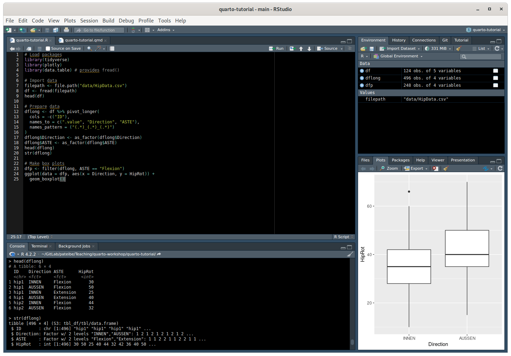
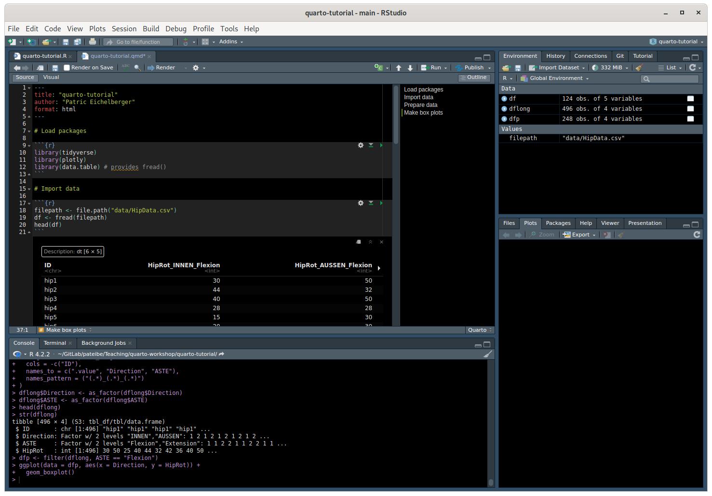
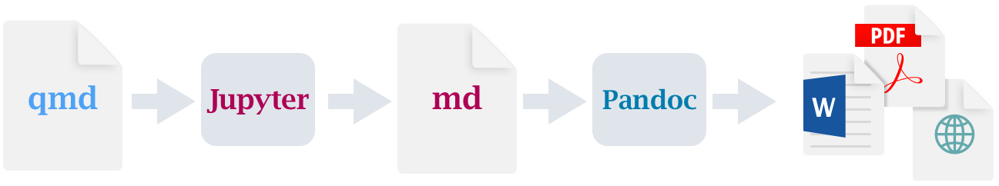

## [Quarto](https://quarto.org/) lets us... {.smaller}

- Analyze data and visualize data through R and Python (and more): **You know - the things we do anyway**
- Create dynamic content for scientific reports, manuscripts or presentations: **Create output when input changes**
- Using one source and produce output in various formats like HTML, PDF and MS Word: **Reduce copy-paste**
- Create reports, manuscripts, presentations, websites, books or knowledge repos through [Pandoc](https://pandoc.org/) and writing in [Markdown](https://daringfireball.net/projects/markdown/)
- Do all Open-Source and adopt good Open-Science practice

> Provide seamless and reproducible workflows from data analysis to dissemination of knowledge

## Aims of this workshop {.smaller}

- After this workshop you can understand and describe the basic mechanisms of Quarto and know where it can support your research activities.
- Apply Quarto to concrete use-cases to get inspiration about its capabilities.
- You will have a running toolchain on your computer to work further on your own projects.

**What we don't aim**

- Introduce coding basics, R programming or Markdown editing.
- Workshops to R and ggplot were given in the past and resources are available [in this Gitlab repository](https://gitlab.ti.bfh.ch/pateibe/R/r-intro)
- Quarto is huge. We won't cover everything.

## Helpful resources and tips

- [Quarto website](https://quarto.org/). Lot of material > good to take time to familiarize yourself. The [Guide](https://quarto.org/docs/guide/) section is a good starting point.
- Adopt using [Visual Studio Code](https://code.visualstudio.com/download), a powerful text editor.
- Check out the getting started tutorials for [VS Code](https://quarto.org/docs/get-started/hello/vscode.html)  or [RStudio](https://quarto.org/docs/get-started/hello/rstudio.html) on the Quarto website.
- Familiarize with basic [Markdown authoring](https://quarto.org/docs/authoring/markdown-basics.html).
- [RStudio approach](https://quarto.org/docs/get-started/hello/rstudio.html) is easier to start for R users.
- [VS Code workflow](https://quarto.org/docs/get-started/hello/vscode.html) is more versatile but harder to adopt.

## Workshop tools

- [R]([link](https://stat.ethz.ch/CRAN/))
- [RStudio]([link](https://posit.co/download/rstudio-desktop/))
- [Visual Studio Code]([link](https://code.visualstudio.com/download))
- [Quarto]([link](https://quarto.org/docs/get-started/))

## R-Script (.R)

{fig-align="center"}

Outputs go to the console and to the plot pane.

## Quarto document (.qmd) {.smaller}

{fig-align="center"}

- Outputs are inline within the `.qmd` file when run (Button **Run**) in RStudio.
- Text, code and output go to `.html` (or whatever format we set in the YAML-header) when rendered through Quarto (Button **Render**).

## How it works?

qmd file with R code in RStudio

{fig-align="center"}

qmd file with Python code from VS Code (or command line)

{fig-align="center"}

## YAML header {.smaller}

:::: {.columns}

::: {.column width="50%"}
Where we set rendering options

``` yaml
---
title: "quarto-tutorial"
author: "Patric Eichelberger"
format: html
---
```

- Common and format-specific rendering options.
- Multiple formats can be specified to produce different output from the same source.
:::

::: {.column width="50%"}
More complex

``` yaml
---
toc: true
bibliography: references.bib
lang: de
date: today
csl: ieee.csl
format:
  pdf:
    documentclass: scrreprt
    papersize: a4
    number-sections: true
    margin-left: 30mm
    margin-right: 30mm
    mainfont: Unit Rounded Pro
    mainfontoptions:
      - UprightFont = *-Light
  html:
    toc: true
    embed-resources: true
---
```
:::

::::

::: footer
Learn more: [YAML html options](https://quarto.org/docs/output-formats/html-basics.html)
:::

## Computations

- Computations are carried out within code chunks.
- Execution options can be set with `#|`.

```{r}
#| echo: fenced
#| label: fig-hiprotation # the chunk can be referred to by its label
#| fig-cap: "Hip internal and external rotation." # caption
#| eval: true # evaluate chunk when set to true
#| include: true # include output when set to true
#| warning: false # include warnings in the output
#| fig-width: 5 # set figure width to 5 inches

print("Hello World!")
```

::: footer
Learn more: [Execution options](https://quarto.org/docs/computations/execution-options.html)
:::

## Example dynamic content

```{r}
#| echo: true
#| fig-width: 5
#| fig-height: 3
#| fig-align: center
library(ggplot2)
ggplot(mtcars, aes(hp, mpg, color = am)) +
  geom_point() +
  geom_smooth(formula = y ~ x, method = "loess")
```

The plot is directly created during rendering and not imported from an external file.
